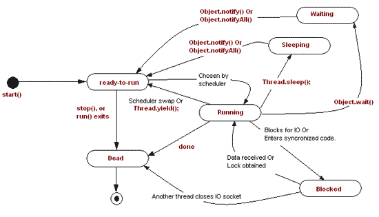
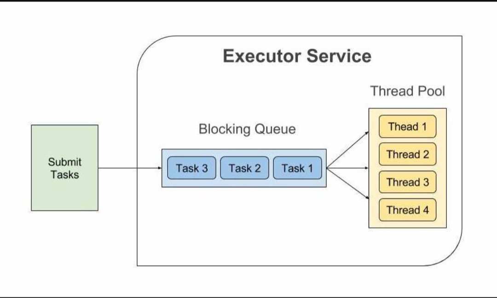

# title: Q&A JAVA

## JAVA

### Table of Contents

| Sr.No. | Question                                                                                                                                                                                                                                                                                      |
| ------ | --------------------------------------------------------------------------------------------------------------------------------------------------------------------------------------------------------------------------------------------------------------------------------------------- |
| 1      | [What are the key principles of object-oriented programming, and could you provide an example of each?](https://jcoding09.github.io/interviewprep/module001/module0000/lecture-001.html#-what-are-the-key-principles-of-object-oriented-programming-and-could-you-provide-an-example-of-each) |

## \*. What are the key principles of object-oriented programming, and could you provide an example of each?

Object-oriented programming (OOP) in Java is based on four key principles: Encapsulation, Inheritance, Polymorphism, and Abstraction. Here's an overview of each principle with examples:

### 1. Encapsulation

Encapsulation is the bundling of data (variables) and methods (functions) that operate on the data into a single unit, usually a class. It restricts direct access to some of the object's components, which is a means of preventing accidental interference and misuse of the data.

**Example:**

```java
public class EncapsulationExample {
    private String name;
    private int age;

    // Getter method for name
    public String getName() {
        return name;
    }

    // Setter method for name
    public void setName(String name) {
        this.name = name;
    }

    // Getter method for age
    public int getAge() {
        return age;
    }

    // Setter method for age
    public void setAge(int age) {
        this.age = age;
    }
}
```

#### Example of Encapsulation with Validation

While getters and setters are the most common way to achieve encapsulation, another way to demonstrate encapsulation is by restricting direct access to certain class members and providing methods that control access and modify these members in a controlled manner. This can include methods that perform validation or other logic before modifying the state.

**BankAccount Class with Encapsulation**

```java
public class BankAccount {
    // Private fields to encapsulate the data
    private String accountNumber;
    private double balance;

    // Constructor
    public BankAccount(String accountNumber, double initialBalance) {
        this.accountNumber = accountNumber;
        if (initialBalance >= 0) {
            this.balance = initialBalance;
        } else {
            this.balance = 0;
        }
    }

    // Method to deposit money with validation
    public void deposit(double amount) {
        if (amount > 0) {
            balance += amount;
            System.out.println("Deposited: $" + amount);
        } else {
            System.out.println("Deposit amount must be positive.");
        }
    }

    // Method to withdraw money with validation
    public void withdraw(double amount) {
        if (amount > 0 && amount <= balance) {
            balance -= amount;
            System.out.println("Withdrew: $" + amount);
        } else {
            System.out.println("Invalid withdrawal amount or insufficient balance.");
        }
    }

    // Method to display the current balance
    public void displayBalance() {
        System.out.println("Current balance: $" + balance);
    }

    // Private method for internal use
    private void logTransaction(String message) {
        // Log transaction (hypothetical implementation)
        System.out.println("Transaction Log: " + message);
    }
}
```

**Main Class to Use BankAccount**

```java
public class Main {
    public static void main(String[] args) {
        // Creating a BankAccount object
        BankAccount account = new BankAccount("123456789", 1000);

        // Accessing the BankAccount through its methods
        account.displayBalance(); // Output: Current balance: $1000
        account.deposit(500);     // Output: Deposited: $500
        account.displayBalance(); // Output: Current balance: $1500
        account.withdraw(200);    // Output: Withdrew: $200
        account.displayBalance(); // Output: Current balance: $1300
        account.withdraw(2000);   // Output: Invalid withdrawal amount or insufficient balance.
    }
}
```

#### Explanation

1. **Private Fields**: The `accountNumber` and `balance` fields are private, meaning they cannot be accessed directly from outside the class. This encapsulates the data, ensuring that it can only be modified through the class methods.

2. **Constructor with Validation**: The constructor ensures that the initial balance cannot be negative.

3. **Methods with Validation**: The `deposit` and `withdraw` methods include logic to validate the input. This ensures that the state of the `BankAccount` object remains consistent and valid. For example, you can't withdraw more money than is available in the account, and you can't deposit or withdraw a negative amount.

4. **Private Helper Method**: The `logTransaction` method is private, meaning it is intended for internal use within the `BankAccount` class only. This method can be used to log transactions without exposing this functionality to the outside world.

By using methods with built-in validation and making fields private, this example demonstrates encapsulation by controlling how the internal state of an object is accessed and modified.

### 2. Inheritance

Inheritance is a mechanism wherein a new class is derived from an existing class. The new class, known as the subclass (or derived class), inherits the attributes and methods of the superclass (or base class).

**Example:**

```java
// Superclass
public class Animal {
    public void eat() {
        System.out.println("This animal eats food.");
    }
}

// Subclass
public class Dog extends Animal {
    public void bark() {
        System.out.println("The dog barks.");
    }

    public static void main(String[] args) {
        Dog dog = new Dog();
        dog.eat();  // Inherited method
        dog.bark(); // Own method
    }
}
```

### 3. Polymorphism

Polymorphism allows methods to do different things based on the object it is acting upon, even though they share the same name. It can be achieved through method overriding (runtime polymorphism) and method overloading (compile-time polymorphism).

**Example:**

```java
// Method Overloading (Compile-time Polymorphism)
public class PolymorphismExample {
    // Method to add two integers
    public int add(int a, int b) {
        return a + b;
    }

    // Method to add three integers
    public int add(int a, int b, int c) {
        return a + b + c;
    }

    public static void main(String[] args) {
        PolymorphismExample example = new PolymorphismExample();
        System.out.println(example.add(2, 3));       // Output: 5
        System.out.println(example.add(2, 3, 4));    // Output: 9
    }
}

// Method Overriding (Runtime Polymorphism)
public class Animal {
    public void sound() {
        System.out.println("This animal makes a sound");
    }
}

public class Cat extends Animal {
    @Override
    public void sound() {
        System.out.println("The cat meows");
    }

    public static void main(String[] args) {
        Animal myCat = new Cat();
        myCat.sound();  // Output: The cat meows
    }
}
```

### 4. Abstraction

Abstraction is the concept of hiding the complex implementation details and showing only the essential features of the object. It can be achieved using `abstract classes and interfaces`.

**Example:**

```java
// Abstract Class
abstract class Animal {
    // Abstract method (does not have a body)
    public abstract void animalSound();

    // Regular method
    public void sleep() {
        System.out.println("This animal sleeps.");
    }
}

// Subclass (inherited from Animal)
public class Pig extends Animal {
    public void animalSound() {
        System.out.println("The pig says: wee wee");
    }

    public static void main(String[] args) {
        Pig myPig = new Pig();
        myPig.animalSound(); // Output: The pig says: wee wee
        myPig.sleep();       // Output: This animal sleeps.
    }
}
```

#### Is the @Override Annotation Necessary for Interface Methods?

The `@Override` annotation is not strictly necessary when implementing methods from an interface, but it is highly recommended. Here’s why:

1. **Compile-Time Checking**: The `@Override` annotation tells the compiler that the method is intended to override a method in a superclass or implement an interface method. If the method signature does not match the method in the interface (e.g., due to a typo or incorrect parameters), the compiler will generate an error. This helps catch mistakes early.

2. **Readability and Maintenance**: Using `@Override` makes the code more readable and maintainable. It clearly indicates that the method is an implementation of an interface method, making it easier for other developers (or your future self) to understand the code.

**Example:**

```java
public interface Animal {
    void animalSound();
    void sleep();
}

public class Pig implements Animal {
    @Override
    public void animalSound() {
        System.out.println("The pig says: wee wee");
    }

    @Override
    public void sleep() {
        System.out.println("The pig sleeps.");
    }
}
```

#### Why Can't We Create Objects of an Interface or Abstract Class?

##### Interfaces:

- **Purpose**: An interface is a contract that specifies what methods a class must implement but does not provide any implementation itself.
- **Instantiation**: Since interfaces do not have any concrete implementation, there is no behavior to instantiate. You cannot create an instance of an interface directly because it does not have any code to execute.

##### Abstract Classes:

- **Purpose**: An abstract class can provide both complete (concrete) methods and incomplete (abstract) methods that must be implemented by subclasses.
- **Instantiation**: Similar to interfaces, you cannot create an instance of an abstract class because it might contain abstract methods with no implementation. Even if it has some concrete methods, it is meant to be a base class to be extended, not to be instantiated on its own.

**Example:**

```java
// Interface
public interface Animal {
    void animalSound();
    void sleep();
}

// Abstract Class
public abstract class Bird {
    public abstract void fly(); // Abstract method

    public void eat() { // Concrete method
        System.out.println("The bird eats.");
    }
}

// Class implementing an interface
public class Pig implements Animal {
    @Override
    public void animalSound() {
        System.out.println("The pig says: wee wee");
    }

    @Override
    public void sleep() {
        System.out.println("The pig sleeps.");
    }
}

// Class extending an abstract class
public class Sparrow extends Bird {
    @Override
    public void fly() {
        System.out.println("The sparrow flies.");
    }
}

// Main class
public class Main {
    public static void main(String[] args) {
        Pig myPig = new Pig(); // Valid
        myPig.animalSound();
        myPig.sleep();

        Sparrow mySparrow = new Sparrow(); // Valid
        mySparrow.fly();
        mySparrow.eat();

        // Animal myAnimal = new Animal(); // Invalid, cannot instantiate interface
        // Bird myBird = new Bird(); // Invalid, cannot instantiate abstract class
    }
}
```

#### **default methods** and **static methods** in Interface JAVA 8

In Java 8, interfaces can have concrete methods. These are called **default methods** and **static methods**.

##### Default Methods

Default methods are methods defined in an interface with the `default` keyword and provide a concrete implementation. This feature allows interfaces to evolve by adding new methods without breaking existing implementations of the interface.

**Example of Default Methods:**

```java
public interface Animal {
    void animalSound(); // Abstract method

    // Default method
    default void sleep() {
        System.out.println("This animal sleeps.");
    }
}

public class Pig implements Animal {
    @Override
    public void animalSound() {
        System.out.println("The pig says: wee wee");
    }

    // Pig class does not need to implement sleep() method
    // as it has a default implementation in the interface
}

public class Main {
    public static void main(String[] args) {
        Pig myPig = new Pig();
        myPig.animalSound(); // Output: The pig says: wee wee
        myPig.sleep();       // Output: This animal sleeps.
    }
}
```

##### Static Methods

Static methods in interfaces are similar to static methods in classes. They belong to the interface itself rather than to instances of the interface.

**Example of Static Methods:**

```java
public interface Animal {
    void animalSound(); // Abstract method

    // Static method
    static void printInfo() {
        System.out.println("This is an animal.");
    }
}

public class Main {
    public static void main(String[] args) {
        Animal.printInfo(); // Output: This is an animal.
    }
}
```

##### Why Introduce Default and Static Methods?

1. **Backward Compatibility**: Default methods allow the addition of new methods to interfaces without breaking the existing implementations. Before Java 8, adding a new method to an interface would force all implementing classes to provide an implementation for that method, potentially breaking a lot of code.
2. **Utility Methods**: Static methods in interfaces provide a way to include utility methods related to the interface without requiring a separate utility class.

These principles are fundamental to writing robust, maintainable, and scalable object-oriented code in Java.

## \*. Is it possible for the 'public static void main' method to work without being named 'main'? If not, why? Describe 'public static void main'

The main method must be named main because it is a convention specified by the JVM to identify the entry point of a Java application. Deviating from this convention will prevent the JVM from starting the program correctly.

Public:- it is an access specifier that means it will be accessed by publically. Static:- it is access modifier that means when the java program is load then it will create the space in memory automatically.
Void:- it is a return type that is it does not return any value.
main():- it is a method or a function name.

## \*. Can we run a class in Java 1.9, which was compiled in Java 1.8?

yes but in some cases it might not work.

## \*. Can a single Java class contain multiple 'main' methods? If so, how does the program determine which one to execute?

Yes, a single Java class can contain multiple `main` methods with different parameter lists (overloaded), but only the `public static void main(String[] args)` method will be executed by the JVM.

Below is a code example of a single Java class containing multiple `main` methods with different parameter lists (overloaded). The JVM will only execute the `public static void main(String[] args)` method.

```java
public class MainMethodExample {

    // Standard main method that JVM will execute
    public static void main(String[] args) {
        System.out.println("Hello from the standard main method!");
        // Calling other main methods for demonstration
        main(42);
        main("Overloaded main method");
    }

    // Overloaded main method with an integer parameter
    public static void main(int arg) {
        System.out.println("Hello from the main method with int parameter: " + arg);
    }

    // Overloaded main method with a string parameter
    public static void main(String arg) {
        System.out.println("Hello from the main method with String parameter: " + arg);
    }
}
```

### Explanation

1. **Standard `main` method**: This is the method that the JVM will look for and execute when the program starts.

2. **Overloaded `main` methods**: These methods have different parameter lists (one takes an `int`, and the other takes a `String`). These will not be executed by the JVM automatically but can be called from within the standard `main` method or other methods in the class.

### Execution

When you run the program using the command `java MainMethodExample`, the JVM will execute the standard `public static void main(String[] args)` method, and the output will be:

```
Hello from the standard main method!
Hello from the main method with int parameter: 42
Hello from the main method with String parameter: Overloaded main method
```

## \*. Describe what is constructor and types of constructor in JAVA with code example.

### What is a Constructor in Java?

A constructor in Java is a special method that is called when an object is instantiated. The purpose of a constructor is to initialize the newly created object. Constructors have the same name as the class and do not have a return type, not even `void`.

### Types of Constructors in Java

1. **Default Constructor**: A no-argument constructor provided by the compiler if no constructors are defined in the class. It initializes the object with default values.
2. **No-Argument Constructor**: A constructor that does not take any parameters. If a class does not explicitly define a constructor, the compiler automatically provides a default no-argument constructor.
3. **Parameterized Constructor**: A constructor that takes arguments to initialize the object with specific values.

### Examples

**1. Default Constructor**

If you do not provide any constructor, Java provides a default constructor that initializes the object with default values.

```java
public class DefaultConstructorExample {
    int value;

    // No need to explicitly define a default constructor
    // Java provides one if no constructors are defined

    public static void main(String[] args) {
        DefaultConstructorExample obj = new DefaultConstructorExample();
        System.out.println("Value: " + obj.value); // Output: Value: 0
    }
}
```

**2. No-Argument Constructor**

You can explicitly define a no-argument constructor to initialize default values.

```java
public class NoArgConstructorExample {
    int value;

    // No-argument constructor
    public NoArgConstructorExample() {
        value = 42; // Default initialization
    }

    public static void main(String[] args) {
        NoArgConstructorExample obj = new NoArgConstructorExample();
        System.out.println("Value: " + obj.value); // Output: Value: 42
    }
}
```

**3. Parameterized Constructor**

A constructor with parameters allows you to pass initial values to the object at the time of creation.

```java
public class ParameterizedConstructorExample {
    int value;

    // Parameterized constructor
    public ParameterizedConstructorExample(int value) {
        this.value = value;
    }

    public static void main(String[] args) {
        ParameterizedConstructorExample obj = new ParameterizedConstructorExample(100);
        System.out.println("Value: " + obj.value); // Output: Value: 100
    }
}
```

### Summary

- **Default Constructor**: Provided by the compiler if no constructors are defined.
- **No-Argument Constructor**: Explicitly defined with no parameters, used to initialize default values.
- **Parameterized Constructor**: Allows passing specific values to initialize the object during instantiation.

These constructors help in the creation and initialization of objects, providing flexibility in how objects are instantiated and initialized in Java.

## \*. Explain the differences between encapsulation and abstraction in Java with examples.

Encapsulation and abstraction are both fundamental concepts in object-oriented programming (OOP), and especially in Java. While they are interrelated, they serve distinct purposes:

**Encapsulation:**

- **Focus:** Bundling data (attributes) and methods (functions) that operate on that data together within a single unit, typically a class.
- **Goal:** Data protection and controlled access. Encapsulation ensures data integrity by restricting direct access to attributes and providing controlled access mechanisms through methods (getters and setters).
- **Implementation:** Achieved using access modifiers (public, private, protected) in Java. Public methods allow external access, while private methods are hidden within the class.

**Example:**

```java
public class Car {
  private String model;  // Encapsulated data (attribute)
  private int speed;     // Encapsulated data (attribute)

  public void accelerate() {  // Public method (function)
    speed++;
  }

  public int getSpeed() {     // Public getter method
    return speed;
  }
}
```

In this example, `model` and `speed` are private attributes hidden within the `Car` class. The `accelerate` method modifies the speed, and the `getSpeed` method provides controlled access to the value.

**Abstraction:**

- **Focus:** Hiding the internal implementation details of an object and exposing only the essential functionalities.
- **Goal:** Simplifies complex functionalities and promotes loose coupling (reduced reliance between objects). Users interact with the "what" rather than the "how".
- **Implementation:** Achieved through interfaces and abstract classes. Interfaces define functionalities (methods) without implementation details. Abstract classes provide partial implementations that can be extended by subclasses.

**Example:**

```java
public interface Shape {
  double calculateArea();  // Abstract method (what)
}

public abstract class Vehicle {
  public abstract void start();  // Abstract method (what)
}

public class ElectricCar extends Vehicle {
  @Override
  public void start() {
    // Implementation details (how) for electric car start
  }
}
```

The `Shape` interface defines the `calculateArea` method without specifying how to calculate it. Different shapes (classes implementing `Shape`) can provide their specific implementations. Similarly, the `Vehicle` class has an abstract `start` method that gets implemented in subclasses like `ElectricCar`.

**Key Differences:**

- Encapsulation focuses on data protection and access control, while abstraction focuses on hiding implementation details and exposing functionalities.
- Encapsulation is typically achieved within a class, while abstraction can be applied across classes using interfaces and inheritance.

By effectively using encapsulation and abstraction, Java programmers can create secure, maintainable, and reusable code.

## \*. Differentiate between Method Overloading and Method Overriding, providing examples.

Method overloading and overriding are two powerful concepts in Java that deal with methods (functions) within classes. They might seem similar at first glance, but they have distinct purposes and functionalities:

**Method Overloading**

- **Definition:** Occurs within the same class when multiple methods share the same name but have different parameter lists (number, type, or both).
- **Purpose:** Provides flexibility for methods with the same functionality but acting on different data types or quantities. Improves code readability.
- **Key Points:**
  - Same method name within a class.
  - Different parameter lists (number or type of parameters).
  - Return type can be the same or different.
  - Example of compile-time polymorphism (the compiler decides which method to call based on arguments at compile time).

**Code Example:**

```java
public class Calculator {
  public int add(int a, int b) {
    return a + b;
  }

  public double add(double a, double b) {
    return a + b;
  }

  public String add(String a, String b) {
    return a.concat(b);  // String concatenation for combining strings
  }
}
```

In this example, the `Calculator` class has three `add` methods. Each takes different parameters (two integers, two doubles, or two strings), allowing for addition of different data types.

**Method Overriding**

- **Definition:** Occurs in inheritance hierarchies when a subclass re-implements a method inherited from its superclass.
- **Purpose:** Provides a way for subclasses to specialize the behavior of inherited methods.
- **Key Points:**
  - Same method name and parameter list (signature) in subclass and superclass.
  - Must follow inheritance relationship (subclass overrides superclass method).
  - Return type must be the same or a subtype (covariant) of the superclass return type.
  - Example of run-time polymorphism (the actual method called is determined at runtime based on the object's type).

```java
public class Animal {
  public void makeSound() {
    System.out.println("Generic animal sound");
  }
}

public class Dog extends Animal {
  @Override  // Optional annotation indicating overriding
  public void makeSound() {
    System.out.println("Woof!");
  }
}

public class Main {
  public static void main(String[] args) {
    Animal myAnimal = new Animal();  // Create an Animal object
    myAnimal.makeSound();            // Calls Animal's makeSound

    Dog myDog = new Dog();            // Create a Dog object
    myDog.makeSound();                // Calls Dog's overridden makeSound
  }
}
```

Here, the `Animal` class has a `makeSound` method. The `Dog` class inherits from `Animal` and overrides the `makeSound` method to provide a specific sound for dogs.

You would use `Animal an = new Dog();` in Java when you want to leverage **inheritance and polymorphism** for code flexibility and reusability. Here's a breakdown of the scenario:

**Inheritance:**

- The `Dog` class likely inherits from the `Animal` class. This means `Dog` inherits attributes and methods from `Animal`.

**Polymorphism:**

- By creating a reference variable `an` of type `Animal` and assigning a new `Dog` object to it, you are taking advantage of polymorphism.
- An object reference variable can hold a reference to objects of its own class or subclasses. In this case, `Animal` is the superclass, and `Dog` is the subclass.

**Use Cases:**

There are several reasons why you might use this approach:

1. **Collections:** If you have a collection (like an array or list) that needs to store objects of various animal types (dogs, cats, birds, etc.), all of which inherit from a common `Animal` class. You can use `Animal` as the reference type for the collection elements, allowing you to store objects of different subclasses (like `Dog`).

2. **Generic Functionality:** If you want to focus on common functionalities shared by all animals (e.g., making a sound, eating), you can define these methods in the `Animal` class. Then, subclasses like `Dog` can override them to provide specific implementations. Using the `Animal` reference variable `an`, you can call these methods, and the appropriate version (from `Animal` or the subclass like `Dog`) will be executed based on the actual object type at runtime (polymorphism).

**Example:**

```java
public class Animal {
  public void makeSound() {
    System.out.println("Generic animal sound");
  }
}

public class Dog extends Animal {
  @Override
  public void makeSound() {
    System.out.println("Woof!");
  }
}

public class Main {
  public static void main(String[] args) {
    Animal an = new Dog();  // Create a Dog object but assign it to an Animal reference
    an.makeSound();        // Calls Dog's overridden makeSound (due to polymorphism)
  }
}
```

**Important Caveats:**

- While `an` can call methods defined in the `Animal` class, it cannot directly access methods specific to `Dog` unless you cast it back to a `Dog` object (but that might defeat the purpose of using `Animal` as the reference type).
- If you only need the functionalities of a `Dog` and don't care about treating it as a generic animal, it's generally better to directly use `Dog` for the reference variable and object creation.

**In Summary:**

- Method overloading deals with multiple methods with the same name but different functionalities within a class.
- Method overriding deals with subclasses providing their specific implementations for inherited methods.

## \*. Explain Inheritance vs Composition

Inheritance and composition are fundamental concepts in object-oriented programming (OOP) used to establish relationships between classes in Java. They both achieve code reusability, but in different ways:

**Inheritance (IS-A Relationship):**

- Represents a hierarchical relationship between classes.
- A subclass ("child") inherits attributes and methods from its superclass ("parent").
- Subclasses can add new attributes and methods or override inherited ones to specialize behavior.

**Java Code Example:**

```java
public class Animal {
  private String name;
  private int age;

  public Animal(String name, int age) {
    this.name = name;
    this.age = age;
  }

  public void makeSound() {
    System.out.println("Generic animal sound");
  }
}

public class Dog extends Animal {
  private String breed;

  public Dog(String name, int age, String breed) {
    super(name, age);  // Call superclass constructor
    this.breed = breed;
  }

  @Override
  public void makeSound() {
    System.out.println("Woof!");
  }
}
```

In this example, `Dog` inherits from `Animal`. `Dog` has its own attribute `breed` and overrides the `makeSound` method to provide a specific sound for dogs.

**Composition (HAS-A Relationship):**

- Represents a "has-a" relationship between objects.
- A class contains an instance of another class as a member variable.
- The containing class can access the member object's methods and attributes.
- Subclasses are not involved.

**Java Code Example:**

```java
public class Engine {
  private int horsePower;

  public Engine(int horsePower) {
    this.horsePower = horsePower;
  }

  public void start() {
    System.out.println("Engine started!");
  }
}

public class Car {
  private String model;
  private Engine engine;  // Car HAS-A Engine

  public Car(String model, Engine engine) {
    this.model = model;
    this.engine = engine;
  }

  public void accelerate() {
    engine.start();  // Access Engine's method through the member object
    System.out.println(model + " is accelerating!");
  }
}
```

Here, `Car` does not inherit from `Engine`. Instead, `Car` has an `Engine` object as a member variable. `Car` can access the `Engine`'s methods (like `start`) to perform actions related to the engine.

**Key Differences:**

- **Relationship:** Inheritance represents an "is-a" relationship, while composition represents a "has-a" relationship.
- **Code Reusability:** Inheritance allows for code reuse through inheritance hierarchy. Composition allows for code reuse by creating objects of other classes and using their functionalities.
- **Flexibility:** Inheritance creates a tighter coupling between classes. Composition provides more flexibility as different objects can be used in the containing class.
- **Multiple Inheritance:** Java doesn't support direct multiple inheritance (a class inheriting from multiple superclasses). Composition allows for a kind of simulated multiple inheritance by having a class contain objects of multiple other classes.

**Choosing Between Inheritance and Composition:**

- Use inheritance when there's a true "is-a" relationship and the subclass specializes the behavior of the superclass.
- Use composition for a more flexible approach where one object needs to utilize the functionalities of another without a strict inheritance hierarchy.

## \*. What are access modifiers in Java, and which ones are inherited by subclasses?

Access modifiers in Java are keywords that define the accessibility (visibility) of classes, fields (attributes), methods, and constructors. They control which parts of your code can access these elements. There are four main access modifiers:

1. **Public:** Members declared as `public` are accessible from anywhere in your program, regardless of the package or class.
2. **Private:** Members declared as `private` are only accessible within the class they are defined in. They are hidden from other classes.
3. **Protected:** Members declared as `protected` are accessible from within the class they are defined in, as well as from subclasses (regardless of package).
4. **Default (Package-Private):** If no access modifier is explicitly declared, the member is considered package-private. This means it's accessible from within the same package but hidden from outside the package.

**Inheritance and Access Modifiers:**

- **Public and Protected Members:** These are inherited by subclasses. Subclasses can access and potentially override them.
- **Private Members:** These are **not** inherited by subclasses. They are strictly confined to the class where they are defined.
- **Default (Package-Private) Members:** These are generally **not** inherited by subclasses from different packages. However, subclasses within the same package can access them.

Here's a table summarizing access modifiers and inheritance:

| Access Modifier           | Accessible By                                        | Inherited By Subclasses?                    |
| ------------------------- | ---------------------------------------------------- | ------------------------------------------- |
| Public                    | Everywhere                                           | Yes                                         |
| Private                   | Within the class only                                | No                                          |
| Protected                 | Within the class, subclasses (regardless of package) | Yes                                         |
| Default (Package-Private) | Within the same package                              | No (unless subclass is in the same package) |

**Example:**

```java
public class Animal {
  private String name;  // Only accessible within Animal
  protected int age;     // Accessible in Animal and subclasses
  public void makeSound() {  // Accessible from anywhere
    System.out.println("Generic animal sound");
  }
}

public class Dog extends Animal {
  public String breed;  // Accessible from anywhere

  @Override
  public void makeSound() {
    System.out.println("Woof!");
  }
}
```

In this example:

- `name` (private) is only accessible within `Animal`.
- `age` (protected) is accessible in both `Animal` and `Dog`.
- `makeSound` (public) in `Animal` and the overridden version in `Dog` are accessible from anywhere.
- `breed` (public) in `Dog` is accessible from anywhere.

**Key Points:**

- Use access modifiers judiciously to control access and promote encapsulation.
- Protected members are useful for creating a base class with core functionalities that can be extended by subclasses.
- Private members ensure data protection and prevent unintended modifications.

## \*. Default vs protected access specifiers.

Default: Visible within the package, not inherited by subclasses. Protected: Visible within the package and inherited by subclasses, promoting controlled inheritance.

## \*. Explain the concept of a static method in Java and its significance.

A static method in Java is a method that belongs to the class itself rather than an object of the class. Here are the key characteristics and significance of static methods:

- **Class-Level Association:** Static methods are defined with the `static` keyword and are associated with the class, not its instances. You can call them directly using the class name without needing to create an object first. (e.g., `Math.sqrt(4)`).
- **No Access to Instance Variables:** Static methods cannot directly access non-static (instance) variables of the class, as they are not tied to a specific object's state.
- **Can Access Static Variables:** They can access static variables (class variables) that belong to the class itself.
- **Utility Methods:** Static methods are often used for utility functions that don't require modifying object state. Examples include mathematical calculations (like `Math.sqrt()`), conversions (`Integer.parseInt()`), or helper functions specific to the class.
- **Early Execution:** The JVM typically executes static methods before creating class instances, making them suitable for initialization tasks or accessing class-level constants.
- **Improved Efficiency:** Since static methods don't involve object creation overhead, they can potentially be more efficient for frequently called utility functions.

**Significance:**

- **Code Reusability:** Static methods promote code reusability by providing functionality that can be used by any object of the class without redundancy.
- **Improved Readability:** Calling a static method using the class name often improves code readability, especially for utility functions that don't rely on object state.
- **Class-Level Logic:** Static methods are useful for encapsulating logic related to the class itself, such as validation routines or helper functions.

In summary, static methods are a powerful tool in Java for creating reusable utility functions, improving code organization, and potentially enhancing efficiency. They are well-suited for tasks that operate on class-level data or don't require modifying object state.

## \*. Can you override a private or static method in Java?

No, you cannot override a private or static method in Java. Here's why for each case:

**Private Methods:**

- **Reason:** Private methods are encapsulated within a class and hidden from subclasses.
- **Inheritance:** Inheritance establishes a relationship between classes where a subclass inherits members from its superclass. Since private members are hidden, they are not part of the inheritance contract.
- **Override Attempt:** If you try to override a private method in a subclass, it would essentially be creating a new method with the same signature within the subclass, not overriding an inherited one.

**Static Methods:**

- **Reason:** Static methods are associated with the class itself, not objects. They are resolved at compile time based on the class name used in the call.
- **Override vs. Overload:** Overriding involves redefining a method in a subclass that has the same signature (name and parameter list) as a method in the superclass. Static methods, however, cannot be overridden because they are not part of the object's behavior. Calling a static method with the subclass name would still call the method in the superclass.
- **Similar Functionality:** If you need similar functionality in a subclass, you can create a new static method with a different name in the subclass.

Here's an analogy:

Imagine a private method as a blueprint hidden inside a house (the class). Subclasses (extensions) cannot access or modify these internal blueprints. Similarly, static methods are like features of the house exterior (the class) that are accessed directly without needing to enter a specific house instance (object). You cannot "override" the exterior features by extending the house.

**Alternatives:**

- If you need to share functionality between classes but want to restrict access, consider using protected methods. These are inherited by subclasses but remain accessible only within the package or by subclasses themselves.
- If you need similar functionality specific to a subclass, create a new static method with a different name within the subclass.

## \*. Could you elaborate on the usage of 'this' and 'super' keywords in Java?

The `this` and `super` keywords in Java are fundamental for object manipulation and navigating class hierarchies. Here's a breakdown of their usage:

**this Keyword:**

- **Reference to Current Object:** The `this` keyword refers to the current object instance itself within a method or constructor. It is used to distinguish between instance variables and method parameters that might have the same name.

**Usages:**

1. **Accessing Instance Variables:** When a method needs to access an instance variable (attribute) that has the same name as a method parameter, you use `this` to clarify that you're referring to the object's variable.

   ```java
   public class Person {
     private String name;

     public void setName(String name) {
       this.name = name;  // this.name refers to the object's name attribute
     }
   }
   ```

2. **Calling Other Constructors:** You can use `this` to call other constructors within the same class during object creation. This is useful for constructor overloading.

   ```java
   public class Car {
     private String model;

     public Car(String model) {
       this.model = model;
     }

     public Car(int year) {
       this("Unknown");  // Call the other constructor with default model
       // Additional logic specific to year
     }
   }
   ```

3. **Returning the Current Object:** You can use `this` to return the current object instance from a method. This is often used for method chaining (calling multiple methods on the same object consecutively).

   ```java
   public class StringBuilder {
     private String value;

     public StringBuilder append(String str) {
       value += str;
       return this;  // Return the current StringBuilder object for chaining
     }
   }
   ```

**super Keyword:**

- **Reference to Superclass:** The `super` keyword refers to the immediate superclass of the current class. It is used to call methods or access constructors defined in the superclass.

**Usages:**

1. **Calling Superclass Methods:** You can use `super` to call methods defined in the superclass from within a subclass method. This is useful when you want to leverage the superclass's implementation and potentially add your own logic afterward (method overriding).

   ```java
   public class Animal {
     public void makeSound() {
       System.out.println("Generic animal sound");
     }
   }

   public class Dog extends Animal {
     @Override
     public void makeSound() {
       super.makeSound();  // Call the superclass's makeSound first
       System.out.println("Woof!");
     }
   }
   ```

2. **Calling Superclass Constructors:** You can use `super` to call the superclass constructor from within a subclass constructor. This is important for proper object initialization and ensures the superclass's constructor gets called first.

   ```java
   public class Person {
     private String name;

     public Person(String name) {
       this.name = name;
     }
   }

   public class Student extends Person {
     private String id;

     public Student(String name, String id) {
       super(name);  // Call the superclass constructor with name
       this.id = id;
     }
   }
   ```

**Key Points:**

- Both `this` and `super` must be used within non-static contexts (methods or constructors).
- `this` is used for within-class references, while `super` is used for superclass interactions.

By effectively using `this` and `super`, you can write clean, maintainable, and well-structured Java code that leverages object-oriented programming principles.

## \*. Discuss the immutability of Strings in Java and the reasons behind it.

In Java, strings are immutable, meaning once a String object is created, its content cannot be changed. Any attempt to modify an existing String object will result in a new String object being created with the updated content. Here's a breakdown of immutability in Java Strings and the reasons behind it:

**Immutability of Strings:**

- **String Pool:** Java maintains a String pool in memory. When you create a String literal (e.g., "hello"), the JVM checks the pool first. If an identical String already exists, the reference to the existing object is returned. Otherwise, a new String object is created in the pool.
- **Fixed Content:** Once a String object is created, its character data becomes final. Any methods that appear to modify a String (like `concat` or `replace`) actually create a new String object with the changes. The original String remains unmodified.

**Reasons for Immutability:**

- **Thread Safety:** Since Strings are immutable, multiple threads can access the same String object concurrently without worrying about data corruption. This simplifies thread synchronization and reduces the risk of race conditions.
- **Security:** Immutability prevents accidental or malicious modification of String content, enhancing data integrity. For example, if a password is stored as a String, immutability safeguards it from unauthorized changes.
- **Performance Optimization:** The String pool can improve performance by reusing existing String objects. Additionally, immutable Strings allow for efficient caching techniques based on their content.
- **Declarative Nature:** Immutability aligns with a declarative programming style where you focus on "what" the String should be, not how it should be modified. This can lead to cleaner and more predictable code.

**Example:**

```java
String str1 = "Hello";
String str2 = str1.concat(" World");  // str2 points to a new String object

System.out.println(str1); // Prints "Hello" (original unchanged)
System.out.println(str2); // Prints "Hello World" (new String)
```

**Alternatives for Modification:**

While you cannot modify an existing String object, you can achieve similar results by:

- **Creating a New String:** As demonstrated above, methods like `concat` or `replace` return a new String object with the modifications.
- **StringBuilder:** For scenarios requiring frequent modifications, consider using the `StringBuilder` class. It's mutable and allows for efficient character manipulation.

**In Summary:**

String immutability in Java is a deliberate design choice that offers several benefits, including thread safety, security, performance optimization, and a more declarative programming style. Understanding and effectively utilizing String immutability is essential for writing robust and efficient Java applications.

## \*. Discuss Stringbuffer vs Stringbuilder vs string

All right, here's a breakdown of String, StringBuffer, and StringBuilder in Java, explaining their functionalities, immutability, and use cases with code examples:

**1. String:**

- **Immutable:** Strings are immutable, meaning their content cannot be changed after creation.
- **Thread-safe:** Since they are immutable, multiple threads can safely access the same String object without data corruption concerns.
- **Use cases:** Ideal for scenarios where the String content remains constant, like storing names, constant messages, or configuration values.

**Code Example:**

```java
String name = "Alice";
// name = name.concat(" Bob"); // This would create a new String object
name = new String(name.concat(" Bob")); // Create a new String explicitly
System.out.println(name); // Prints "Alice Bob"
```

**2. StringBuffer:**

- **Mutable:** StringBuffer is a thread-safe mutable string buffer class. You can modify its content using methods like `append`, `insert`, and `replace`.
- **Thread-safe:** Multiple threads cannot access a StringBuffer concurrently and modify it safely without proper synchronization.
- **Use cases:** When you need to build a String dynamically by performing multiple modifications, especially in a multi-threaded environment.

**Code Example:**

```java
StringBuffer message = new StringBuffer("Hello");
message.append(" World");
message.insert(5, " from ");
System.out.println(message); // Prints "Hello from World"
```

**3. StringBuilder:**

- **Mutable:** Similar to StringBuffer, StringBuilder is a mutable string builder class for efficient string manipulation.
- **Non-thread-safe:** Unlike StringBuffer, StringBuilder is not thread-safe. If multiple threads access and modify a StringBuilder concurrently, you need to implement synchronization to avoid data corruption.
- **Use cases:** When you need a mutable string builder class for performance-critical operations in single-threaded environments. StringBuilder is generally faster than StringBuffer due to the lack of synchronization overhead.

**Code Example:**

```java
StringBuilder address = new StringBuilder();
address.append("123 Main St");
address.append(", Apt. 5");
System.out.println(address); // Prints "123 Main St, Apt. 5"
```

**Choosing Between Them:**

- **Immutability:** Use String if the content remains constant.
- **Thread Safety:** If thread safety is crucial, use StringBuffer.
- **Performance:** If thread safety is not a concern and performance is critical in a single-threaded environment, use StringBuilder.

**In Summary:**

String, StringBuffer, and StringBuilder offer different trade-offs between immutability, thread safety, and performance. By understanding their characteristics and use cases, you can choose the most appropriate option for your specific Java programming needs.

## \*. Implement your own immutable class in Java.

Here's an example of an immutable class in Java:

```java
public final class Point {
  private final int x;
  private final int y;

  public Point(int x, int y) {
    this.x = x;
    this.y = y;
  }

  public int getX() {
    return x;
  }

  public int getY() {
    return y;
  }

  // Don't provide setter methods for x and y

  // Create a new Point object with a new location (useful for immutability)
  public Point move(int deltaX, int deltaY) {
    return new Point(x + deltaX, y + deltaY);
  }

  @Override
  public boolean equals(Object o) {
    if (this == o) return true;
    if (o == null || getClass() != o.getClass()) return false;
    Point point = (Point) o;
    return x == point.x && y == point.y;
  }

  @Override
  public int hashCode() {
    return Objects.hash(x, y);
  }

  @Override
  public String toString() {
    return "Point{" + x + ", " + y + '}';
  }
}
```

This `Point` class represents a point in a two-dimensional space with immutable x and y coordinates. Here's a breakdown of the key aspects:

- **Final Class:** The class is declared as `final` to prevent subclassing and accidental modification of the immutability behavior.
- **Final Fields:** The `x` and `y` fields are declared as `final`. Once assigned during object creation, their values cannot be changed.
- **No Setter Methods:** The class doesn't provide setter methods for `x` and `y`. This enforces immutability by preventing direct modification of the coordinates.
- **`move` Method:** Instead of modifying the current object, this method creates a new `Point` object with the updated coordinates based on the provided deltas. This allows for creating new points with different locations while maintaining the immutability of the original object.
- **`equals` and `hashCode`:** These methods are overridden to provide proper equality and hash code functionality based on the immutable x and y coordinates.
- **`toString`:** This method provides a meaningful string representation of the `Point` object.

By following these principles, you can create immutable classes in Java that promote data integrity, thread safety (as there's no concurrent modification risk), and better reasoning about object state.

## \*. Compare and contrast shallow cloning and deep cloning in Java, providing examples.

**Shallow Cloning:**

In shallow cloning, a new object is created, but only the top-level fields of the original object are duplicated. If the object contains references to other objects, those references are copied, but the actual objects are not cloned. As a result, changes made to the cloned object's nested objects will also affect the original object's nested objects, and vice versa.

**Example of Shallow Cloning:**

```java
class Person implements Cloneable {
    private String name;
    private Address address;

    public Person(String name, Address address) {
        this.name = name;
        this.address = address;
    }

    // Getter and setter methods

    @Override
    public Object clone() throws CloneNotSupportedException {
        return super.clone();
    }
}

class Address {
    private String city;

    public Address(String city) {
        this.city = city;
    }

    // Getter and setter methods
}

public class Main {
    public static void main(String[] args) throws CloneNotSupportedException {
        Address address = new Address("New York");
        Person originalPerson = new Person("Alice", address);

        // Shallow clone
        Person clonedPerson = (Person) originalPerson.clone();

        // Modify the cloned person's address
        clonedPerson.getAddress().setCity("Los Angeles");

        // Output the original person's address
        System.out.println(originalPerson.getAddress().getCity()); // Output: Los Angeles
    }
}
```

In this example, when the `originalPerson` is cloned, a new `clonedPerson` object is created. However, both `originalPerson` and `clonedPerson` share the same `Address` object. Therefore, when the address of `clonedPerson` is modified, it also affects the address of `originalPerson`.

**Deep Cloning:**

In deep cloning, not only the top-level fields of the original object are duplicated, but all the nested objects are recursively cloned. This means that changes made to the cloned object's nested objects will not affect the original object's nested objects, and vice versa.

**Example of Deep Cloning:**

```java
class Person implements Cloneable {
    private String name;
    private Address address;

    public Person(String name, Address address) {
        this.name = name;
        this.address = address;
    }

    // Getter and setter methods

    @Override
    public Object clone() throws CloneNotSupportedException {
        Person clonedPerson = (Person) super.clone();
        clonedPerson.address = (Address) address.clone(); // Deep clone the Address object
        return clonedPerson;
    }
}

class Address implements Cloneable {
    private String city;

    public Address(String city) {
        this.city = city;
    }

    // Getter and setter methods

    @Override
    public Object clone() throws CloneNotSupportedException {
        return super.clone();
    }
}

public class Main {
    public static void main(String[] args) throws CloneNotSupportedException {
        Address address = new Address("New York");
        Person originalPerson = new Person("Alice", address);

        // Deep clone
        Person clonedPerson = (Person) originalPerson.clone();

        // Modify the cloned person's address
        clonedPerson.getAddress().setCity("Los Angeles");

        // Output the original person's address
        System.out.println(originalPerson.getAddress().getCity()); // Output: New York
    }
}
```

In this example, when the `originalPerson` is cloned, a new `clonedPerson` object is created with a deep copy of the `Address` object. Therefore, changes made to the address of `clonedPerson` do not affect the address of `originalPerson`.

## \*. What happens when you override both the 'equals' and 'hashCode' methods in Java? What if 'hashCode' returns the same value while 'equals' returns false?

When you override both the `equals` and `hashCode` methods in Java, you ensure consistency between these methods, which is crucial when using objects in collections like `HashMap`, `HashSet`, etc.

### When Both `equals` and `hashCode` are Overridden:

1. **Consistency**: Objects that are considered equal according to the `equals` method must have the same hash code according to the `hashCode` method. This ensures consistency when objects are used in hash-based collections.

2. **Performance**: Overriding `hashCode` method is important for performance in hash-based collections. It ensures that objects that are "equal" (as per the `equals` method) are likely to be stored in the same hash bucket, which reduces the time complexity of operations like searching and retrieval.

### What if `hashCode` Returns the Same Value While `equals` Returns False?

If `hashCode` returns the same value for two objects that are not considered equal according to the `equals` method, it can lead to unexpected behavior when these objects are used in hash-based collections:

1. **Hash Collision**: When different objects produce the same hash code, they are stored in the same hash bucket in a hash-based collection. This results in a hash collision.

2. **Search Complexity**: When searching for an object in a hash-based collection, the collection needs to iterate over all objects in the same hash bucket to find the matching object. This can degrade the performance of hash-based operations.

3. **Inconsistency**: Since `equals` returns `false` for these objects, they should not be considered equal. However, because they have the same hash code, they are stored in the same hash bucket, leading to inconsistency in the behavior of hash-based collections.

### Example:

```java
public class Person {
    private String name;
    private int age;

    public Person(String name, int age) {
        this.name = name;
        this.age = age;
    }

    @Override
    public boolean equals(Object obj) {
        if (this == obj) return true;
        if (obj == null || getClass() != obj.getClass()) return false;
        Person person = (Person) obj;
        return age == person.age && Objects.equals(name, person.name);
    }

    @Override
    public int hashCode() {
        return Objects.hash(name); // Hash code based only on name
    }
}
```

In this example, if two `Person` objects have the same name but different ages, they will have the same hash code (based on name), but `equals` will return `false`. This can lead to hash collisions and inconsistent behavior in hash-based collections.

### Summary:

- Overriding both `equals` and `hashCode` methods ensures consistency and performance when objects are used in hash-based collections.
- If `hashCode` returns the same value while `equals` returns `false`, it can lead to hash collisions and inconsistent behavior in hash-based collections. It's important to ensure that `equals` and `hashCode` are consistent to maintain the correctness and performance of hash-based operations.

## \*. Explain Comparator and comparable in JAVA 8, with code example. Give difference in table.

In Java, `Comparable` and `Comparator` are two interfaces used for sorting objects. Both provide ways to determine the order of objects, but they have different use cases and methods of implementation.

### Comparable

`Comparable` is used to define the natural ordering of objects. A class that implements `Comparable` must override the `compareTo` method, which compares `this` object with the specified object for order.

#### Example of Comparable

```java
public class Person implements Comparable<Person> {
    private String name;
    private int age;

    public Person(String name, int age) {
        this.name = name;
        this.age = age;
    }

    @Override
    public int compareTo(Person other) {
        return this.age - other.age; // Compare based on age
    }

    @Override
    public String toString() {
        return name + " (" + age + ")";
    }

    public static void main(String[] args) {
        List<Person> people = new ArrayList<>();
        people.add(new Person("Alice", 30));
        people.add(new Person("Bob", 25));
        people.add(new Person("Charlie", 35));

        Collections.sort(people);
        people.forEach(System.out::println);
    }
}
```

### Comparator

`Comparator` is used to define custom orderings of objects. It can be implemented as a separate class, allowing multiple different comparisons for the same type of objects. Java 8 introduced lambda expressions and method references, which make using `Comparator` more concise.

#### Example of Comparator

```java
import java.util.*;

public class Person {
    private String name;
    private int age;

    public Person(String name, int age) {
        this.name = name;
        this.age = age;
    }

    @Override
    public String toString() {
        return name + " (" + age + ")";
    }

    public static void main(String[] args) {
        List<Person> people = new ArrayList<>();
        people.add(new Person("Alice", 30));
        people.add(new Person("Bob", 25));
        people.add(new Person("Charlie", 35));

        // Sort by age using Comparator
        people.sort(Comparator.comparingInt(p -> p.age));
        people.forEach(System.out::println);

        // Sort by name using Comparator with method reference
        people.sort(Comparator.comparing(Person::getName));
        people.forEach(System.out::println);
    }

    public String getName() {
        return name;
    }

    public int getAge() {
        return age;
    }
}
```

### Difference Between Comparable and Comparator

| Feature                 | `Comparable`                                        | `Comparator`                                           |
| ----------------------- | --------------------------------------------------- | ------------------------------------------------------ |
| **Package**             | `java.lang`                                         | `java.util`                                            |
| **Method**              | `compareTo(Object o)`                               | `compare(Object o1, Object o2)`                        |
| **Usage**               | Natural ordering                                    | Custom ordering                                        |
| **Implementation**      | Class implements `Comparable`                       | Separate class or lambda expression                    |
| **Single vs Multiple**  | Single comparison logic                             | Multiple comparison logics                             |
| **Code Modification**   | Modifies the class whose objects are being compared | Does not modify the class being compared               |
| **Java 8 Enhancements** | Not directly affected                               | Enhanced with lambda expressions and method references |

### Summary

- **Use `Comparable`**: When you want to define a single, natural ordering for objects of a class. The class itself implements the `Comparable` interface and defines the `compareTo` method.
- **Use `Comparator`**: When you need multiple ways to compare objects, or when you cannot modify the class whose objects you want to sort. Java 8's lambda expressions and method references make it easier and more flexible to create comparator instances.

### Additional Notes

- **Comparable**: Best used for objects that have one logical order.
- **Comparator**: Provides more flexibility and can be used to create multiple different orderings for objects. Ideal for use cases where the ordering logic can change or needs to be dynamic.

## \*. What are the different types of functional interfaces in java ?

In Java, a functional interface is an interface that contains only one abstract method. Functional interfaces are a key concept in Java's functional programming paradigm, particularly with the introduction of lambda expressions in Java 8. There are several types of functional interfaces in Java, and some of the commonly used ones include:

1. **java.lang.Runnable**: Represents a task that can be executed asynchronously.
2. **java.util.concurrent.Callable**: Represents a task that returns a result and may throw an exception.
3. **java.util.Comparator**: Represents a function that compares two arguments for order.

4. **java.util.function.Function**: Represents a function that accepts one argument and produces a result.

5. **java.util.function.Predicate**: Represents a predicate (boolean-valued function) of one argument.

6. **java.util.function.Consumer**: Represents an operation that accepts a single input argument and returns no result.

7. **java.util.function.Supplier**: Represents a supplier of results.

8. **java.util.function.UnaryOperator**: Represents an operation on a single operand that produces a result of the same type as its operand.

9. **java.util.function.BinaryOperator**: Represents an operation upon two operands of the same type, producing a result of the same type as the operands.

These functional interfaces provide a foundation for working with lambda expressions and functional programming constructs in Java, enabling concise and expressive code. They are widely used in APIs like the Streams API and in many other scenarios where functional programming paradigms are applicable.

## \*. How do you invoke lambda function ?

In Java, you can invoke a lambda function by assigning it to a functional interface reference and then calling the method defined in that functional interface. Lambda expressions provide a concise way to represent anonymous functions, especially when working with functional interfaces. Here's an example of invoking a lambda function:

```java
public class LambdaExample {
    public static void main(String[] args) {
        // Define a lambda expression for a Runnable functional interface
        Runnable runnable = () -> System.out.println("Executing runnable lambda");

        // Invoke the lambda function by calling the method defined in the functional interface
        runnable.run();

        // Define a lambda expression for a Comparator functional interface
        Comparator<Integer> comparator = (a, b) -> a.compareTo(b);

        // Invoke the lambda function by calling the method defined in the functional interface
        int result = comparator.compare(5, 10);
        System.out.println("Comparison result: " + result);
    }
}
```

In this example:

1. We define a lambda expression for the `Runnable` functional interface, which represents a task that can be executed asynchronously. The lambda expression `( ) -> System.out.println("Executing runnable lambda")` is a shorthand way to implement the `run` method of the `Runnable` interface.

2. We assign the lambda expression to a reference of type `Runnable` named `runnable`.

3. We invoke the lambda function by calling the `run` method defined in the `Runnable` interface using the `runnable.run()` syntax.

4. Similarly, we define a lambda expression for the `Comparator` functional interface, which represents a function for comparing two objects. The lambda expression `(a, b) -> a.compareTo(b)` compares two integers.

5. We assign the lambda expression to a reference of type `Comparator<Integer>` named `comparator`.

6. We invoke the lambda function by calling the `compare` method defined in the `Comparator` interface using the `comparator.compare(5, 10)` syntax.

Lambda expressions provide a concise and expressive way to implement functional interfaces, making it easier to work with functional programming constructs in Java.

## \*. How is the diamond problem resolved in interfaces after Java 8?

In Java, the diamond problem refers to a scenario in multiple inheritance where a class implements two interfaces, both of which have a default method with the same signature. This creates ambiguity about which default method should be invoked by the implementing class.

Prior to Java 8, Java did not allow multiple inheritance through classes, but it was still possible through interfaces. However, starting from Java 8, interfaces support default methods, which could potentially lead to the diamond problem if two interfaces with conflicting default methods were implemented by a class.

To resolve the diamond problem in interfaces after Java 8, Java introduced the following rules:

1. **Class Takes Precedence**: If a class inherits a method with the same signature from both a superclass and an interface, the method in the class takes precedence.

2. **Interface Method Hiding**: If a class inherits a method with the same signature from two interfaces, the class must explicitly implement the method or provide its own implementation to resolve the conflict. The method from one of the interfaces can be invoked using `InterfaceName.super.method()` syntax.

3. **Interface Method Overriding**: If a class inherits a method with the same signature from two interfaces, it can override the method and provide its own implementation. However, this approach should be used with caution as it could potentially break the contract of one or both interfaces.

These rules ensure that the diamond problem is effectively resolved in interfaces after Java 8, providing clarity on method resolution and avoiding ambiguity in multiple inheritance scenarios.

Here's a simple example illustrating how the diamond problem is resolved in interfaces after Java 8:

```java
interface InterfaceA {
    default void display() {
        System.out.println("InterfaceA");
    }
}

interface InterfaceB extends InterfaceA {
    default void display() {
        System.out.println("InterfaceB");
    }
}

class MyClass implements InterfaceB {
    // Resolves the conflict by providing its own implementation
    @Override
    public void display() {
        InterfaceB.super.display(); // Invokes the default method from InterfaceB
        // Additional implementation if needed
    }
}

public class Main {
    public static void main(String[] args) {
        MyClass obj = new MyClass();
        obj.display(); // Output: InterfaceB
    }
}
```

In this example, `InterfaceA` and `InterfaceB` both have a default `display()` method with the same signature. The `MyClass` implements `InterfaceB`, and it resolves the conflict by providing its own implementation of the `display()` method.

## \*. Differentiate between abstract classes and interfaces in Java, discussing their respective use cases.

Both abstract classes and interfaces are key concepts in Java used for abstraction and defining contracts. However, they have different characteristics and are used in different scenarios.

### Abstract Classes:

1. **Characteristics**:

   - Abstract classes are classes that cannot be instantiated on their own and may contain abstract methods.
   - Abstract methods are methods without a body (implementation) and are declared with the `abstract` keyword.
   - Abstract classes can contain both abstract and concrete methods.

2. **Use Cases**:

   - Abstract classes are used when a common base implementation is required for a group of related classes.
   - They provide a way to define common methods and fields that subclasses can inherit and override.
   - Abstract classes are useful for creating hierarchies where some methods have a default implementation, and subclasses can provide specific implementations for certain methods.

3. **Example**:

   ```java
   abstract class Shape {
       // Abstract method to calculate area
       public abstract double calculateArea();

       // Concrete method to display shape information
       public void display() {
           System.out.println("This is a shape.");
       }
   }
   ```

### Interfaces:

1. **Characteristics**:

   - Interfaces are like contracts that define a set of methods without providing any implementation.
   - All methods in an interface are implicitly `public` and `abstract` (prior to Java 8), or they can be `default` or `static` methods (from Java 8 onwards).
   - Classes implement interfaces to provide specific implementations for the methods defined in the interface.

2. **Use Cases**:

   - Interfaces are used when you want to define a contract that multiple classes can implement.
   - They provide a way to achieve multiple inheritance of type, as a class can implement multiple interfaces but can only extend one class.
   - Interfaces are widely used in Java APIs for defining behavior that can be implemented by different classes.

3. **Example**:
   ```java
   interface Drawable {
       void draw();
   }
   ```

### Comparison:

1. **Instantiation**:

   - Abstract classes cannot be instantiated directly, while interfaces cannot be instantiated at all.

2. **Inheritance**:

   - A class can extend only one abstract class but can implement multiple interfaces.
   - Abstract classes can have constructors, instance variables, and non-abstract methods, while interfaces cannot.

3. **Default Implementation**:

   - Abstract classes can provide default implementations for some methods, while interfaces can only declare methods without providing implementations (before Java 8).

4. **Use Cases**:
   - Use abstract classes when you want to provide a common base implementation or when you need to define non-public members.
   - Use interfaces when you want to define a contract for classes to implement or when you need to achieve multiple inheritance of type.

In summary, abstract classes and interfaces are both used for abstraction and defining contracts, but they have different characteristics and are used in different scenarios based on the requirements of the design.

## \*. What is marker interface ?

A marker interface in Java is an interface that does not contain any methods or members. Its sole purpose is to mark or tag a class as having some special behavior or capability. Marker interfaces are also known as tag interfaces.

### Characteristics of Marker Interfaces:

1. **Empty**: Marker interfaces do not contain any methods or members. They serve as a form of metadata attached to a class.

2. **Used for Identification**: Marker interfaces are used to indicate that a class implementing the interface possesses certain characteristics or capabilities.

3. **Compile-Time Check**: The presence or absence of a marker interface is typically checked at compile time rather than at runtime.

4. **Convention**: Marker interfaces are a convention rather than a language feature. They rely on developers adhering to the convention and implementing the necessary behavior in the marked classes.

### Example Use Cases:

1. **Serializable Interface**: `java.io.Serializable` is a marker interface used to indicate that a class is serializable, meaning its objects can be converted into a stream of bytes and then restored back to objects.

2. **Clonable Interface**: `java.lang.Cloneable` is a marker interface used to indicate that a class supports object cloning, meaning its objects can be copied to create new objects.

3. **Remote Interface**: In Java's Remote Method Invocation (RMI), `java.rmi.Remote` is a marker interface used to indicate that a class can be accessed remotely.

### Example of a Marker Interface:

```java
// Marker interface for printable objects
public interface Printable {
    // No methods
}

// Class implementing the Printable marker interface
public class Book implements Printable {
    private String title;

    public Book(String title) {
        this.title = title;
    }

    public void print() {
        System.out.println("Printing book: " + title);
    }
}
```

In this example, `Printable` is a marker interface with no methods. The `Book` class implements the `Printable` interface, indicating that instances of `Book` are printable objects. The presence of the `Printable` interface serves as a marker indicating that certain behavior, in this case, printing, is supported by the `Book` class.

Marker interfaces provide a way to add metadata or mark certain classes for special handling without requiring any additional methods or fields. However, their use has diminished with the introduction of annotations in Java.

## \*. How to create a custom annotation?

To create a custom annotation in Java, you define a new interface and annotate it with the `@interface` keyword. This interface serves as the definition of the custom annotation, specifying its name, elements, and optional default values. Here's how you can create a custom annotation:

```java
import java.lang.annotation.ElementType;
import java.lang.annotation.Retention;
import java.lang.annotation.RetentionPolicy;
import java.lang.annotation.Target;

// Define a custom annotation named MyAnnotation
@Retention(RetentionPolicy.RUNTIME) // Specifies annotation retention policy
@Target(ElementType.METHOD) // Specifies where the annotation can be applied
public @interface MyAnnotation {
    // Define elements of the annotation (optional)
    String value() default ""; // Default value for the annotation element
    int priority() default 0; // Default value for another annotation element
}
```

In this example:

- `@Retention(RetentionPolicy.RUNTIME)`: This annotation specifies the retention policy of the custom annotation. In this case, `RetentionPolicy.RUNTIME` indicates that the annotation will be retained at runtime and can be accessed via reflection.

- `@Target(ElementType.METHOD)`: This annotation specifies where the custom annotation can be applied. In this case, `ElementType.METHOD` indicates that the annotation can only be applied to methods.

- `public @interface MyAnnotation`: This line defines the custom annotation named `MyAnnotation`. Annotations are declared using the `@interface` keyword.

- `String value() default "";`: This line defines an element named `value` for the annotation. Elements are similar to methods and can have default values. If no value is specified for this element when using the annotation, it defaults to an empty string.

- `int priority() default 0;`: This line defines another element named `priority` for the annotation, which also has a default value of 0.

After defining the custom annotation, you can use it by applying it to elements in your code, such as classes, methods, fields, etc. Here's an example of how to use the `MyAnnotation` annotation on a method:

```java
public class MyClass {

    // Apply the custom annotation to a method
    @MyAnnotation(value = "CustomAnnotationExample", priority = 1)
    public void myMethod() {
        // Method implementation
    }
}
```

In this example, the `MyAnnotation` annotation is applied to the `myMethod()` method with specified values for its elements (`value` and `priority`).

## \*. Explain Thread Lifecycle.

In Java, a thread undergoes several phases during its lifecycle. These phases represent the different states a thread can be in from its creation to its termination. Understanding these phases is crucial for effective multithreaded programming. The phases of a thread lifecycle in Java are as follows:

1. **New (Born)**
2. **Runnable (Ready to run)**
3. **Blocked**
4. **Waiting**
5. **Timed Waiting**
6. **Terminated (Dead)**

### Phases of Thread Lifecycle

1. **New (Born)**

   - **Description**: When a thread is created, it is in the new state. In this state, the thread is instantiated but not yet started.
   - **Example**:
     ```java
     Thread t = new Thread(() -> {
         // Task to be performed
     });
     ```

2. **Runnable (Ready to run)**

   - **Description**: A thread enters the runnable state when the `start()` method is called. In this state, the thread is ready to run and is waiting for CPU time. It can move between the runnable state and running state.
   - **Example**:
     ```java
     t.start();
     ```

3. **Blocked**

   - **Description**: A thread enters the blocked state when it tries to access a protected section of code that is currently locked by another thread. It will remain in this state until the lock is released.
   - **Example**:
     ```java
     synchronized (someObject) {
         // Protected code
     }
     ```

4. **Waiting**

   - **Description**: A thread enters the waiting state when it is waiting indefinitely for another thread to perform a particular action. This can occur when `wait()`, `join()`, or `park()` methods are called without a timeout.
   - **Example**:
     ```java
     synchronized (someObject) {
         someObject.wait(); // Thread waits here
     }
     ```
     ```java
     t.join(); // Current thread waits for t to finish
     ```

5. **Timed Waiting**

   - **Description**: A thread is in the timed waiting state when it is waiting for a specified amount of time. This can occur when `sleep()`, `wait()`, `join()`, or `parkNanos()`/`parkUntil()` methods are called with a timeout.
   - **Example**:
     ```java
     Thread.sleep(1000); // Thread sleeps for 1000 milliseconds
     ```
     ```java
     synchronized (someObject) {
         someObject.wait(1000); // Wait for 1000 milliseconds
     }
     ```
     ```java
     t.join(1000); // Wait for t to finish or for 1000 milliseconds
     ```

6. **Terminated (Dead)**
   - **Description**: A thread enters the terminated state when it has completed its task or when it is explicitly terminated. Once a thread is in this state, it cannot be restarted.
   - **Example**:
     ```java
     public void run() {
         // Task to be performed
         System.out.println("Thread is running");
     }
     // After the run() method completes, the thread enters the terminated state
     ```

### Visual Representation

Here is a visual representation of the thread lifecycle:

```plaintext
       +---+  start()  +-----------+
       |New|---------> | Runnable  |<----------+
       +---+           +-----------+           |
                         /   |  ^               |
                        /    |  |               |
                       /     v  |               |
                +-----+    Running              |
                |Block|       |                 |
                +-----+       |                 |
                  |           |                 |
                  v           |                 |
          +-----------+       |       +---------------+
          |  Waiting  |       |       | Timed Waiting |
          +-----------+       |       +---------------+
                |             |               ^
                +-------------+---------------+
                                |
                                v
                          +-----------+
                          |Terminated |
                          +-----------+
```

### Summary

- **New**: Thread object is created but not yet started.
- **Runnable**: Thread is ready to run and waiting for CPU time.
- **Blocked**: Thread is waiting to acquire a lock.
- **Waiting**: Thread is waiting indefinitely for another thread's action.
- **Timed Waiting**: Thread is waiting for a specified amount of time.
- **Terminated**: Thread has completed execution or is terminated.

## \*. What is the difference between a `wait()` and `sleep()` in Threads?



- `wait()` is a method of `Object` class. `sleep()` is a method of `java.lang.Thread` class.

- `sleep()` allows the thread to go to sleep state for x milliseconds. When a thread goes into sleep state it doesn’t release the lock.

```java
synchronized(LOCK) {
    Thread.sleep(1000); // LOCK is held
}
```

- `wait()` allows thread to release the lock and goes to suspended state. This thread will be active when a notify() or notifAll() method is called for the same object.

```java
 synchronized(LOCK) {
     LOCK.wait(); // LOCK is not held
 }
```

## \*. What is multithreading in Java, and how can you implement it using threads (Start with how thread is created)?

Multithreading in Java refers to the concurrent execution of two or more threads within the same process. Each thread represents an independent flow of control, allowing multiple tasks to be executed concurrently, which can improve the performance and responsiveness of Java applications.

### Creating Threads in Java:

In Java, there are two ways to create threads:

1. **Extending the `Thread` Class**: You can create a new class that extends the `Thread` class and override its `run()` method to define the code that the thread will execute.

2. **Implementing the `Runnable` Interface**: You can create a class that implements the `Runnable` interface and provide an implementation for its `run()` method. Then, you can pass an instance of this class to a `Thread` object.

### Example of Creating Threads:

1. **Extending the `Thread` Class:**

```java
// Define a class that extends the Thread class
class MyThread extends Thread {
    public void run() {
        // Define the code that the thread will execute
        for (int i = 0; i < 5; i++) {
            System.out.println("Thread: " + i);
            try {
                Thread.sleep(1000); // Simulate some work
            } catch (InterruptedException e) {
                e.printStackTrace();
            }
        }
    }
}

public class Main {
    public static void main(String[] args) {
        // Create an instance of the MyThread class
        MyThread thread = new MyThread();

        // Start the thread
        thread.start();

        // Main thread continues execution concurrently with the new thread
        for (int i = 0; i < 5; i++) {
            System.out.println("Main: " + i);
            try {
                Thread.sleep(1000); // Simulate some work
            } catch (InterruptedException e) {
                e.printStackTrace();
            }
        }
    }
}
```

2. **Implementing the `Runnable` Interface:**

```java
// Define a class that implements the Runnable interface
class MyRunnable implements Runnable {
    public void run() {
        // Define the code that the thread will execute
        for (int i = 0; i < 5; i++) {
            System.out.println("Thread: " + i);
            try {
                Thread.sleep(1000); // Simulate some work
            } catch (InterruptedException e) {
                e.printStackTrace();
            }
        }
    }
}

public class Main {
    public static void main(String[] args) {
        // Create an instance of the MyRunnable class
        MyRunnable myRunnable = new MyRunnable();

        // Create a new Thread object and pass the MyRunnable instance to it
        Thread thread = new Thread(myRunnable);

        // Start the thread
        thread.start();

        // Main thread continues execution concurrently with the new thread
        for (int i = 0; i < 5; i++) {
            System.out.println("Main: " + i);
            try {
                Thread.sleep(1000); // Simulate some work
            } catch (InterruptedException e) {
                e.printStackTrace();
            }
        }
    }
}
```

In both examples, a new thread is created and started using either the `start()` method (for a class extending `Thread`) or by passing an instance of a class implementing `Runnable` to a `Thread` object. The code executed by the new thread is defined in the `run()` method overridden in the `Thread` subclass or implemented in the `Runnable` interface. The main thread continues its execution concurrently with the new thread.

## \*. Explain the concepts of compile-time and runtime exceptions in Java, with examples.

Here's a list of some commonly encountered checked and unchecked exceptions in Java:

### Checked Exceptions (Compile-Time Exceptions):

1. `IOException`: Indicates an I/O (input/output) error occurred during input or output operations.

2. `FileNotFoundException`: Indicates that a file specified by the program could not be found.

3. `ParseException`: Indicates an error while parsing strings or text into specific data types.

4. `SQLException`: Indicates an error occurred while interacting with a database using JDBC (Java Database Connectivity).

5. `ClassNotFoundException`: Indicates that a class required by the program could not be found at runtime.

### Unchecked Exceptions (Runtime Exceptions):

1. `NullPointerException`: Indicates an attempt to access or use a null object reference.

2. `ArithmeticException`: Indicates an arithmetic operation (such as division by zero) that is not valid.

3. `ArrayIndexOutOfBoundsException`: Indicates an attempt to access an array element at an index that is out of bounds.

4. `IllegalArgumentException`: Indicates an illegal argument passed to a method.

5. `IllegalStateException`: Indicates that the state of an object is not suitable for the operation being attempted.

6. `ClassCastException`: Indicates an attempt to cast an object to a subclass of which it is not an instance.

7. `NumberFormatException`: Indicates that a string cannot be parsed into a numeric format (e.g., `Integer.parseInt("abc")`).

### Compile-Time Exceptions (Checked Exceptions):

Compile-time exceptions, also known as checked exceptions, are exceptions that are checked at compile time by the Java compiler. These exceptions must be handled by the programmer using `try-catch` blocks or declared using the `throws` clause in the method signature.

**Example: FileNotFoundException**

```java
import java.io.File;
import java.io.FileReader;
import java.io.FileNotFoundException;

public class Main {
    public static void main(String[] args) {
        try {
            // Attempt to open a file that does not exist
            File file = new File("nonexistent.txt");
            FileReader reader = new FileReader(file); // This line can throw FileNotFoundException
        } catch (FileNotFoundException e) {
            // Handle the FileNotFoundException
            System.out.println("File not found: " + e.getMessage());
        }
    }
}
```

In this example, `FileReader` constructor can throw `FileNotFoundException`, which is a checked exception. The compiler ensures that the exception is handled or declared to be thrown.

### Runtime Exceptions (Unchecked Exceptions):

Runtime exceptions, also known as unchecked exceptions, are exceptions that are not checked at compile time by the Java compiler. They typically occur due to programming errors or unexpected conditions during runtime.

**Example: ArithmeticException**

```java
public class Main {
    public static void main(String[] args) {
        try {
            int result = 10 / 0; // This line can throw ArithmeticException
        } catch (ArithmeticException e) {
            // Handle the ArithmeticException
            System.out.println("Division by zero: " + e.getMessage());
        }
    }
}
```

In this example, `ArithmeticException` occurs when attempting to divide by zero. Since `ArithmeticException` is a runtime exception, it is not required to be handled or declared using `try-catch` or `throws` clause.

### Key Differences:

1. **Checked Exceptions vs. Unchecked Exceptions**:

   - Checked exceptions are checked by the compiler at compile time, whereas unchecked exceptions are not checked at compile time.
   - Checked exceptions must be handled using `try-catch` blocks or declared using `throws` clause, while unchecked exceptions do not have this requirement.

2. **Nature of Exceptions**:

   - Checked exceptions typically represent recoverable errors or conditions external to the program (e.g., file not found), while unchecked exceptions typically represent programming errors or unexpected conditions within the program (e.g., division by zero).

3. **Handling Requirement**:
   - Checked exceptions require explicit handling by the programmer, whereas unchecked exceptions may or may not be handled, depending on the situation.

## \*. What is Try with resources in exception handling.

Try-with-resources is a feature introduced in Java 7 to automatically manage resources (such as streams, database connections, etc.) that implement the `AutoCloseable` or `Closeable` interface. It simplifies the handling of resources and ensures that they are closed properly, even in the presence of exceptions.

### Syntax:

The syntax of the try-with-resources statement is as follows:

```java
try (resource initialization) {
    // Use the resource
} catch (ExceptionType e) {
    // Handle the exception
}
```

### How it Works:

1. **Resource Initialization**: In the try-with-resources statement, resources are initialized within the parentheses after the `try` keyword. Multiple resources can be declared and initialized using semicolons (`;`).

2. **Automatic Closing**: The resources declared in the try-with-resources statement are automatically closed at the end of the try block, regardless of whether an exception occurs or not. The `close()` method of each resource is called in the reverse order of their initialization.

3. **Exception Handling**: If an exception occurs during the execution of the try block, any resources that were successfully opened before the exception are automatically closed in the reverse order of their initialization. The exception can be caught and handled in the catch block as usual.

### Example:

```java
import java.io.BufferedReader;
import java.io.FileReader;
import java.io.IOException;

public class Main {
    public static void main(String[] args) {
        try (BufferedReader reader = new BufferedReader(new FileReader("example.txt"))) {
            String line;
            while ((line = reader.readLine()) != null) {
                System.out.println(line);
            }
        } catch (IOException e) {
            System.err.println("Error reading file: " + e.getMessage());
        }
    }
}
```

In this example:

- `BufferedReader` is a resource that reads text from a character-input stream.
- `FileReader` is a resource that reads characters from a file.
- Both `BufferedReader` and `FileReader` implement the `AutoCloseable` interface, so they can be used in a try-with-resources statement.
- The try-with-resources statement ensures that both `BufferedReader` and `FileReader` are automatically closed when the try block exits, either normally or due to an exception.
- If an exception occurs during the execution of the try block, the catch block will handle it as usual, and then the resources will be closed automatically.

## \*. What are some best practices for handling exceptions in Java programs?

Handling exceptions properly is crucial for writing robust and reliable Java programs. Here are some best practices for handling exceptions:

1. **Use Specific Exception Types**: Catch specific exception types rather than catching `Exception` or `Throwable` indiscriminately. This helps in identifying and handling specific error conditions more effectively.

2. **Handle Exceptions Appropriately**: Decide whether to handle an exception locally or propagate it to the caller based on the context. Handle exceptions if you can recover from them at the current level; otherwise, propagate them to higher levels for appropriate handling.

3. **Use Try-With-Resources**: Whenever possible, use the try-with-resources statement for automatically managing resources such as streams, database connections, etc. This ensures that resources are closed properly, even in the presence of exceptions.

4. **Log Exceptions**: Always log exceptions along with relevant information such as error messages, stack traces, and contextual data. Use a logging framework like Log4j or java.util.logging for consistent and configurable logging.

5. **Avoid Swallowing Exceptions**: Avoid catching exceptions without proper handling or logging, as it may lead to silent failures or difficult-to-debug issues. If you catch an exception, make sure to handle it appropriately or rethrow it with additional context.

6. **Follow Exception Handling Best Practices**: Follow established best practices for exception handling, such as avoiding empty catch blocks, avoiding catching `Error` or `RuntimeException` unless absolutely necessary, etc.

7. **Use Custom Exceptions**: Define and use custom exception classes for specific error conditions in your application domain. This improves readability and maintainability by providing meaningful exception types.

8. **Graceful Degradation**: Implement graceful degradation by anticipating potential failure points and providing fallback mechanisms or alternative paths of execution.

## \*. Is a catch block mandatory when handling exceptions in Java? Explain.

No, a catch block is not mandatory for handling exceptions in Java. If a method declares that it throws a checked exception, it is not required to handle the exception locally using a catch block. Instead, the caller of the method must handle the exception or propagate it further. However, if a method throws a checked exception and it is not caught or declared to be thrown by the caller, a compilation error will occur.

Unchecked exceptions, such as `RuntimeException` and its subclasses, do not require handling or declaration. They can be caught and handled if needed, but it is not mandatory.

Yes, you can use a `try` block without a corresponding `catch` block in Java, but in such cases, you must follow it with either a `finally` block or a `try-with-resources` statement.

### 1. `try-finally` Block:

```java
try {
    // Code that may throw exceptions
} finally {
    // Code that will always execute, regardless of whether an exception occurred
}
```

In this case, the `finally` block will execute even if an exception occurs within the `try` block. This is useful for resource cleanup or other actions that must be performed whether an exception occurred or not.

### 2. `try-with-resources` Statement:

```java
try (resource initialization) {
    // Code that uses the resource
}
```

The `try-with-resources` statement automatically manages resources by ensuring that the resource is closed at the end of the block, regardless of whether an exception occurs. The resource must implement the `AutoCloseable` interface.

### Example:

Using `try-finally`:

```java
import java.io.FileWriter;
import java.io.IOException;

public class Main {
    public static void main(String[] args) {
        FileWriter writer = null;
        try {
            writer = new FileWriter("output.txt");
            writer.write("Hello, World!");
        } catch (IOException e) {
            System.err.println("Error writing to file: " + e.getMessage());
        } finally {
            // Close the writer in the finally block
            if (writer != null) {
                try {
                    writer.close();
                } catch (IOException e) {
                    System.err.println("Error closing writer: " + e.getMessage());
                }
            }
        }
    }
}
```

Using `try-with-resources`:

```java
import java.io.FileWriter;
import java.io.IOException;

public class Main {
    public static void main(String[] args) {
        try (FileWriter writer = new FileWriter("output.txt")) {
            writer.write("Hello, World!");
        } catch (IOException e) {
            System.err.println("Error writing to file: " + e.getMessage());
        }
    }
}
```

Both examples achieve the same result: they write the string "Hello, World!" to a file named "output.txt". However, the second example using `try-with-resources` is more concise and ensures that the `FileWriter` resource is closed automatically after use, without needing an explicit `finally` block.

## \*. What is nested try-catch in Java, and when might you use it (Describe all possibilities)?

Nested try-catch blocks refer to the nesting of one or more try-catch blocks within another try block. This is useful when different parts of a code block may throw different types of exceptions, and you want to handle them separately.

There are several scenarios where nested try-catch blocks might be used:

1. **Exception Recovery**: You might use nested try-catch blocks to recover from specific exceptions while handling others at a higher level.

2. **Granular Exception Handling**: When different operations within a try block can throw different types of exceptions, you can handle them separately to provide more granular exception handling.

3. **Resource Management**: Nested try-catch blocks can be used in conjunction with try-with-resources to handle exceptions related to resource management, such as closing multiple resources where one close operation could throw an exception but you still want to ensure that other resources are closed.

4. **Fallback Mechanisms**: You might use nested try-catch blocks to implement fallback mechanisms or alternative paths of execution in case of failure.

Here's an example demonstrating nested try-catch blocks:

```java
try {
    // Outer try block
    try {
        // Inner try block
        // Code that may throw an IOException
    } catch (IOException e) {
        // Handle IOException
    }

    // Code that may throw another type of exception
} catch (Exception ex) {
    // Handle other types of exceptions
}
```

In this example, the inner try-catch block handles `IOException`, while the outer try-catch block handles other types of exceptions that may occur in the outer code block. This allows for more specific exception handling at different levels of the code.

## \*. What will happen if you put the return statement or System.exit() on the try or catch block? Will finally block execute?

### Example with `return` statement:

```java
public class Main {
    public static void main(String[] args) {
        System.out.println(testMethod());
    }

    public static int testMethod() {
        try {
            System.out.println("Inside try block");
            return 10;
        } catch (Exception e) {
            System.out.println("Inside catch block");
        } finally {
            System.out.println("Inside finally block");
        }
        return 20;
    }
}
```

Output:

```
Inside try block
Inside finally block
10
```

In this example, even though the `return` statement is encountered inside the try block, the `finally` block still executes before the method returns.

### Example with `System.exit()` call:

```java
public class Main {
    public static void main(String[] args) {
        testMethod();
        System.out.println("After testMethod()");
    }

    public static void testMethod() {
        try {
            System.out.println("Inside try block");
            System.exit(0);
        } catch (Exception e) {
            System.out.println("Inside catch block");
        } finally {
            System.out.println("Inside finally block");
        }
    }
}
```

Output:

```
Inside try block
```

In this example, when `System.exit(0)` is called inside the try block, it immediately terminates the program without executing the finally block. Therefore, the output does not include "Inside finally block". However, if `System.exit()` is not called, the finally block would have executed.

## \*. If a method throws NullPointerException in the superclass, can we override it with a method that throws RuntimeException? - Is it possible to load a class by two ClassLoader?

In Java, overriding a method in a subclass allows you to provide a new implementation for that method while maintaining the method signature (i.e., the method name, parameters, and return type). When it comes to exceptions, the overriding method in the subclass can throw the same exception type, a subtype of the exception type, or no exception at all. However, it is not allowed to override a method with a different exception type that is not a subtype of the original exception type.

### Can a method that throws NullPointerException in the superclass be overridden with a method that throws RuntimeException in the subclass?

Yes, it is possible to override a method that throws NullPointerException in the superclass with a method that throws RuntimeException in the subclass because RuntimeException is a superclass of NullPointerException. This is allowed because RuntimeException is an unchecked exception, and overriding methods can throw any unchecked exception or no exception at all.

Here's an example to illustrate this:

```java
class Superclass {
    // Method in the superclass throws NullPointerException
    void method() throws NullPointerException {
        // Code that may throw NullPointerException
    }
}

class Subclass extends Superclass {
    // Overriding method in the subclass throws RuntimeException
    @Override
    void method() throws RuntimeException {
        // Code that may throw RuntimeException
    }
}
```

In this example, the subclass overrides the method `method()` from the superclass. It is allowed to declare that it throws `RuntimeException` instead of `NullPointerException` because `RuntimeException` is a superclass of `NullPointerException`.

### Is it possible to load a class by two ClassLoaders?

Yes, it is possible to load a class by two different ClassLoaders in Java. Each ClassLoader in Java maintains its own namespace, and classes loaded by different ClassLoaders are treated as different classes, even if they have the same fully qualified name.

When a class is loaded by a ClassLoader, it is identified by a fully qualified name along with the ClassLoader instance that loaded it. If another ClassLoader loads the same class with the same fully qualified name, it will be treated as a separate class by the Java runtime.

Here's a simple example to demonstrate loading a class by two different ClassLoaders:

```java
public class Main {
    public static void main(String[] args) throws ClassNotFoundException {
        // Define two custom ClassLoaders
        ClassLoader classLoader1 = new CustomClassLoader1();
        ClassLoader classLoader2 = new CustomClassLoader2();

        // Load a class using the first ClassLoader
        Class<?> clazz1 = classLoader1.loadClass("TestClass");
        System.out.println("Class loaded by ClassLoader1: " + clazz1.getClassLoader());

        // Load the same class using the second ClassLoader
        Class<?> clazz2 = classLoader2.loadClass("TestClass");
        System.out.println("Class loaded by ClassLoader2: " + clazz2.getClassLoader());

        // Check if the classes loaded by different ClassLoaders are equal
        System.out.println("Classes are equal: " + (clazz1 == clazz2));
    }
}
```

In this example, `TestClass` is loaded by two different custom ClassLoaders (`CustomClassLoader1` and `CustomClassLoader2`). Even though they load the same class with the same fully qualified name, they are treated as different classes by the Java runtime because they are loaded by different ClassLoaders.

## \*. Discuss the significance of the 'volatile' keyword in Java and its impact on multithreading.

The `volatile` keyword in Java is used to indicate that a variable's value may be modified by different threads asynchronously. When a variable is declared with the `volatile` keyword, it ensures that any thread accessing the variable always reads the latest value from the main memory and not from the thread's cache.

### Significance of the `volatile` Keyword:

1. **Visibility**: The `volatile` keyword guarantees visibility of changes made to the variable across threads. When a thread writes to a `volatile` variable, the new value is immediately visible to other threads, ensuring that all threads see the latest value.

2. **Atomicity**: While the `volatile` keyword ensures visibility, it does not provide atomicity for compound operations (e.g., incrementing a variable). For operations that require atomicity, such as incrementing a counter, you should use synchronization mechanisms like `synchronized` blocks or `java.util.concurrent.atomic` classes.

3. **Synchronization**: Unlike synchronization mechanisms like `synchronized` blocks, which introduce performance overhead due to locking, the `volatile` keyword is lightweight and suitable for variables that are accessed frequently but updated infrequently.

4. **Preventing Instruction Reordering**: The `volatile` keyword also prevents instruction reordering by the compiler and the JVM, ensuring that operations on the `volatile` variable are not reordered with respect to other memory operations.

### Impact on Multithreading:

In multithreaded applications, where multiple threads access shared variables concurrently, using the `volatile` keyword can help ensure thread safety and prevent visibility issues. It is commonly used for variables that are accessed by multiple threads but are not subject to compound operations that require atomicity.

### Example:

```java
public class Main {
    private static volatile boolean flag = false;

    public static void main(String[] args) {
        Thread writerThread = new Thread(() -> {
            try {
                Thread.sleep(1000);
            } catch (InterruptedException e) {
                e.printStackTrace();
            }
            flag = true;
            System.out.println("Flag set to true by writerThread");
        });

        Thread readerThread = new Thread(() -> {
            while (!flag) {
                // Spin until flag becomes true
            }
            System.out.println("Flag is true, readerThread exiting");
        });

        writerThread.start();
        readerThread.start();
    }
}
```

In this example, the `flag` variable is declared as `volatile`. The `writerThread` sets the value of the `flag` variable to `true` after a delay, and the `readerThread` continuously checks the value of the `flag` variable until it becomes `true`. Without the `volatile` keyword, the `readerThread` might not see the updated value of the `flag` variable set by the `writerThread`, leading to potential visibility issues. However, with the `volatile` keyword, the updated value of the `flag` variable is immediately visible to the `readerThread`, ensuring correct behavior.

## \*. Explain serialization in Java and its importance in data persistence.

Serialization in Java refers to the process of converting an object into a stream of bytes, which can be easily persisted to a file, transmitted over a network, or stored in a database. This allows the object's state to be saved and later restored, providing a convenient way to achieve data persistence.

### Importance of Serialization in Data Persistence:

1. **Object Persistence**: Serialization allows objects to be persisted to a file or database, enabling long-term storage of application state. This is essential for saving user data, configuration settings, and other application state information.

2. **Network Communication**: Serialization facilitates the transmission of objects between different applications or systems over a network. Objects can be serialized and sent as byte streams, allowing for communication between distributed systems.

3. **Caching**: Serialized objects can be cached in memory or on disk to improve application performance by reducing the need to recreate objects from scratch.

4. **Concurrency and Multithreading**: Serialization can be used for sharing data between threads in a multithreaded environment, allowing objects to be safely passed between threads without the risk of data corruption.

### Java Code Example:

Here's a simple Java code example demonstrating serialization and deserialization of an object:

```java
import java.io.*;

class Employee implements Serializable {
    private String name;
    private int age;

    public Employee(String name, int age) {
        this.name = name;
        this.age = age;
    }

    public String getName() {
        return name;
    }

    public int getAge() {
        return age;
    }
}

public class SerializationExample {
    public static void main(String[] args) {
        // Create an Employee object
        Employee employee = new Employee("John Doe", 30);

        // Serialize the object to a file
        try (FileOutputStream fileOut = new FileOutputStream("employee.ser");
             ObjectOutputStream objectOut = new ObjectOutputStream(fileOut)) {
            objectOut.writeObject(employee);
            System.out.println("Employee object serialized successfully.");
        } catch (IOException e) {
            e.printStackTrace();
        }

        // Deserialize the object from the file
        try (FileInputStream fileIn = new FileInputStream("employee.ser");
             ObjectInputStream objectIn = new ObjectInputStream(fileIn)) {
            Employee deserializedEmployee = (Employee) objectIn.readObject();
            System.out.println("Employee object deserialized successfully.");
            System.out.println("Name: " + deserializedEmployee.getName());
            System.out.println("Age: " + deserializedEmployee.getAge());
        } catch (IOException | ClassNotFoundException e) {
            e.printStackTrace();
        }
    }
}
```

In this example:

- We define a simple `Employee` class that implements the `Serializable` interface.
- An `Employee` object is serialized to a file named "employee.ser" using `ObjectOutputStream`.
- The serialized object is then deserialized from the file using `ObjectInputStream`, and its state is printed to the console.

Serialization allows the `Employee` object to be persisted to a file and later restored, providing a simple mechanism for data persistence in Java applications.

## \*. What happens if your Serializable class contains a member which is not serializable? How do you fix it?

If a class implements the `Serializable` interface but contains a member that is not serializable, attempting to serialize an instance of that class will result in a `java.io.NotSerializableException` at runtime. This exception occurs because the serialization mechanism cannot serialize non-serializable members of the class.

To fix this issue, there are a few possible approaches:

1. **Make the Member Serializable**: If the non-serializable member is a custom class that you control, you can make that class implement the `Serializable` interface. This ensures that instances of the member class can be serialized along with the containing class.

2. **Declare the Member as `transient`**: If the member does not need to be serialized or does not contribute to the object's state that needs to be persisted, you can declare it as `transient`. Transient members are ignored during serialization and are not saved or restored when the object is serialized or deserialized.

3. **Custom Serialization**: If making the member class serializable or declaring it as transient is not feasible, you can implement custom serialization by providing custom `writeObject()` and `readObject()` methods in the containing class. Within these methods, you can manually serialize and deserialize the non-serializable member using the `ObjectOutputStream` and `ObjectInputStream` respectively.

Here's an example demonstrating the first two approaches:

```java
import java.io.Serializable;

class NonSerializableClass {
    private int value;

    public NonSerializableClass(int value) {
        this.value = value;
    }

    public int getValue() {
        return value;
    }
}

class SerializableClass implements Serializable {
    private transient NonSerializableClass nonSerializableMember; // Declare as transient

    public SerializableClass(int value) {
        this.nonSerializableMember = new NonSerializableClass(value);
    }

    public int getNonSerializableMemberValue() {
        return nonSerializableMember.getValue();
    }
}

public class SerializationExample {
    public static void main(String[] args) {
        // Create an instance of the SerializableClass
        SerializableClass serializableObject = new SerializableClass(10);

        // Serialize the object
        // Deserialization will result in null for nonSerializableMember
        // because it is declared as transient
    }
}
```

In this example, the `NonSerializableClass` is not serializable. We handle this by declaring the `nonSerializableMember` in the `SerializableClass` as `transient`, indicating that it should not be serialized. When instances of `SerializableClass` are serialized, the `nonSerializableMember` is ignored, and during deserialization, it will be restored as `null`.

## \*. What is a Singleton class, and how do you implement it in Java? What problem does it solve?

A Singleton class in Java is a design pattern that ensures a class has only one instance and provides a global point of access to that instance. This pattern is commonly used when exactly one object is needed to coordinate actions across the system, such as configuration settings, logging, thread pools, database connections, and more.

### Implementation of Singleton Pattern in Java:

There are several ways to implement the Singleton pattern in Java. The most common approaches include:

1. **Eager Initialization**:

```java
public class Singleton {
    private static final Singleton instance = new Singleton();

    private Singleton() {}

    public static Singleton getInstance() {
        return instance;
    }
}
```

In this approach, the instance of the Singleton class is created eagerly when the class is loaded, ensuring thread safety.

2. **Lazy Initialization (Double-Checked Locking)**:

```java
public class Singleton {
    private static volatile Singleton instance;

    private Singleton() {}

    public static Singleton getInstance() {
        if (instance == null) {
            synchronized (Singleton.class) {
                if (instance == null) {
                    instance = new Singleton();
                }
            }
        }
        return instance;
    }
}
```

In this approach, the instance is created lazily upon the first invocation of the `getInstance()` method. It uses double-checked locking to ensure thread safety.

3. **Initialization on Demand Holder (Static Inner Class)**:

```java
public class Singleton {
    private Singleton() {}

    private static class SingletonHolder {
        private static final Singleton instance = new Singleton();
    }

    public static Singleton getInstance() {
        return SingletonHolder.instance;
    }
}
```

In this approach, the Singleton instance is created lazily upon the first invocation of the `getInstance()` method. The SingletonHolder class is loaded only when `getInstance()` is called, ensuring thread safety without the need for synchronization.

### Problems Solved by Singleton Pattern:

1. **Global Access**: Singleton pattern ensures that only one instance of the class exists and provides a global point of access to that instance, allowing other objects to easily access its methods and properties.

2. **Resource Sharing**: Singleton pattern can be used to share resources, such as database connections or thread pools, across multiple parts of the application, ensuring efficient resource utilization.

3. **State Management**: Singleton pattern can help manage global state within an application, providing a centralized location for storing and updating shared state information.

4. **Thread Safety**: Singleton pattern implementations can ensure thread safety by controlling the creation and access to the singleton instance, preventing multiple threads from concurrently creating multiple instances.

## \*. What is double check locking in singletons? - Are enums Singleton in Java?

### What is Double-Check Locking in Singletons?

Double-Check Locking is a design pattern used to reduce the overhead of acquiring a lock every time a thread needs to access a shared resource. In the context of Singleton pattern implementation, Double-Check Locking is used to ensure that only one instance of the Singleton class is created lazily while also providing thread safety.

Here's how Double-Check Locking works in a Singleton class implementation:

```java
public class Singleton {
    private static volatile Singleton instance;

    private Singleton() {}

    public static Singleton getInstance() {
        if (instance == null) {                         // First check (without locking)
            synchronized (Singleton.class) {
                if (instance == null) {                 // Second check (with locking)
                    instance = new Singleton();
                }
            }
        }
        return instance;
    }
}
```

In this approach:

- The first check (`if (instance == null)`) is performed without acquiring a lock. If the instance is not yet initialized, only then the lock is acquired.
- Inside the synchronized block, a second check (`if (instance == null)`) is performed to ensure that only one thread initializes the instance when multiple threads enter the synchronized block concurrently.

This approach minimizes the overhead of synchronization by avoiding unnecessary locking once the instance has been initialized.

### \*. Are Enums Singleton in Java?

Yes, Enums are inherently Singleton in Java. When you define an enum in Java, the enum constants are implicitly static final instances of the enum type. This means that each enum constant is a Singleton instance of its enum type, and only one instance of each enum constant exists in memory throughout the lifetime of the program.

Here's an example of a Singleton enum in Java:

```java
public enum SingletonEnum {
    INSTANCE; // Singleton instance

    // Additional methods and properties
    public void doSomething() {
        System.out.println("SingletonEnum is doing something.");
    }
}
```

In this example, `INSTANCE` is a Singleton instance of the `SingletonEnum` enum type, and it is the only instance that exists throughout the program's execution. You can access this Singleton instance using `SingletonEnum.INSTANCE` from anywhere in the program.

## \*. How would you implement the Producer-Consumer pattern in Java using both wait/notify and BlockingQueue?

The Producer-Consumer pattern is a classic example of a multi-threaded design pattern where producers generate data and place it into a shared resource (buffer), and consumers take the data from the buffer and process it. In Java, this can be implemented using two different approaches: wait/notify and `BlockingQueue`.

### Implementation Using `wait`/`notify`

#### Step-by-Step Process

1. **Shared Buffer**: A shared buffer where producers put data and consumers take data.
2. **Producer**: Produces data and puts it into the buffer.
3. **Consumer**: Takes data from the buffer and processes it.
4. **Synchronization**: Use `synchronized`, `wait()`, and `notify()` to manage access to the buffer.

#### Code Example

```java
import java.util.LinkedList;
import java.util.Queue;

class SharedBuffer {
    private final Queue<Integer> buffer = new LinkedList<>();
    private final int capacity;

    public SharedBuffer(int capacity) {
        this.capacity = capacity;
    }

    public synchronized void produce(int value) throws InterruptedException {
        while (buffer.size() == capacity) {
            wait();
        }
        buffer.add(value);
        notifyAll(); // Notify consumers
    }

    public synchronized int consume() throws InterruptedException {
        while (buffer.isEmpty()) {
            wait();
        }
        int value = buffer.poll();
        notifyAll(); // Notify producers
        return value;
    }
}

class Producer implements Runnable {
    private final SharedBuffer buffer;

    public Producer(SharedBuffer buffer) {
        this.buffer = buffer;
    }

    @Override
    public void run() {
        int value = 0;
        while (true) {
            try {
                buffer.produce(value);
                System.out.println("Produced: " + value);
                value++;
                Thread.sleep(100);
            } catch (InterruptedException e) {
                e.printStackTrace();
            }
        }
    }
}

class Consumer implements Runnable {
    private final SharedBuffer buffer;

    public Consumer(SharedBuffer buffer) {
        this.buffer = buffer;
    }

    @Override
    public void run() {
        while (true) {
            try {
                int value = buffer.consume();
                System.out.println("Consumed: " + value);
                Thread.sleep(150);
            } catch (InterruptedException e) {
                e.printStackTrace();
            }
        }
    }
}

public class ProducerConsumerWaitNotify {
    public static void main(String[] args) {
        SharedBuffer buffer = new SharedBuffer(10);
        Thread producerThread = new Thread(new Producer(buffer));
        Thread consumerThread = new Thread(new Consumer(buffer));

        producerThread.start();
        consumerThread.start();
    }
}
```

### Implementation Using `BlockingQueue`

#### Step-by-Step Process

1. **Shared Buffer**: Use a `BlockingQueue` from the `java.util.concurrent` package.
2. **Producer**: Produces data and puts it into the `BlockingQueue`.
3. **Consumer**: Takes data from the `BlockingQueue` and processes it.
4. **Synchronization**: `BlockingQueue` handles the synchronization internally.

#### Code Example

```java
import java.util.concurrent.ArrayBlockingQueue;
import java.util.concurrent.BlockingQueue;

class Producer implements Runnable {
    private final BlockingQueue<Integer> queue;

    public Producer(BlockingQueue<Integer> queue) {
        this.queue = queue;
    }

    @Override
    public void run() {
        int value = 0;
        while (true) {
            try {
                queue.put(value);
                System.out.println("Produced: " + value);
                value++;
                Thread.sleep(100);
            } catch (InterruptedException e) {
                e.printStackTrace();
            }
        }
    }
}

class Consumer implements Runnable {
    private final BlockingQueue<Integer> queue;

    public Consumer(BlockingQueue<Integer> queue) {
        this.queue = queue;
    }

    @Override
    public void run() {
        while (true) {
            try {
                int value = queue.take();
                System.out.println("Consumed: " + value);
                Thread.sleep(150);
            } catch (InterruptedException e) {
                e.printStackTrace();
            }
        }
    }
}

public class ProducerConsumerBlockingQueue {
    public static void main(String[] args) {
        BlockingQueue<Integer> queue = new ArrayBlockingQueue<>(10);
        Thread producerThread = new Thread(new Producer(queue));
        Thread consumerThread = new Thread(new Consumer(queue));

        producerThread.start();
        consumerThread.start();
    }
}
```

### Summary

- **Wait/Notify Approach**: Requires manual handling of synchronization using `synchronized`, `wait()`, and `notify()`. It's more complex and error-prone.
- **BlockingQueue Approach**: Simplifies the implementation by using `BlockingQueue` which handles the synchronization internally, making the code easier to read and maintain.

Both approaches demonstrate the Producer-Consumer pattern, but using `BlockingQueue` is generally recommended for its simplicity and robustness.

## \*. Could you elaborate on FutureTask and Callable interfaces in Java, and how they relate to concurrency?

Certainly! In Java, the `FutureTask` class and the `Callable` interface are closely related to concurrency and are used in conjunction with each other to perform asynchronous computations and retrieve results.

### Callable Interface:

The `Callable` interface in Java is similar to the `Runnable` interface but allows a task to return a result and throw a checked exception. It defines a single method `call()` that represents the task to be executed asynchronously.

```java
import java.util.concurrent.Callable;

public class MyCallable implements Callable<String> {
    @Override
    public String call() throws Exception {
        // Perform some computation
        return "Result of computation";
    }
}
```

### FutureTask Class:

The `FutureTask` class in Java is a concrete implementation of the `Future` interface and represents a computation that may be asynchronously executed and whose result can be retrieved later. It can be used to wrap a `Callable` or a `Runnable` and provides methods to start, cancel, and retrieve the result of the computation.

```java
import java.util.concurrent.FutureTask;

public class Main {
    public static void main(String[] args) throws Exception {
        // Create a Callable task
        Callable<String> callable = new MyCallable();

        // Create a FutureTask with the Callable
        FutureTask<String> futureTask = new FutureTask<>(callable);

        // Start the computation asynchronously
        Thread thread = new Thread(futureTask);
        thread.start();

        // Perform other tasks while waiting for the result

        // Retrieve the result of the computation
        String result = futureTask.get();
        System.out.println("Result: " + result);
    }
}
```

### How They Relate to Concurrency:

- **Asynchronous Execution**: Callable tasks can be executed asynchronously, allowing the main thread to perform other tasks while waiting for the result.
- **Result Retrieval**: FutureTask provides a `get()` method to retrieve the result of the computation once it is available. If the computation is not yet complete, the `get()` method will block until the result is available.

- **Cancellation**: FutureTask provides a `cancel()` method to cancel the execution of the task. This can be useful for stopping long-running tasks or freeing up resources.

- **Exception Handling**: Callable tasks can throw checked exceptions, which can be handled using try-catch blocks or propagated to the caller using the `get()` method.

- **Concurrent Execution**: Multiple Callable tasks can be executed concurrently using ExecutorService, allowing for efficient utilization of system resources in multithreaded environments.

Overall, Callable and FutureTask are powerful tools in Java concurrency, allowing developers to perform asynchronous computations, retrieve results, handle exceptions, and manage concurrent execution effectively.

## \*. Why do we use readResolve in singletons? - Why wait(), notify(), and notifyAll() methods have to be called from a synchronized method or block?

### Why do we use readResolve in Singletons?

The `readResolve()` method is used in Singleton classes to ensure that deserialization does not create a new instance of the Singleton but instead returns the existing Singleton instance. When an object is deserialized, the JVM creates a new instance of the object, bypassing the constructor. This can violate the Singleton pattern, as it allows multiple instances of the Singleton to exist in memory.

By implementing the `readResolve()` method and returning the existing Singleton instance from within it, we can ensure that deserialization always returns the same instance of the Singleton. This prevents multiple instances of the Singleton from being created and maintains the Singleton pattern's integrity.

Here's an example of using `readResolve()` in a Singleton class:

```java
import java.io.Serializable;

public class Singleton implements Serializable {
    private static final Singleton instance = new Singleton();

    private Singleton() {}

    public static Singleton getInstance() {
        return instance;
    }

    // Method to ensure deserialization returns the existing Singleton instance
    protected Object readResolve() {
        return instance;
    }
}
```

### Why wait(), notify(), and notifyAll() methods have to be called from a synchronized method or block?

In Java, the `wait()`, `notify()`, and `notifyAll()` methods are used for inter-thread communication and coordination. These methods are used to implement the producer-consumer pattern, thread synchronization, and other multi-threading scenarios.

These methods must be called from within a synchronized method or block for the following reasons:

1. **Monitor Ownership**: In Java, synchronization is achieved using object monitors (or locks). When a thread enters a synchronized method or block, it acquires the lock associated with the object on which the method or block is synchronized. The thread holds the lock until it exits the synchronized method or block. Only one thread can hold the lock on an object's monitor at a time.

2. **Thread Safety**: Calling `wait()`, `notify()`, or `notifyAll()` without holding the lock on the object's monitor can result in `IllegalMonitorStateException`. This exception is thrown when the calling thread does not own the monitor associated with the object on which it is trying to wait, notify, or notifyAll.

3. **Coordination**: By ensuring that `wait()`, `notify()`, and `notifyAll()` are called from within synchronized methods or blocks, we ensure that the calling thread owns the monitor on the object and has exclusive access to the object's state. This prevents race conditions and ensures proper coordination between threads.

Here's an example demonstrating the use of `wait()`, `notify()`, and `notifyAll()` within a synchronized block:

```java
public class SharedObject {
    private boolean flag = false;

    public synchronized void waitForFlag() throws InterruptedException {
        while (!flag) {
            wait(); // Wait until flag is set by another thread
        }
    }

    public synchronized void setFlag() {
        flag = true;
        notify(); // Notify one waiting thread
    }

    public synchronized void setAllFlags() {
        flag = true;
        notifyAll(); // Notify all waiting threads
    }
}
```

In this example, the `waitForFlag()` method waits until the `flag` is set to `true` by another thread, while `setFlag()` and `setAllFlags()` methods set the `flag` and notify waiting threads. All these methods are synchronized to ensure thread safety and proper coordination.

## \*. Why are wait, notify, and notifyAll in the Object class?

The `wait()`, `notify()`, and `notifyAll()` methods are defined in the `Object` class in Java because they are fundamental mechanisms for inter-thread communication and synchronization, and they are applicable to any Java object. Placing these methods in the `Object` class allows all objects in Java to participate in thread synchronization and coordination.

### Reasons for Being in the Object Class:

1. **Universal Applicability**: Since all Java objects are instances of a class that ultimately extends `Object`, placing `wait()`, `notify()`, and `notifyAll()` in the `Object` class makes them universally available to all objects. This allows any object to be used as a synchronization point and participate in inter-thread communication.

2. **Intrinsic Locks**: The `wait()`, `notify()`, and `notifyAll()` methods are closely tied to the concept of intrinsic locks (or monitors) in Java, which are associated with every object. These methods are used to manage the state of the object's monitor and allow threads to coordinate access to shared resources.

3. **Thread Synchronization**: These methods are critical for implementing thread synchronization and coordination, such as producer-consumer patterns, thread signaling, and mutual exclusion. Placing them in the `Object` class ensures that they are available for use in any synchronization scenario.

4. **Historical Reasons**: The `Object` class is at the root of the Java class hierarchy and serves as the base class for all other classes. When Java was initially designed, `wait()`, `notify()`, and `notifyAll()` were included in the `Object` class to provide a simple and uniform mechanism for thread synchronization and communication.

### Example Usage:

```java
public class SharedObject {
    private boolean flag = false;

    public synchronized void waitForFlag() throws InterruptedException {
        while (!flag) {
            wait(); // Wait until flag is set by another thread
        }
    }

    public synchronized void setFlag() {
        flag = true;
        notify(); // Notify one waiting thread
    }

    public synchronized void setAllFlags() {
        flag = true;
        notifyAll(); // Notify all waiting threads
    }
}
```

In this example, the `waitForFlag()` method waits until the `flag` is set to `true` by another thread, while `setFlag()` and `setAllFlags()` methods set the `flag` and notify waiting threads. All these methods are synchronized to ensure thread safety and proper coordination, leveraging the intrinsic lock associated with the `SharedObject` instance.

## \*. Differentiate between concurrency and parallelism in Java.

Concurrency and parallelism are two related but distinct concepts in programming, especially when dealing with multi-threaded applications in Java.

### Concurrency

Concurrency is about dealing with multiple tasks at the same time but not necessarily executing them simultaneously. It allows multiple tasks to make progress by sharing time slices of CPU resources. In Java, concurrency can be achieved using threads or the Executor framework.

### Parallelism

Parallelism, on the other hand, is about executing multiple tasks simultaneously, leveraging multiple CPU cores. It involves actual simultaneous execution of tasks on different processors or cores.

### Example: Concurrency in Java

Here's a simple example demonstrating concurrency using threads:

```java
class Task1 extends Thread {
    public void run() {
        for (int i = 0; i < 5; i++) {
            System.out.println("Task 1 - Count: " + i);
            try {
                Thread.sleep(100); // Sleep to simulate task delay
            } catch (InterruptedException e) {
                e.printStackTrace();
            }
        }
    }
}

class Task2 extends Thread {
    public void run() {
        for (int i = 0; i < 5; i++) {
            System.out.println("Task 2 - Count: " + i);
            try {
                Thread.sleep(100); // Sleep to simulate task delay
            } catch (InterruptedException e) {
                e.printStackTrace();
            }
        }
    }
}

public class ConcurrencyExample {
    public static void main(String[] args) {
        Task1 t1 = new Task1();
        Task2 t2 = new Task2();
        t1.start();
        t2.start();
    }
}
```

In this example, `Task1` and `Task2` are run concurrently. The output will show interleaved prints from both tasks, indicating that they are sharing CPU time.

### Example: Parallelism in Java

Here's an example demonstrating parallelism using the `ForkJoinPool`:

```java
import java.util.concurrent.RecursiveAction;
import java.util.concurrent.ForkJoinPool;

class ParallelTask extends RecursiveAction {
    private int start;
    private int end;
    private static final int THRESHOLD = 10;

    public ParallelTask(int start, int end) {
        this.start = start;
        this.end = end;
    }

    @Override
    protected void compute() {
        if (end - start <= THRESHOLD) {
            for (int i = start; i < end; i++) {
                System.out.println(Thread.currentThread().getName() + " - Count: " + i);
            }
        } else {
            int middle = (start + end) / 2;
            ParallelTask task1 = new ParallelTask(start, middle);
            ParallelTask task2 = new ParallelTask(middle, end);
            invokeAll(task1, task2);
        }
    }
}

public class ParallelismExample {
    public static void main(String[] args) {
        ForkJoinPool pool = new ForkJoinPool();
        ParallelTask task = new ParallelTask(0, 100);
        pool.invoke(task);
    }
}
```

In this example, `ParallelTask` divides the work into smaller tasks that can be processed in parallel. The `ForkJoinPool` splits tasks and assigns them to different threads, achieving parallel execution. You will see the output from different threads working on the tasks simultaneously.

### Summary

- **Concurrency**: Multiple tasks progress concurrently by sharing CPU time, not necessarily simultaneously. Achieved using `Thread`, `Runnable`, or `ExecutorService`.
- **Parallelism**: Multiple tasks are executed simultaneously, leveraging multiple CPU cores. Achieved using `ForkJoinPool`, `parallelStream()`, or other parallel processing frameworks.

Both concurrency and parallelism aim to make programs more efficient, but they do so in different ways and are suitable for different types of problems.

## \*. Provide examples of IllegalStateException and NoSuchElementException in Java, and when they might occur.

### IllegalStateException in Java

`IllegalStateException` is thrown to indicate that a method has been invoked at an illegal or inappropriate time. In other words, the Java environment or Java application is not in an appropriate state for the requested operation.

#### Example 1: Calling `next()` on an Iterator without checking `hasNext()`

```java
import java.util.ArrayList;
import java.util.Iterator;
import java.util.List;

public class IllegalStateExceptionExample {
    public static void main(String[] args) {
        List<String> list = new ArrayList<>();
        list.add("A");
        list.add("B");
        list.add("C");

        Iterator<String> iterator = list.iterator();

        while (iterator.hasNext()) {
            System.out.println(iterator.next());
            iterator.remove(); // Works fine here
        }

        // Attempt to remove again without calling next()
        iterator.remove(); // This will throw IllegalStateException
    }
}
```

In this example, calling `iterator.remove()` after the iteration has finished throws an `IllegalStateException` because `next()` has not been called since the last `remove()`.

#### Example 2: Calling `submit()` on an `ExecutorService` after it has been shutdown

```java
import java.util.concurrent.ExecutorService;
import java.util.concurrent.Executors;

public class IllegalStateExceptionExample2 {
    public static void main(String[] args) {
        ExecutorService executorService = Executors.newSingleThreadExecutor();
        executorService.submit(() -> System.out.println("Task 1"));
        executorService.shutdown();

        // Attempting to submit another task after shutdown
        executorService.submit(() -> System.out.println("Task 2")); // This will throw IllegalStateException
    }
}
```

Here, calling `submit()` on the `ExecutorService` after it has been shut down results in an `IllegalStateException` because the executor is no longer in a state to accept new tasks.

### NoSuchElementException in Java

`NoSuchElementException` is thrown to indicate that the requested element does not exist. This typically occurs when one tries to access an element that is not present.

#### Example 1: Calling `next()` on an Iterator when there are no more elements

```java
import java.util.ArrayList;
import java.util.Iterator;
import java.util.List;

public class NoSuchElementExceptionExample {
    public static void main(String[] args) {
        List<String> list = new ArrayList<>();
        list.add("A");
        list.add("B");
        list.add("C");

        Iterator<String> iterator = list.iterator();

        while (iterator.hasNext()) {
            System.out.println(iterator.next());
        }

        // Attempt to call next() when no more elements are present
        System.out.println(iterator.next()); // This will throw NoSuchElementException
    }
}
```

In this example, calling `iterator.next()` after all elements have been iterated over throws a `NoSuchElementException`.

#### Example 2: Calling `element()` on an empty Queue

```java
import java.util.LinkedList;
import java.util.Queue;

public class NoSuchElementExceptionExample2 {
    public static void main(String[] args) {
        Queue<String> queue = new LinkedList<>();

        // Attempt to retrieve the head of the queue when it's empty
        System.out.println(queue.element()); // This will throw NoSuchElementException
    }
}
```

Here, calling `queue.element()` on an empty queue results in a `NoSuchElementException` because there are no elements to return.

### Summary

- **IllegalStateException**: Thrown when a method has been invoked at an inappropriate or illegal time. Examples include calling `remove()` on an iterator without first calling `next()`, or submitting a task to an executor that has been shut down.
- **NoSuchElementException**: Thrown when trying to access an element that does not exist. Examples include calling `next()` on an iterator with no more elements, or calling `element()` on an empty queue.

## \*. Explain the differences between ClassNotFoundException and NoClassDefFoundError exceptions in Java.

In Java, both `ClassNotFoundException` and `NoClassDefFoundError` relate to issues with class loading, but they occur in different scenarios and have different implications. Here are the key differences between these two exceptions:

### ClassNotFoundException

- **Type**: Checked Exception
- **When it occurs**: This exception is thrown when an application tries to load a class at runtime using methods like `Class.forName()`, `ClassLoader.loadClass()`, or `ClassLoader.findSystemClass()`, but the class with the specified name could not be found in the classpath.
- **Handling**: Since it is a checked exception, it must be either caught or declared in the method's `throws` clause.
- **Common Scenario**: Often occurs in situations involving dynamic class loading, such as loading JDBC drivers, or using reflection.

#### Example

```java
public class ClassNotFoundExceptionExample {
    public static void main(String[] args) {
        try {
            // Attempting to load a class dynamically
            Class.forName("com.example.NonExistentClass");
        } catch (ClassNotFoundException e) {
            e.printStackTrace();
            System.out.println("ClassNotFoundException caught: Class not found in the classpath.");
        }
    }
}
```

In this example, `Class.forName("com.example.NonExistentClass")` tries to load a class named `NonExistentClass` which does not exist, resulting in a `ClassNotFoundException`.

### NoClassDefFoundError

- **Type**: Error (specifically, a subclass of `LinkageError`)
- **When it occurs**: This error is thrown when the Java Virtual Machine (JVM) or a classloader tries to load the definition of a class that was present at compile time but is not found at runtime. Unlike `ClassNotFoundException`, this occurs when the class was successfully compiled but cannot be found when needed during the execution.
- **Handling**: As an error, it indicates a serious problem that a reasonable application should not try to catch. However, it can still be caught using a catch block for `Error`.
- **Common Scenario**: Often occurs if there is a mismatch in the environment between compile time and runtime, such as missing JAR files, classpath issues, or if a dependent class is not available at runtime.

#### Example

```java
public class NoClassDefFoundErrorExample {
    public static void main(String[] args) {
        try {
            MissingClass mc = new MissingClass(); // MissingClass was present at compile time but not at runtime
        } catch (NoClassDefFoundError e) {
            e.printStackTrace();
            System.out.println("NoClassDefFoundError caught: Class definition not found at runtime.");
        }
    }
}

class MissingClass {
    // This class might be removed or its JAR might be missing at runtime
}
```

In this example, `MissingClass` was available at compile time, but if it is missing at runtime (e.g., due to a missing JAR file), it will result in a `NoClassDefFoundError`.

### Summary of Differences

- **Type**: `ClassNotFoundException` is a checked exception; `NoClassDefFoundError` is an error.
- **When it occurs**:
  - `ClassNotFoundException`: Thrown when a class is explicitly loaded at runtime but not found.
  - `NoClassDefFoundError`: Thrown when a class was available at compile time but cannot be found at runtime.
- **Handling**: `ClassNotFoundException` must be caught or declared, while `NoClassDefFoundError` generally indicates a serious issue that might not be practical to handle.
- **Common Scenario**: `ClassNotFoundException` is common in dynamic class loading situations; `NoClassDefFoundError` is common in cases where there are classpath or deployment issues leading to missing classes at runtime.

## \*. How can you create custom exceptions in Java? Provide a brief overview of the process.

Creating custom exceptions in Java involves defining a new class that extends one of the existing exception classes, typically `Exception` for checked exceptions or `RuntimeException` for unchecked exceptions. Here’s a brief overview of the process:

1. **Define the custom exception class**: Extend the appropriate exception class (`Exception` or `RuntimeException`).
2. **Add constructors**: Provide constructors that allow for different ways of initializing the exception (e.g., with a message, with a message and a cause).
3. **Optionally, add custom methods or fields**: If you need to store additional information or provide extra functionality specific to your exception.

### Example: Creating a Custom Checked Exception

#### Step-by-Step Process

1. **Define the Custom Exception Class**
   - Extend the `Exception` class.
   - Provide constructors for different initialization scenarios.

```java
public class CustomCheckedException extends Exception {
    // Default constructor
    public CustomCheckedException() {
        super();
    }

    // Constructor that accepts a message
    public CustomCheckedException(String message) {
        super(message);
    }

    // Constructor that accepts a message and a cause
    public CustomCheckedException(String message, Throwable cause) {
        super(message, cause);
    }

    // Constructor that accepts a cause
    public CustomCheckedException(Throwable cause) {
        super(cause);
    }
}
```

2. **Using the Custom Checked Exception in Code**
   - This exception needs to be declared in the method's `throws` clause or handled with a try-catch block.

```java
public class CustomCheckedExceptionDemo {
    public static void main(String[] args) {
        try {
            performOperation();
        } catch (CustomCheckedException e) {
            e.printStackTrace();
        }
    }

    public static void performOperation() throws CustomCheckedException {
        // Simulating an error condition
        boolean errorOccurred = true;
        if (errorOccurred) {
            throw new CustomCheckedException("An error occurred in performOperation");
        }
    }
}
```

### Example: Creating a Custom Unchecked Exception

#### Step-by-Step Process

1. **Define the Custom Exception Class**
   - Extend the `RuntimeException` class.
   - Provide constructors for different initialization scenarios.

```java
public class CustomUncheckedException extends RuntimeException {
    // Default constructor
    public CustomUncheckedException() {
        super();
    }

    // Constructor that accepts a message
    public CustomUncheckedException(String message) {
        super(message);
    }

    // Constructor that accepts a message and a cause
    public CustomUncheckedException(String message, Throwable cause) {
        super(message, cause);
    }

    // Constructor that accepts a cause
    public CustomUncheckedException(Throwable cause) {
        super(cause);
    }
}
```

2. **Using the Custom Unchecked Exception in Code**
   - This exception does not need to be declared in the method's `throws` clause. It can be thrown directly.

```java
public class CustomUncheckedExceptionDemo {
    public static void main(String[] args) {
        try {
            performAnotherOperation();
        } catch (CustomUncheckedException e) {
            e.printStackTrace();
        }
    }

    public static void performAnotherOperation() {
        // Simulating an error condition
        boolean errorOccurred = true;
        if (errorOccurred) {
            throw new CustomUncheckedException("An error occurred in performAnotherOperation");
        }
    }
}
```

### Summary

- **Checked Exception**: Extend `Exception`. Must be declared or caught.
- **Unchecked Exception**: Extend `RuntimeException`. No need to declare.
- **Constructors**: Provide constructors for different scenarios (message, cause).
- **Usage**: Throw the custom exception where needed in the code. For checked exceptions, handle or declare them; for unchecked exceptions, you can directly throw them.

## \*. Why can constructors be created in abstract classes but not initialized? Explain the reasoning behind this.

In Java, abstract classes can have constructors, but they cannot be instantiated directly. This may seem counterintuitive at first, but there are valid reasons for this design:

### Why Constructors in Abstract Classes?

1. **Initialization of Fields**: Abstract classes can have fields, and these fields may need initialization. Constructors in abstract classes allow for the initialization of these fields.
2. **Super Constructor Calls**: When a concrete subclass is instantiated, the constructor of the abstract superclass is called (using `super()`) to ensure proper initialization.
3. **Common Initialization Code**: Abstract classes can contain common setup code in their constructors that can be reused by subclasses.

### Why Abstract Classes Cannot Be Instantiated?

1. **Incomplete Implementation**: Abstract classes often contain abstract methods (methods without an implementation) that must be implemented by subclasses. Instantiating an abstract class directly would be problematic because it would result in an object with unimplemented methods.
2. **Design Intent**: Abstract classes are designed to be extended, not used directly. They serve as a blueprint for other classes, providing a common base of functionality and ensuring a certain contract (via abstract methods) that subclasses must fulfill.

### Code Example

Consider the following example that illustrates these concepts:

#### Abstract Class with a Constructor

```java
abstract class Animal {
    protected String name;

    // Constructor in abstract class
    public Animal(String name) {
        this.name = name;
    }

    // Abstract method (must be implemented by subclasses)
    public abstract void makeSound();

    // Concrete method
    public void sleep() {
        System.out.println(name + " is sleeping.");
    }
}

class Dog extends Animal {
    public Dog(String name) {
        super(name); // Call the constructor of the abstract class
    }

    @Override
    public void makeSound() {
        System.out.println(name + " says: Woof!");
    }
}

public class Main {
    public static void main(String[] args) {
        // Animal animal = new Animal("Generic Animal"); // This line would cause a compile-time error

        Dog dog = new Dog("Buddy");
        dog.makeSound();
        dog.sleep();
    }
}
```

### Explanation

1. **Abstract Class `Animal`**: Contains a constructor that initializes the `name` field and defines an abstract method `makeSound()`.
2. **Concrete Subclass `Dog`**: Extends `Animal`, calls the `super(name)` constructor to initialize the `name` field, and provides an implementation for the `makeSound()` method.
3. **Instantiation**: The `Animal` class cannot be instantiated directly because it is abstract:

   ```java
   // Animal animal = new Animal("Generic Animal"); // Compile-time error
   ```

   However, the `Dog` class, which is a concrete subclass, can be instantiated:

   ```java
   Dog dog = new Dog("Buddy");
   ```

4. **Constructor Call**: When a `Dog` object is created, the `Dog` constructor calls the `Animal` constructor using `super(name)`. This ensures that the `name` field is properly initialized, demonstrating the utility of constructors in abstract classes.

### Summary

- **Constructors in Abstract Classes**: Allow for the initialization of fields and ensure proper setup through inheritance.
- **Cannot Instantiate Abstract Classes**: Prevents creating objects with unimplemented methods and aligns with the design intent of using abstract classes as blueprints for subclasses.

By understanding these principles, we can see how constructors in abstract classes facilitate proper initialization while maintaining the integrity and purpose of abstract classes in the object-oriented design.

## \*. {Concurrency, Parallelism, Threads (Multithreading) (java)}, Processes, Async, and Sync?

To understand these concepts, let's define each one briefly and provide relevant Java code examples where applicable:

1. **Concurrency**: Concurrency is the ability of a program to deal with multiple tasks at once. It does not necessarily mean that these tasks are executed simultaneously but rather that they make progress without waiting for each other to complete.

2. **Parallelism**: Parallelism is the simultaneous execution of multiple tasks, typically utilizing multiple CPU cores.

3. **Threads (Multithreading)**: A thread is a single path of execution within a process. Multithreading involves multiple threads running concurrently within the same process, sharing resources.

4. **Processes**: A process is an independent program running on a computer. Each process has its own memory space.

5. **Async (Asynchronous)**: Asynchronous operations allow tasks to run independently of the main program flow, with completion signaled through callbacks, futures, or other mechanisms.

6. **Sync (Synchronous)**: Synchronous operations run sequentially, with each step waiting for the previous one to complete.

### Java Code Examples

#### Concurrency with Threads (Multithreading)

```java
class Task extends Thread {
    private String taskName;

    public Task(String taskName) {
        this.taskName = taskName;
    }

    @Override
    public void run() {
        for (int i = 0; i < 5; i++) {
            System.out.println(taskName + " - Count: " + i);
            try {
                Thread.sleep(100); // Sleep to simulate some work
            } catch (InterruptedException e) {
                e.printStackTrace();
            }
        }
    }
}

public class ConcurrencyExample {
    public static void main(String[] args) {
        Task t1 = new Task("Task 1");
        Task t2 = new Task("Task 2");

        t1.start(); // Start Task 1
        t2.start(); // Start Task 2
    }
}
```

#### Parallelism with `ForkJoinPool`

```java
import java.util.concurrent.RecursiveAction;
import java.util.concurrent.ForkJoinPool;

class ParallelTask extends RecursiveAction {
    private int start;
    private int end;
    private static final int THRESHOLD = 10;

    public ParallelTask(int start, int end) {
        this.start = start;
        this.end = end;
    }

    @Override
    protected void compute() {
        if (end - start <= THRESHOLD) {
            for (int i = start; i < end; i++) {
                System.out.println(Thread.currentThread().getName() + " - Count: " + i);
            }
        } else {
            int middle = (start + end) / 2;
            ParallelTask task1 = new ParallelTask(start, middle);
            ParallelTask task2 = new ParallelTask(middle, end);
            invokeAll(task1, task2);
        }
    }
}

public class ParallelismExample {
    public static void main(String[] args) {
        ForkJoinPool pool = new ForkJoinPool();
        ParallelTask task = new ParallelTask(0, 100);
        pool.invoke(task);
    }
}
```

#### Asynchronous Execution with `CompletableFuture`

```java
import java.util.concurrent.CompletableFuture;

public class AsyncExample {
    public static void main(String[] args) {
        CompletableFuture<Void> future = CompletableFuture.runAsync(() -> {
            for (int i = 0; i < 5; i++) {
                System.out.println("Async Task - Count: " + i);
                try {
                    Thread.sleep(100);
                } catch (InterruptedException e) {
                    e.printStackTrace();
                }
            }
        });

        System.out.println("Main thread continues...");
        future.join(); // Wait for the async task to complete
    }
}
```

#### Synchronous Execution

```java
public class SyncExample {
    public static void main(String[] args) {
        performTask();
        System.out.println("Main thread continues...");
    }

    public static void performTask() {
        for (int i = 0; i < 5; i++) {
            System.out.println("Sync Task - Count: " + i);
            try {
                Thread.sleep(100);
            } catch (InterruptedException e) {
                e.printStackTrace();
            }
        }
    }
}
```

#### Using Processes in Java

```java
import java.io.IOException;

public class ProcessExample {
    public static void main(String[] args) {
        try {
            Process process = new ProcessBuilder("notepad.exe").start(); // Starts a new process (e.g., Notepad)
            process.waitFor(); // Wait for the process to complete
        } catch (IOException | InterruptedException e) {
            e.printStackTrace();
        }
    }
}
```

### Summary

- **Concurrency**: Multiple tasks make progress simultaneously, not necessarily executed at the same time. Demonstrated with threads.
- **Parallelism**: Tasks are executed simultaneously using multiple cores. Demonstrated with `ForkJoinPool`.
- **Threads (Multithreading)**: Multiple threads within a process running concurrently.
- **Processes**: Independent programs running on the system, each with its own memory space.
- **Async**: Tasks run independently of the main program flow, demonstrated with `CompletableFuture`.
- **Sync**: Tasks run sequentially, one after the other, demonstrated with a simple method call.

## \*. How does hashing work in Java HashMap? Provide an overview of the process.

### Overview of Hashing in Java `HashMap`

Hashing is a technique used to convert an input (or a key) into a fixed-size value, which is usually a number that serves as an index for storing and retrieving values in a data structure, such as a `HashMap`.

### How Hashing Works in `HashMap`

1. **Hash Code Calculation**: When a key-value pair is inserted into a `HashMap`, the key's `hashCode()` method is called to compute an integer hash code. This hash code is then used to determine the bucket location where the entry will be stored.

2. **Bucket Index Calculation**: The hash code is then transformed into a bucket index using a formula, typically `index = (n - 1) & hash`, where `n` is the number of buckets. This ensures that the index is within the array bounds.

3. **Collision Handling**: If two keys hash to the same bucket index, a collision occurs. Java `HashMap` handles collisions using a linked list or a balanced tree (for buckets with many entries) within each bucket.

4. **Entry Storage**: Each bucket contains a linked list (or tree) of `Map.Entry` objects. A `Map.Entry` object stores the key, value, and a reference to the next entry in the list.

5. **Retrieval**: To retrieve a value, the key's hash code is computed, the bucket index is determined, and the bucket is searched sequentially (or through the tree) to find the key.

### Code Example

Here is a simple example demonstrating how hashing works internally in a `HashMap`.

#### Simplified HashMap Implementation

```java
import java.util.Objects;

class SimpleHashMap<K, V> {
    static class Entry<K, V> {
        final K key;
        V value;
        Entry<K, V> next;

        public Entry(K key, V value, Entry<K, V> next) {
            this.key = key;
            this.value = value;
            this.next = next;
        }
    }

    private Entry<K, V>[] table;
    private static final int INITIAL_CAPACITY = 16;

    @SuppressWarnings("unchecked")
    public SimpleHashMap() {
        table = new Entry[INITIAL_CAPACITY];
    }

    private int hash(K key) {
        return Objects.hashCode(key) & (table.length - 1);
    }

    public void put(K key, V value) {
        int hash = hash(key);
        Entry<K, V> newEntry = new Entry<>(key, value, null);

        if (table[hash] == null) {
            table[hash] = newEntry;
        } else {
            Entry<K, V> current = table[hash];
            while (current != null) {
                if (current.key.equals(key)) {
                    current.value = value;
                    return;
                }
                if (current.next == null) {
                    current.next = newEntry;
                    return;
                }
                current = current.next;
            }
        }
    }

    public V get(K key) {
        int hash = hash(key);
        Entry<K, V> current = table[hash];
        while (current != null) {
            if (current.key.equals(key)) {
                return current.value;
            }
            current = current.next;
        }
        return null;
    }

    public static void main(String[] args) {
        SimpleHashMap<String, String> map = new SimpleHashMap<>();
        map.put("one", "1");
        map.put("two", "2");
        map.put("three", "3");

        System.out.println("one: " + map.get("one"));    // Output: 1
        System.out.println("two: " + map.get("two"));    // Output: 2
        System.out.println("three: " + map.get("three"));// Output: 3
    }
}
```

### Explanation

1. **Entry Class**: The `Entry` class represents a key-value pair and the next entry in the bucket (linked list).
2. **Table Initialization**: The `table` is an array of `Entry` objects, initially of size 16.
3. **Hash Function**: The `hash` method computes the bucket index using the key's hash code and the array length.
4. **Put Method**: Adds a key-value pair to the map. If the bucket is empty, it inserts the entry. If not, it iterates through the linked list to either update an existing entry or append the new entry.
5. **Get Method**: Retrieves the value for a given key by computing the hash and searching the linked list in the corresponding bucket.

### Conclusion

Hashing in a `HashMap` involves calculating the hash code of the key, determining the appropriate bucket using that hash code, and handling collisions through linked lists or trees. The simplified `SimpleHashMap` example demonstrates the basic mechanism of how entries are stored and retrieved in a hash map using hashing.

## \*. Compare and contrast ArrayList with LinkedList in Java, highlighting their differences. Give simple code example.

In Java, `ArrayList` and `LinkedList` are two commonly used implementations of the `List` interface, but they have different internal structures and performance characteristics. Here's a comparison of their differences, along with simple code examples.

### ArrayList

#### Characteristics

1. **Internal Structure**: Backed by a dynamically resizing array.
2. **Access Time**: Fast random access, O(1) for get and set operations.
3. **Insertion/Deletion**: Slower for insertions and deletions, especially in the middle of the list, O(n) due to shifting elements.
4. **Memory Usage**: More memory-efficient as it requires less overhead per element compared to `LinkedList`.

#### Use Case

- Best for applications where frequent access to elements is required and insertions/deletions are infrequent.

### LinkedList

#### Characteristics

1. **Internal Structure**: Doubly linked list.
2. **Access Time**: Slower random access, O(n) for get and set operations as it requires traversal from the beginning or end.
3. **Insertion/Deletion**: Faster insertions and deletions, O(1) when adding/removing elements from the beginning or end, O(n) for arbitrary positions.
4. **Memory Usage**: Less memory-efficient due to additional storage required for node pointers.

#### Use Case

- Best for applications where frequent insertions and deletions are required, particularly at the beginning or end of the list.

### Code Examples

#### ArrayList Example

```java
import java.util.ArrayList;
import java.util.List;

public class ArrayListExample {
    public static void main(String[] args) {
        List<String> arrayList = new ArrayList<>();
        arrayList.add("Element 1");
        arrayList.add("Element 2");
        arrayList.add("Element 3");

        // Accessing elements
        System.out.println("First Element: " + arrayList.get(0));

        // Iterating over elements
        System.out.println("ArrayList Elements:");
        for (String element : arrayList) {
            System.out.println(element);
        }

        // Inserting an element
        arrayList.add(1, "Inserted Element");
        System.out.println("After insertion: " + arrayList);

        // Removing an element
        arrayList.remove("Element 2");
        System.out.println("After removal: " + arrayList);
    }
}
```

#### LinkedList Example

```java
import java.util.LinkedList;
import java.util.List;

public class LinkedListExample {
    public static void main(String[] args) {
        List<String> linkedList = new LinkedList<>();
        linkedList.add("Element A");
        linkedList.add("Element B");
        linkedList.add("Element C");

        // Accessing elements
        System.out.println("First Element: " + linkedList.get(0));

        // Iterating over elements
        System.out.println("LinkedList Elements:");
        for (String element : linkedList) {
            System.out.println(element);
        }

        // Inserting an element
        linkedList.add(1, "Inserted Element");
        System.out.println("After insertion: " + linkedList);

        // Removing an element
        linkedList.remove("Element B");
        System.out.println("After removal: " + linkedList);
    }
}
```

### Summary of Differences

1. **Internal Structure**: `ArrayList` uses a dynamic array, while `LinkedList` uses a doubly linked list.
2. **Access Time**: `ArrayList` provides O(1) time complexity for accessing elements, whereas `LinkedList` requires O(n) time.
3. **Insertion/Deletion**: `ArrayList` has O(n) complexity for insertions/deletions due to shifting elements, while `LinkedList` can perform these operations in O(1) time if the position is known.
4. **Memory Overhead**: `ArrayList` is more memory-efficient compared to `LinkedList` because it does not store pointers to the next and previous elements.

### Choosing Between ArrayList and LinkedList

- Use `ArrayList` when you need fast random access and infrequent insertions or deletions.
- Use `LinkedList` when you need to perform frequent insertions and deletions, particularly at the beginning or end of the list.

## \*. Discuss the distinctions between ArrayList and HashMap in Java. Give simple code example.

`ArrayList` and `HashMap` are both popular data structures in Java, but they serve different purposes and have different characteristics. Here's a comparison of their distinctions:

### ArrayList

1. **Purpose**: `ArrayList` is a resizable array implementation of the `List` interface, allowing for dynamic addition and removal of elements.
2. **Ordered Collection**: Elements in an `ArrayList` are ordered and have indices assigned to them, meaning the order of insertion is preserved.
3. **Access Time**: Provides fast random access to elements based on their indices (`O(1)` time complexity).
4. **Duplicate Values**: Allows duplicate elements.
5. **Iteration**: Supports sequential access via iterators or enhanced for-loops.
6. **Example Use Case**: Storing and accessing a collection of objects where the order matters, such as maintaining a list of items in a shopping cart.

### HashMap

1. **Purpose**: `HashMap` is an implementation of the `Map` interface, providing key-value pairs for efficient retrieval and storage.
2. **Unordered Collection**: Elements in a `HashMap` are not ordered. The order of the keys may not be consistent across different runs of the application.
3. **Access Time**: Provides fast retrieval of values based on keys (`O(1)` average time complexity for `get` and `put` operations).
4. **Duplicate Values**: Allows duplicate values but not duplicate keys. If a key already exists, its corresponding value is overwritten.
5. **Iteration**: Supports iteration over key-value pairs, but the order is not guaranteed.
6. **Example Use Case**: Storing and retrieving data based on unique keys, such as storing user information with their corresponding IDs.

### Code Examples

#### ArrayList Example

```java
import java.util.ArrayList;
import java.util.List;

public class ArrayListExample {
    public static void main(String[] args) {
        List<String> arrayList = new ArrayList<>();

        // Adding elements
        arrayList.add("Apple");
        arrayList.add("Banana");
        arrayList.add("Orange");

        // Accessing elements by index
        System.out.println("Element at index 0: " + arrayList.get(0)); // Output: Apple

        // Iterating over elements
        System.out.println("ArrayList Elements:");
        for (String element : arrayList) {
            System.out.println(element);
        }
    }
}
```

#### HashMap Example

```java
import java.util.HashMap;
import java.util.Map;

public class HashMapExample {
    public static void main(String[] args) {
        Map<String, Integer> hashMap = new HashMap<>();

        // Adding key-value pairs
        hashMap.put("Alice", 25);
        hashMap.put("Bob", 30);
        hashMap.put("Charlie", 35);

        // Accessing values by key
        System.out.println("Age of Bob: " + hashMap.get("Bob")); // Output: 30

        // Iterating over key-value pairs
        System.out.println("HashMap Entries:");
        for (Map.Entry<String, Integer> entry : hashMap.entrySet()) {
            System.out.println("Key: " + entry.getKey() + ", Value: " + entry.getValue());
        }
    }
}
```

### Summary

- `ArrayList` is used for storing ordered collections of objects with fast random access to elements.
- `HashMap` is used for storing key-value pairs, providing fast retrieval of values based on keys.
- `ArrayList` maintains insertion order, while `HashMap` does not guarantee any specific order of its elements.
- Both `ArrayList` and `HashMap` are widely used in Java applications, but they serve different purposes and have different performance characteristics.

## \*. What are the differences between TreeSet and HashSet in Java, and when would you use each? Give simple code example.

| Criteria       | HashSet                                                                                 | TreeSet                                                                       |
| -------------- | --------------------------------------------------------------------------------------- | ----------------------------------------------------------------------------- |
| Ordering       | Unordered                                                                               | Ordered (sorted)                                                              |
| Implementation | Implemented using a hash table                                                          | Implemented using a red-black tree                                            |
| Null Elements  | Allows one null element                                                                 | Does not allow null elements                                                  |
| Duplication    | Does not allow duplicate elements                                                       | Does not allow duplicate elements                                             |
| Performance    | Generally faster for add, remove, and contains operations                               | Slower for add, remove, and contains operations, but faster for range queries |
| Use Case       | Best when order is not important and you need fast add, remove, and contains operations | Best when elements need to be ordered or you need range queries               |

### Code Examples

#### HashSet Example

```java
import java.util.HashSet;
import java.util.Set;

public class HashSetExample {
    public static void main(String[] args) {
        Set<String> hashSet = new HashSet<>();

        // Adding elements
        hashSet.add("Apple");
        hashSet.add("Banana");
        hashSet.add("Orange");

        // Adding a duplicate element
        hashSet.add("Apple"); // Ignored, as HashSet does not allow duplicates

        // Iterating over elements
        System.out.println("HashSet Elements:");
        for (String element : hashSet) {
            System.out.println(element);
        }
    }
}
```

#### TreeSet Example

```java
import java.util.Set;
import java.util.TreeSet;

public class TreeSetExample {
    public static void main(String[] args) {
        Set<String> treeSet = new TreeSet<>();

        // Adding elements
        treeSet.add("Apple");
        treeSet.add("Banana");
        treeSet.add("Orange");

        // Adding a duplicate element
        treeSet.add("Apple"); // Ignored, as TreeSet does not allow duplicates

        // Iterating over elements
        System.out.println("TreeSet Elements:");
        for (String element : treeSet) {
            System.out.println(element);
        }
    }
}
```

### Summary

- Use `HashSet` when you need fast add, remove, and contains operations, and order is not important.
- Use `TreeSet` when you need elements to be ordered (sorted), or you need to perform range queries (e.g., finding elements within a certain range).
- Avoid using `TreeSet` when dealing with large datasets or when performance is critical, as it can be slower than `HashSet` for basic operations like add, remove, and contains.

## \*. What are the differences between HashMap and TreeMap in Java, and when would you use each? Give simple code example.

In Java, `HashMap` and `TreeMap` are two important implementations of the `Map` interface, each with its own characteristics and use cases. Below, I explain the differences between `HashMap` and `TreeMap` with a table summarizing these differences and provide code examples for each.

### Comparison Table

| Feature         | HashMap                     | TreeMap                      |
| --------------- | --------------------------- | ---------------------------- |
| Order           | No specific order           | Sorted order based on keys   |
| Performance     | O(1) for `get` and `put`    | O(log n) for `get` and `put` |
| Null Key        | Allows one null key         | Does not allow null keys     |
| Null Values     | Allows multiple null values | Allows multiple null values  |
| Synchronization | Not synchronized            | Not synchronized             |
| Use Case        | Fast lookups and insertions | Sorted data, range queries   |

### HashMap

`HashMap` is a part of Java's collection framework and provides a basic implementation of the `Map` interface, which stores key-value pairs. It is based on a hash table.

#### Characteristics of HashMap:

- **Order**: Does not maintain any order of the elements.
- **Performance**: Offers constant-time complexity, O(1), for basic operations like `get` and `put`, assuming the hash function disperses the elements properly among the buckets.
- **Null Values**: Allows one null key and multiple null values.
- **Synchronization**: Not synchronized, making it unsuitable for concurrent access from multiple threads.

#### Code Example of HashMap:

```java
import java.util.HashMap;

public class HashMapExample {
    public static void main(String[] args) {
        HashMap<Integer, String> hashMap = new HashMap<>();

        // Adding elements to the HashMap
        hashMap.put(1, "One");
        hashMap.put(2, "Two");
        hashMap.put(3, "Three");

        // Accessing elements
        System.out.println("Value for key 1: " + hashMap.get(1));

        // Iterating through the HashMap
        for (Integer key : hashMap.keySet()) {
            System.out.println("Key: " + key + ", Value: " + hashMap.get(key));
        }
    }
}
```

### TreeMap

`TreeMap` is another implementation of the `Map` interface, which stores key-value pairs in a Red-Black tree structure.

#### Characteristics of TreeMap:

- **Order**: Maintains a sorted order of the elements based on the natural ordering of the keys or by a comparator provided at map creation time.
- **Performance**: Offers logarithmic-time complexity, O(log n), for basic operations like `get` and `put`.
- **Null Values**: Does not allow any null key but can have multiple null values.
- **Synchronization**: Not synchronized, making it unsuitable for concurrent access from multiple threads.

#### Code Example of TreeMap:

```java
import java.util.TreeMap;

public class TreeMapExample {
    public static void main(String[] args) {
        TreeMap<Integer, String> treeMap = new TreeMap<>();

        // Adding elements to the TreeMap
        treeMap.put(1, "One");
        treeMap.put(2, "Two");
        treeMap.put(3, "Three");

        // Accessing elements
        System.out.println("Value for key 1: " + treeMap.get(1));

        // Iterating through the TreeMap
        for (Integer key : treeMap.keySet()) {
            System.out.println("Key: " + key + ", Value: " + treeMap.get(key));
        }
    }
}
```

### Summary

- Use `HashMap` when you need a simple, fast implementation without any order guarantee and you are dealing with non-thread-safe operations.
- Use `TreeMap` when you need sorted key-value pairs, range queries, or when you need to navigate the map in a sorted manner.

## \*. What are the differences between HashMap and HashTable in Java, and when would you use each? Give simple code example.

### Differences Between `HashMap` and `Hashtable` in Java

| Feature             | `HashMap`                                       | `Hashtable`                             |
| ------------------- | ----------------------------------------------- | --------------------------------------- |
| **Order**           | No specific order                               | No specific order                       |
| **Performance**     | Generally faster due to lack of synchronization | Generally slower due to synchronization |
| **Null Values**     | Allows one null key and multiple null values    | Does not allow null keys or values      |
| **Synchronization** | Not synchronized                                | Synchronized                            |
| **Thread Safety**   | Not thread-safe                                 | Thread-safe                             |
| **Introduced In**   | Java 1.2 (part of Collections Framework)        | Java 1.0 (legacy class)                 |
| **Legacy**          | No                                              | Yes (part of original Java 1.0)         |

### When to Use Each

- **`HashMap`**: Use when you do not need synchronized access, need better performance, and can handle null keys and values.
- **`Hashtable`**: Use when you need thread-safe operations without manually synchronizing code, and you can avoid using null keys and values.

### Code Examples

#### HashMap Example

```java
import java.util.HashMap;

public class HashMapExample {
    public static void main(String[] args) {
        HashMap<Integer, String> hashMap = new HashMap<>();

        // Adding elements to the HashMap
        hashMap.put(1, "One");
        hashMap.put(2, "Two");
        hashMap.put(3, "Three");

        // Accessing elements
        System.out.println("Value for key 1: " + hashMap.get(1));

        // Iterating through the HashMap
        for (Integer key : hashMap.keySet()) {
            System.out.println("Key: " + key + ", Value: " + hashMap.get(key));
        }
    }
}
```

#### Hashtable Example

```java
import java.util.Hashtable;

public class HashtableExample {
    public static void main(String[] args) {
        Hashtable<Integer, String> hashtable = new Hashtable<>();

        // Adding elements to the Hashtable
        hashtable.put(1, "One");
        hashtable.put(2, "Two");
        hashtable.put(3, "Three");

        // Accessing elements
        System.out.println("Value for key 1: " + hashtable.get(1));

        // Iterating through the Hashtable
        for (Integer key : hashtable.keySet()) {
            System.out.println("Key: " + key + ", Value: " + hashtable.get(key));
        }
    }
}
```

### Detailed Comparison Table

| Feature             | `HashMap`                                                     | `Hashtable`                                                       |
| ------------------- | ------------------------------------------------------------- | ----------------------------------------------------------------- |
| **Order**           | No specific order                                             | No specific order                                                 |
| **Performance**     | Generally faster due to lack of synchronization               | Generally slower due to synchronization                           |
| **Null Values**     | Allows one null key and multiple null values                  | Does not allow null keys or values                                |
| **Synchronization** | Not synchronized                                              | Synchronized                                                      |
| **Thread Safety**   | Not thread-safe                                               | Thread-safe                                                       |
| **Legacy**          | Part of Java Collections Framework (Java 1.2)                 | Legacy class from Java 1.0                                        |
| **Iterating**       | Fail-fast iterator                                            | Fail-safe iterator                                                |
| **Usage**           | Best for non-thread-safe scenarios requiring high performance | Best for thread-safe scenarios requiring built-in synchronization |
| **Data Structure**  | Hash table                                                    | Hash table                                                        |

### Summary

- **Use `HashMap`**: When you need a non-synchronized, high-performance map that can store null keys and values.
- **Use `Hashtable`**: When you need a thread-safe map without having to implement synchronization manually and can avoid null keys and values.

## \*. Compare Vector and ArrayList in Java, considering their features and use cases. Give simple code example.

| Criteria        | Vector                                   | ArrayList                                 |
| --------------- | ---------------------------------------- | ----------------------------------------- |
| Synchronization | Synchronized                             | Not synchronized                          |
| Performance     | Slower due to synchronization overhead   | Faster                                    |
| Growth Strategy | Doubles in size when capacity is reached | Increases by 50% when capacity is reached |
| Legacy          | Part of the legacy collections framework | Introduced in Java 1.2, more modern       |
| Use Case        | When thread safety is required           | When thread safety is not a concern       |

### Code Examples

#### Vector Example

```java
import java.util.Vector;

public class VectorExample {
    public static void main(String[] args) {
        Vector<String> vector = new Vector<>();

        // Adding elements
        vector.add("Apple");
        vector.add("Banana");
        vector.add("Orange");

        // Accessing elements by index
        System.out.println("Element at index 1: " + vector.get(1)); // Output: Banana

        // Iterating over elements
        System.out.println("Vector Elements:");
        for (String element : vector) {
            System.out.println(element);
        }
    }
}
```

#### ArrayList Example

```java
import java.util.ArrayList;

public class ArrayListExample {
    public static void main(String[] args) {
        ArrayList<String> arrayList = new ArrayList<>();

        // Adding elements
        arrayList.add("Apple");
        arrayList.add("Banana");
        arrayList.add("Orange");

        // Accessing elements by index
        System.out.println("Element at index 1: " + arrayList.get(1)); // Output: Banana

        // Iterating over elements
        System.out.println("ArrayList Elements:");
        for (String element : arrayList) {
            System.out.println(element);
        }
    }
}
```

### Summary

- Use `Vector` when thread safety is required, as it is synchronized and ensures safe concurrent access by multiple threads.
- Use `ArrayList` when thread safety is not a concern and you need better performance, as `ArrayList` is not synchronized and does not incur the overhead of synchronization.
- Prefer `ArrayList` in modern Java applications, as it provides better performance and flexibility unless explicit synchronization is required.

## \*. What is Record In Java? Give simple code example.

In Java, starting from version 14, records are a new kind of type declaration. They are classes that act primarily as transparent carriers for immutable data, typically modeling data that is simply a group of values. Records provide concise syntax for declaring immutable data-carrying classes.

Here's a simple code example of a record in Java:

```java
public record Person(String name, int age) {
    // No need to explicitly declare fields, constructors, equals, hashCode, or toString
}

public class RecordExample {
    public static void main(String[] args) {
        Person person = new Person("Alice", 30);
        System.out.println(person); // Output: Person[name=Alice, age=30]

        // Records are immutable, so the following will result in a compilation error:
        // person.age = 31;
    }
}
```

In the above example:

- `Person` is a record declared with two components: `name` and `age`.
- The record declaration is concise and implicitly creates final fields, a constructor that initializes those fields, `equals()`, `hashCode()`, and `toString()` methods.
- Records are immutable by default, meaning their state cannot be changed after initialization.
- An instance of the `Person` record is created with the name "Alice" and age 30.
- Printing the `person` object results in a string representation that includes the values of its components.
- Attempting to modify the fields of a record after initialization will result in a compilation error because records are immutable.

## \*. Map vs. flatMap in Stream API in Java with example.

In Java's Stream API, both `map` and `flatMap` are intermediate operations used to transform elements in a stream. However, they differ in their behavior and what they return:

### map

- The `map` operation transforms each element of the stream into another object using the provided function.
- It returns a new stream consisting of the transformed elements.

### flatMap

- The `flatMap` operation also transforms each element of the stream, but the provided function must return a stream.
- It flattens the streams returned by the function into a single stream.
- This is useful when the transformation function can produce multiple elements for each input element.

### Example

Let's consider a scenario where we have a list of strings, and we want to transform each string into a stream of characters and then count the total number of characters.

#### Using map

```java
import java.util.Arrays;
import java.util.List;

public class MapVsFlatMapExample {
    public static void main(String[] args) {
        List<String> words = Arrays.asList("hello", "world", "java");

        long totalCharacters = words.stream()
                                    .map(String::chars) // Transform each string into a stream of characters
                                    .count();           // Count the number of streams (not characters)

        System.out.println("Total characters using map: " + totalCharacters); // Output: 3
    }
}
```

In the above example, the `map` operation transforms each string into a stream of characters (IntStream), resulting in a stream of streams. Then, the `count` operation counts the number of streams, not the total number of characters.

#### Using flatMap

```java
import java.util.Arrays;
import java.util.List;

public class MapVsFlatMapExample {
    public static void main(String[] args) {
        List<String> words = Arrays.asList("hello", "world", "java");

        long totalCharacters = words.stream()
                                    .flatMapToInt(String::chars) // Transform each string into a stream of characters and flatten
                                    .count();                     // Count the total number of characters

        System.out.println("Total characters using flatMap: " + totalCharacters); // Output: 10
    }
}
```

In this example, the `flatMapToInt` operation transforms each string into a stream of characters (IntStream) and then flattens these streams into a single IntStream. Finally, the `count` operation counts the total number of characters in the flattened stream.

### Summary

- Use `map` when each input element needs to be transformed into exactly one output element.
- Use `flatMap` when the transformation function produces multiple elements for each input element, and you want to flatten these elements into a single stream.

## \*. Explore the features introduced in Java 8 such as Function Interface, Method Reference, Streams (filter, map, reduce, and collect), lambda function and Collections. Give simple code example.

Sure, I'd be happy to provide examples for each feature introduced in Java 8:

### 1. Functional Interface

A functional interface is an interface that contains only one abstract method. It can have any number of default or static methods.

```java
@FunctionalInterface
interface MyFunctionalInterface {
    void myMethod();
}

public class FunctionalInterfaceExample {
    public static void main(String[] args) {
        MyFunctionalInterface functionalInterface = () -> System.out.println("Hello from functional interface");
        functionalInterface.myMethod();
    }
}
```

### 2. Method Reference

Method references provide a way to refer to methods without invoking them.

```java
import java.util.function.Supplier;

public class MethodReferenceExample {
    public static void main(String[] args) {
        Supplier<Double> randomNumberSupplier = Math::random;
        System.out.println("Random number: " + randomNumberSupplier.get());
    }
}
```

### 3. Streams

Streams provide a way to process collections of objects in a functional style.

#### a. Filter

Filtering allows you to select elements from a stream based on a predicate.

```java
import java.util.Arrays;
import java.util.List;
import java.util.stream.Collectors;

public class FilterExample {
    public static void main(String[] args) {
        List<Integer> numbers = Arrays.asList(1, 2, 3, 4, 5, 6, 7, 8, 9, 10);
        List<Integer> evenNumbers = numbers.stream()
                                           .filter(n -> n % 2 == 0)
                                           .collect(Collectors.toList());
        System.out.println("Even numbers: " + evenNumbers);
    }
}
```

#### b. Map

Mapping allows you to transform each element in a stream using a function.

```java
import java.util.Arrays;
import java.util.List;
import java.util.stream.Collectors;

public class MapExample {
    public static void main(String[] args) {
        List<String> words = Arrays.asList("hello", "world", "java");
        List<Integer> wordLengths = words.stream()
                                         .map(String::length)
                                         .collect(Collectors.toList());
        System.out.println("Word lengths: " + wordLengths);
    }
}
```

#### c. Reduce

Reduction combines all elements of a stream into a single result.

```java
import java.util.Arrays;
import java.util.List;

public class ReduceExample {
    public static void main(String[] args) {
        List<Integer> numbers = Arrays.asList(1, 2, 3, 4, 5);
        int sum = numbers.stream().reduce(0, Integer::sum);
        System.out.println("Sum of numbers: " + sum);
    }
}
```

#### d. Collect

Collecting allows you to accumulate elements into a collection.

```java
import java.util.Arrays;
import java.util.List;
import java.util.stream.Collectors;

public class CollectExample {
    public static void main(String[] args) {
        List<String> words = Arrays.asList("hello", "world", "java");
        String concatenatedString = words.stream()
                                         .collect(Collectors.joining(", "));
        System.out.println("Concatenated string: " + concatenatedString);
    }
}
```

### 4. Lambda Functions

Lambda expressions provide a concise way to express instances of single-method interfaces (functional interfaces).

```java
interface MyInterface {
    void myMethod();
}

public class LambdaExample {
    public static void main(String[] args) {
        MyInterface myInterface = () -> System.out.println("Hello from lambda");
        myInterface.myMethod();
    }
}
```

### 5. Collections

Java 8 introduced various enhancements to the Collections framework, including the `forEach` method for iterating over collections.

```java
import java.util.ArrayList;
import java.util.List;

public class CollectionsExample {
    public static void main(String[] args) {
        List<String> fruits = new ArrayList<>();
        fruits.add("Apple");
        fruits.add("Banana");
        fruits.add("Orange");

        // Iterating using forEach
        fruits.forEach(System.out::println);
    }
}
```

## \*. List different ways of iterating through in JAVA. Give code example. What are the deciding factors to select on over another.

There are several ways to iterate through collections in Java. Each approach has its own advantages and is suitable for different use cases. Here are some common ways to iterate through collections:

### 1. Traditional for loop

```java
List<String> list = Arrays.asList("a", "b", "c");
for (int i = 0; i < list.size(); i++) {
    String element = list.get(i);
    System.out.println(element);
}
```

### 2. Enhanced for loop (for-each loop)

```java
List<String> list = Arrays.asList("a", "b", "c");
for (String element : list) {
    System.out.println(element);
}
```

### 3. Iterator

```java
List<String> list = Arrays.asList("a", "b", "c");
Iterator<String> iterator = list.iterator();
while (iterator.hasNext()) {
    String element = iterator.next();
    System.out.println(element);
}
```

### 4. forEach loop with lambda expression (JVAA 8)

```java
List<String> list = Arrays.asList("a", "b", "c");
list.forEach(element -> System.out.println(element));
```

### 5. forEach loop with method reference (JVAA 8)

```java
List<String> list = Arrays.asList("a", "b", "c");
list.forEach(System.out::println);
```

### 6. forEach with Stream API (JVAA 8)

```java
List<String> list = Arrays.asList("a", "b", "c");
list.stream().forEach(element -> System.out.println(element));
```

### 7. ListIterator

```java
List<String> list = new ArrayList<>(Arrays.asList("a", "b", "c"));
ListIterator<String> iterator = list.listIterator();
while (iterator.hasNext()) {
    String element = iterator.next();
    System.out.println(element);
}
```

### Deciding Factors

- **Functional vs. Imperative**: forEach with Stream API is more functional and concise, while the traditional for loop, enhanced for loop, iterators, and ListIterator are more imperative.

- **Support for Modification**: ListIterator supports bidirectional iteration and allows modification of the underlying list during iteration, which other methods may not support.

- **Performance**: Performance considerations may vary based on the collection type and size, as well as the complexity of the iteration operation. Some methods may have better performance characteristics depending on the collection type and size. For example, traditional for loops might be more efficient for arrays, while iterators might perform better for certain types of collections like LinkedList.

- **Readability and Maintainability**: Choose the iteration method that enhances the readability and maintainability of your code, considering the familiarity of the method to your team members and the alignment with the code style guidelines.

## \*. Explain lambda expression & explain difference between lambda expression and annonymous inner class.

### Lambda Expression in Java

Lambda expressions in Java provide a way to write concise and functional code by enabling you to create anonymous functions. They were introduced in Java 8 and are particularly useful for implementing functional interfaces, which are interfaces with a single abstract method. Lambda expressions help reduce boilerplate code and improve readability.

#### Syntax of Lambda Expression

A lambda expression consists of the following parts:

1. **Parameter list** enclosed in parentheses.
2. **Arrow token** `->` which separates the parameter list from the body.
3. **Body** which can be a single expression or a block of code.

```java
(parameters) -> expression
(parameters) -> { statements; }
```

### Example: Lambda Expression vs. Anonymous Inner Class

#### 1. Using Anonymous Inner Class

```java
import java.util.*;

public class AnonymousInnerClassExample {
    public static void main(String[] args) {
        List<String> names = Arrays.asList("Alice", "Bob", "Charlie");

        // Using anonymous inner class
        Collections.sort(names, new Comparator<String>() {
            @Override
            public int compare(String s1, String s2) {
                return s1.compareTo(s2);
            }
        });

        for (String name : names) {
            System.out.println(name);
        }
    }
}
```

In this example, we use an anonymous inner class to define the comparator for sorting the list of names. This requires a lot of boilerplate code.

#### 2. Using Lambda Expression

```java
import java.util.*;

public class LambdaExpressionExample {
    public static void main(String[] args) {
        List<String> names = Arrays.asList("Alice", "Bob", "Charlie");

        // Using lambda expression
        Collections.sort(names, (s1, s2) -> s1.compareTo(s2));

        for (String name : names) {
            System.out.println(name);
        }
    }
}
```

In this example, we achieve the same result using a lambda expression. The code is more concise and easier to read.

### Key Differences Between Lambda Expressions and Anonymous Inner Classes

| Feature                     | Anonymous Inner Class                               | Lambda Expression                        |
| --------------------------- | --------------------------------------------------- | ---------------------------------------- |
| **Boilerplate Code**        | More boilerplate code                               | Less boilerplate code                    |
| **Readability**             | Less readable due to verbosity                      | More readable due to concise syntax      |
| **Creation of Class Files** | Creates an additional class file                    | Does not create additional class files   |
| **Syntax**                  | Uses `new` keyword and overrides methods explicitly | Uses `->` syntax for defining the method |
| **Scope**                   | Has a separate scope from the enclosing class       | Shares the scope of the enclosing class  |
| **'this' Reference**        | Refers to the anonymous inner class instance        | Refers to the enclosing class instance   |

### Detailed Explanation of Key Differences

1. **Boilerplate Code**: Anonymous inner classes require more lines of code because you need to explicitly define the method signature and override the method. Lambda expressions, on the other hand, provide a concise way to achieve the same functionality.

2. **Readability**: Due to their concise nature, lambda expressions enhance the readability of the code. They allow developers to focus on the functionality rather than the syntax.

3. **Creation of Class Files**: Anonymous inner classes result in the creation of an additional class file (e.g., `OuterClass$1.class`). Lambda expressions do not create such additional class files, making the bytecode less cluttered.

4. **Syntax**: Anonymous inner classes use the `new` keyword and require you to override methods explicitly. Lambda expressions use the `->` syntax, which is more compact.

5. **Scope**: Anonymous inner classes have their own scope, which can lead to some confusion when accessing variables from the enclosing class. Lambda expressions share the scope of the enclosing class, making it easier to work with variables and methods from the enclosing context.

6. **'this' Reference**: In an anonymous inner class, the `this` keyword refers to the instance of the anonymous class itself. In a lambda expression, `this` refers to the instance of the enclosing class, maintaining consistency with the surrounding code.

## \*. Explain final. finally and finalize difference.

In Java, `final`, `finally`, and `finalize` are distinct concepts with different purposes. Here's a detailed explanation of each, along with their differences:

### `final`

The `final` keyword is a modifier that can be applied to variables, methods, and classes.

- **Final Variable**: A final variable's value cannot be changed once it is initialized. This makes it a constant.

  ```java
  final int MAX_VALUE = 100;
  // MAX_VALUE = 200; // This will cause a compilation error
  ```

- **Final Method**: A final method cannot be overridden by subclasses. This is useful to prevent altering the intended behavior of a method.

  ```java
  public class Parent {
      public final void display() {
          System.out.println("Parent display");
      }
  }

  public class Child extends Parent {
      // public void display() {
      //     System.out.println("Child display");
      // } // This will cause a compilation error
  }
  ```

- **Final Class**: A final class cannot be subclassed. This is used to prevent inheritance.

  ```java
  public final class FinalClass {
      // Class content
  }

  // public class SubClass extends FinalClass {
  //     // This will cause a compilation error
  // }
  ```

### `finally`

The `finally` block is used in conjunction with `try` and `catch` blocks to ensure that a block of code executes whether or not an exception is thrown. It is typically used for cleanup activities, such as closing files or releasing resources.

- **Finally Block**: Ensures that the specified code runs regardless of whether an exception occurs.
  ```java
  try {
      // Code that may throw an exception
  } catch (Exception e) {
      // Exception handling code
  } finally {
      // Code that will always execute
  }
  ```

### `finalize`

The `finalize` method is a protected method of the `Object` class that can be overridden to perform cleanup operations before an object is garbage collected. However, its use is generally discouraged in modern Java programming because it is unpredictable and inefficient.

- **Finalize Method**: Used for cleanup before garbage collection, but not recommended for most cases.
  ```java
  protected void finalize() throws Throwable {
      try {
          // Cleanup code
      } finally {
          super.finalize();
      }
  }
  ```

### Differences Summary

| Feature              | `final`                                                                                                | `finally`                                          | `finalize`                                                |
| -------------------- | ------------------------------------------------------------------------------------------------------ | -------------------------------------------------- | --------------------------------------------------------- |
| **Purpose**          | To define constants, prevent method overriding, and prevent inheritance                                | To execute code regardless of exception occurrence | To perform cleanup operations before garbage collection   |
| **Usage**            | With variables, methods, and classes                                                                   | With try-catch blocks                              | As a method in a class                                    |
| **Behavior**         | Cannot change the value of final variables, cannot override final methods, cannot extend final classes | Always executes after try-catch blocks             | Called by the garbage collector before object destruction |
| **Scope**            | Compile-time constraint                                                                                | Runtime code execution                             | Runtime cleanup before garbage collection                 |
| **Common Use Cases** | Defining constants, ensuring method behavior, securing class structure                                 | Resource management, cleanup actions               | Rarely used, legacy cleanup operations                    |

### Examples

#### Final Variable Example

```java
public class FinalVariableExample {
    public static void main(String[] args) {
        final int MAX_VALUE = 100;
        // MAX_VALUE = 200; // Compilation error: cannot assign a value to final variable MAX_VALUE
    }
}
```

#### Finally Block Example

```java
public class FinallyBlockExample {
    public static void main(String[] args) {
        try {
            int data = 25 / 0; // This will throw an ArithmeticException
        } catch (ArithmeticException e) {
            System.out.println("Exception caught: " + e);
        } finally {
            System.out.println("Finally block is always executed");
        }
    }
}
```

#### Finalize Method Example

```java
public class FinalizeExample {
    protected void finalize() throws Throwable {
        try {
            System.out.println("Finalize method called");
        } finally {
            super.finalize();
        }
    }

    public static void main(String[] args) {
        FinalizeExample obj = new FinalizeExample();
        obj = null;
        System.gc(); // Requesting JVM to call garbage collector
    }
}
```

## \*. Explain static keyword in JAVA.

The `static` keyword in Java is used for memory management primarily. It can be applied to variables, methods, blocks, and nested classes. The `static` keyword indicates that the member belongs to the class itself rather than to any specific instance of the class. This means that a static member is shared across all instances of the class.

### Static Variables

A static variable is shared among all instances of the class. Only one copy of a static variable exists, regardless of the number of instances.

#### Example of Static Variable

```java
public class StaticVariableExample {
    static int counter = 0;

    public StaticVariableExample() {
        counter++;
    }

    public static void main(String[] args) {
        StaticVariableExample obj1 = new StaticVariableExample();
        StaticVariableExample obj2 = new StaticVariableExample();
        StaticVariableExample obj3 = new StaticVariableExample();

        System.out.println("Counter: " + StaticVariableExample.counter); // Output: Counter: 3
    }
}
```

### Static Methods

A static method belongs to the class rather than an instance of the class. It can be called without creating an instance of the class. Static methods can only directly access other static members (variables and methods).

#### Example of Static Method

```java
public class StaticMethodExample {
    static void staticMethod() {
        System.out.println("This is a static method.");
    }

    public static void main(String[] args) {
        StaticMethodExample.staticMethod(); // No need to create an instance
    }
}
```

### Static Blocks

A static block is used for static initialization of a class. This code inside the static block is executed only once when the class is loaded into memory.

#### Example of Static Block

```java
public class StaticBlockExample {
    static int staticValue;

    static {
        staticValue = 10;
        System.out.println("Static block executed. Static value: " + staticValue);
    }

    public static void main(String[] args) {
        System.out.println("Main method executed. Static value: " + StaticBlockExample.staticValue);
    }
}
```

### Static Nested Classes

A static nested class is a static class defined inside another class. It can access all static members of the outer class, but it cannot access non-static members.

#### Example of Static Nested Class

```java
public class OuterClass {
    static int outerStaticValue = 100;

    static class StaticNestedClass {
        void display() {
            System.out.println("Static value from outer class: " + outerStaticValue);
        }
    }

    public static void main(String[] args) {
        OuterClass.StaticNestedClass nestedObject = new OuterClass.StaticNestedClass();
        nestedObject.display();
    }
}
```

### Key Points

1. **Static Variables**: Shared among all instances of the class. Only one copy exists.
2. **Static Methods**: Belong to the class and can be called without an instance. Can only access static variables and methods directly.
3. **Static Blocks**: Used for initializing static variables. Executed once when the class is loaded.
4. **Static Nested Classes**: Can access static members of the outer class but not non-static members.

### Summary

- The `static` keyword is used for memory management and to create class-level members.
- Static members (variables, methods, blocks, and nested classes) are associated with the class rather than instances.
- Static variables and methods can be accessed without creating an instance of the class.
- Static blocks are executed once when the class is loaded.
- Static nested classes can interact with static members of the outer class but require an instance to access non-static members.

## \*. What is the difference between deadlock, livelock and starvation in threads in JAVA. Explain with code.

Deadlock, livelock, and starvation are issues that can occur in concurrent programming, especially when using threads in Java. Let's go through each concept with definitions and examples to illustrate their differences.

### Deadlock

A deadlock occurs when two or more threads are blocked forever, each waiting on the other to release a resource. This usually happens with synchronized resources where threads obtain locks in different orders.

#### Example:

Here's an example where two threads attempt to acquire two locks in reverse order, causing a deadlock.

```java
public class DeadlockExample {
    private static final Object lock1 = new Object();
    private static final Object lock2 = new Object();

    public static void main(String[] args) {
        Thread thread1 = new Thread(() -> {
            synchronized (lock1) {
                System.out.println("Thread 1: Holding lock 1...");

                try { Thread.sleep(10); } catch (InterruptedException e) {}
                System.out.println("Thread 1: Waiting for lock 2...");

                synchronized (lock2) {
                    System.out.println("Thread 1: Holding lock 1 & 2...");
                }
            }
        });

        Thread thread2 = new Thread(() -> {
            synchronized (lock2) {
                System.out.println("Thread 2: Holding lock 2...");

                try { Thread.sleep(10); } catch (InterruptedException e) {}
                System.out.println("Thread 2: Waiting for lock 1...");

                synchronized (lock1) {
                    System.out.println("Thread 2: Holding lock 1 & 2...");
                }
            }
        });

        thread1.start();
        thread2.start();
    }
}
```

In this code, `thread1` holds `lock1` and waits for `lock2`, while `thread2` holds `lock2` and waits for `lock1`, causing a deadlock.

### Livelock

A livelock occurs when two or more threads keep changing their state in response to each other without making any progress. It's similar to deadlock, but instead of being stuck waiting, the threads are actively trying to avoid the deadlock, thus never making progress.

#### Example:

Here's an example where two threads keep yielding to each other in an attempt to avoid a deadlock, causing a livelock.

```java
public class LivelockExample {
    static class Resource {
        private volatile boolean isLocked = false;

        public synchronized void tryLock() throws InterruptedException {
            while (isLocked) {
                wait();
            }
            isLocked = true;
        }

        public synchronized void unlock() {
            isLocked = false;
            notify();
        }
    }

    public static void main(String[] args) {
        final Resource resource1 = new Resource();
        final Resource resource2 = new Resource();

        Thread thread1 = new Thread(() -> {
            while (true) {
                try {
                    resource1.tryLock();
                    Thread.sleep(50); // Simulating work
                    resource2.tryLock();
                    System.out.println("Thread 1: Acquired both locks, doing work.");
                    break;
                } catch (InterruptedException e) {
                    e.printStackTrace();
                } finally {
                    resource1.unlock();
                    resource2.unlock();
                }
            }
        });

        Thread thread2 = new Thread(() -> {
            while (true) {
                try {
                    resource2.tryLock();
                    Thread.sleep(50); // Simulating work
                    resource1.tryLock();
                    System.out.println("Thread 2: Acquired both locks, doing work.");
                    break;
                } catch (InterruptedException e) {
                    e.printStackTrace();
                } finally {
                    resource2.unlock();
                    resource1.unlock();
                }
            }
        });

        thread1.start();
        thread2.start();
    }
}
```

In this example, both threads keep trying to acquire locks and release them immediately if they can't get both, causing them to loop indefinitely without making progress.

### Starvation

Starvation occurs when a thread is perpetually denied access to resources it needs to make progress. This can happen if the thread's priority is too low or if resources are consistently given to other higher-priority threads.

#### Example:

Here's an example where a low-priority thread is starved because higher-priority threads are always given preference.

```java
public class StarvationExample {
    private static final Object lock = new Object();

    public static void main(String[] args) {
        Runnable highPriorityTask = () -> {
            while (true) {
                synchronized (lock) {
                    System.out.println(Thread.currentThread().getName() + ": High priority task is running");
                    try { Thread.sleep(50); } catch (InterruptedException e) {}
                }
            }
        };

        Runnable lowPriorityTask = () -> {
            while (true) {
                synchronized (lock) {
                    System.out.println(Thread.currentThread().getName() + ": Low priority task is running");
                    try { Thread.sleep(50); } catch (InterruptedException e) {}
                }
            }
        };

        Thread highPriorityThread1 = new Thread(highPriorityTask);
        Thread highPriorityThread2 = new Thread(highPriorityTask);
        Thread lowPriorityThread = new Thread(lowPriorityTask);

        highPriorityThread1.setPriority(Thread.MAX_PRIORITY);
        highPriorityThread2.setPriority(Thread.MAX_PRIORITY);
        lowPriorityThread.setPriority(Thread.MIN_PRIORITY);

        highPriorityThread1.start();
        highPriorityThread2.start();
        lowPriorityThread.start();
    }
}
```

In this code, the low-priority thread (`lowPriorityThread`) rarely gets to run because the high-priority threads (`highPriorityThread1` and `highPriorityThread2`) always take the lock.

### Summary

- **Deadlock**: Threads are stuck waiting for each other, making no progress.
- **Livelock**: Threads keep changing state in response to each other but still make no progress.
- **Starvation**: A thread is perpetually denied the resources it needs to progress.

## \*. What happens if you submit a task when the queue of the thread pool is already filled ? Explain with code.



When you submit a task to a thread pool whose queue is already full, the behavior depends on the rejection policy of the thread pool. In Java's `java.util.concurrent` package, the `ThreadPoolExecutor` class provides several built-in rejection policies. If the queue is full, the `RejectedExecutionHandler` decides what happens to the rejected task.

`AbortPolicy`, `DiscardPolicy`, `DiscardOldestPolicy` and `CallerRunsPolicy` are strategies for handling rejected tasks in a `ThreadPoolExecutor` when the task queue is full. They determine what happens to a task that cannot be accepted for execution because the thread pool and its queue are saturated.

Here are the four built-in rejection policies in Java:

1. `AbortPolicy`: Throws a `RejectedExecutionException`.
2. `DiscardPolicy`: Silently discards the rejected task.
3. `DiscardOldestPolicy`: Discards the oldest unhandled request and then retries the task.
4. `CallerRunsPolicy`: Runs the task in the caller's thread.

### Example with `AbortPolicy`

Here's a code example demonstrating what happens when you submit a task to a full thread pool using `AbortPolicy`.

```java
import java.util.concurrent.*;

public class ThreadPoolFullQueueExample {

    public static void main(String[] args) {
        // Create a fixed thread pool with 2 threads and a bounded queue with a capacity of 2
        ThreadPoolExecutor executor = new ThreadPoolExecutor(
            2, // corePoolSize
            2, // maximumPoolSize
            0L, TimeUnit.MILLISECONDS, // keepAliveTime, keepAliveTime unit
            new ArrayBlockingQueue<>(2), // workQueue
            new ThreadPoolExecutor.AbortPolicy() // rejectionHandler
        );

        // Submitting 4 tasks
        for (int i = 0; i < 4; i++) {
            try {
                executor.submit(new Task(i));
            } catch (RejectedExecutionException e) {
                System.out.println("Task " + i + " was rejected");
            }
        }

        executor.shutdown();
    }

    static class Task implements Runnable {
        private final int id;

        Task(int id) {
            this.id = id;
        }

        @Override
        public void run() {
            System.out.println("Task " + id + " is running");
            try {
                Thread.sleep(2000); // Simulate a long-running task
            } catch (InterruptedException e) {
                Thread.currentThread().interrupt();
            }
        }
    }
}
```

### Explanation

1. **ThreadPoolExecutor Configuration**:

   - `corePoolSize` and `maximumPoolSize` are set to 2.
   - The queue size is set to 2 using `ArrayBlockingQueue<>(2)`.
   - The rejection policy is `AbortPolicy`.

2. **Submitting Tasks**:

   - Four tasks are submitted to the executor.

3. **Behavior**:
   - The first two tasks will be executed by the two available threads.
   - The next two tasks will be placed in the queue.
   - When the fifth task is submitted, the queue is full and the thread pool can't accept more tasks.
   - Since `AbortPolicy` is used, `RejectedExecutionException` is thrown, and the catch block prints "Task 3 was rejected".

### Example with DiscardPolicy

`DiscardPolicy` silently discards the rejected task. There is no indication that the task was not executed, and no exception is thrown.

**Example:**

```java
import java.util.concurrent.*;

public class DiscardPolicyExample {

    public static void main(String[] args) {
        // Create a thread pool with 2 threads and a bounded queue with a capacity of 2
        ThreadPoolExecutor executor = new ThreadPoolExecutor(
            2, // corePoolSize
            2, // maximumPoolSize
            0L, TimeUnit.MILLISECONDS, // keepAliveTime, keepAliveTime unit
            new ArrayBlockingQueue<>(2), // workQueue
            new ThreadPoolExecutor.DiscardPolicy() // rejectionHandler
        );

        // Submitting 4 tasks
        for (int i = 0; i < 4; i++) {
            try {
                executor.submit(new Task(i));
            } catch (RejectedExecutionException e) {
                System.out.println("Task " + i + " was rejected");
            }
        }

        executor.shutdown();
    }

    static class Task implements Runnable {
        private final int id;

        Task(int id) {
            this.id = id;
        }

        @Override
        public void run() {
            System.out.println("Task " + id + " is running");
            try {
                Thread.sleep(2000); // Simulate a long-running task
            } catch (InterruptedException e) {
                Thread.currentThread().interrupt();
            }
        }
    }
}
```

**Explanation:**

1. **ThreadPoolExecutor Configuration**:

   - The pool size and queue are configured similarly to the previous examples.
   - The rejection policy is `DiscardPolicy`.

2. **Behavior**:
   - When the third and fourth tasks are submitted, and the queue is full, `DiscardPolicy` will silently discard these tasks.
   - No exception will be thrown, and no indication of the discard will be provided.

### Example with DiscardOldestPolicy

`DiscardOldestPolicy` discards the oldest unhandled request in the queue and then retries the execution of the current task. This ensures that the newest tasks are more likely to be executed, potentially prioritizing recent tasks over older ones that have been waiting the longest.

**Example:**

```java
import java.util.concurrent.*;

public class DiscardOldestPolicyExample {

    public static void main(String[] args) {
        // Create a thread pool with 2 threads and a bounded queue with a capacity of 2
        ThreadPoolExecutor executor = new ThreadPoolExecutor(
            2, // corePoolSize
            2, // maximumPoolSize
            0L, TimeUnit.MILLISECONDS, // keepAliveTime, keepAliveTime unit
            new ArrayBlockingQueue<>(2), // workQueue
            new ThreadPoolExecutor.DiscardOldestPolicy() // rejectionHandler
        );

        // Submitting 4 tasks
        for (int i = 0; i < 4; i++) {
            executor.submit(new Task(i));
        }

        executor.shutdown();
    }

    static class Task implements Runnable {
        private final int id;

        Task(int id) {
            this.id = id;
        }

        @Override
        public void run() {
            System.out.println("Task " + id + " is running");
            try {
                Thread.sleep(2000); // Simulate a long-running task
            } catch (InterruptedException e) {
                Thread.currentThread().interrupt();
            }
        }
    }
}
```

**Explanation:**

1. **ThreadPoolExecutor Configuration**:

   - The pool size and queue are configured similarly to the previous examples.
   - The rejection policy is `DiscardOldestPolicy`.

2. **Behavior**:
   - When the third task is submitted and the queue is full, `DiscardOldestPolicy` will discard the oldest task in the queue (the first task that was submitted and is still in the queue).
   - The third task will then be added to the queue.
   - When the fourth task is submitted, a similar process occurs: the oldest task in the queue (now the second task) will be discarded, and the fourth task will be added.

### Example with `CallerRunsPolicy`

Here’s an example using `CallerRunsPolicy`:

```java
import java.util.concurrent.*;

public class ThreadPoolFullQueueCallerRunsExample {

    public static void main(String[] args) {
        // Create a fixed thread pool with 2 threads and a bounded queue with a capacity of 2
        ThreadPoolExecutor executor = new ThreadPoolExecutor(
            2, // corePoolSize
            2, // maximumPoolSize
            0L, TimeUnit.MILLISECONDS, // keepAliveTime, keepAliveTime unit
            new ArrayBlockingQueue<>(2), // workQueue
            new ThreadPoolExecutor.CallerRunsPolicy() // rejectionHandler
        );

        // Submitting 4 tasks
        for (int i = 0; i < 4; i++) {
            executor.submit(new Task(i));
        }

        executor.shutdown();
    }

    static class Task implements Runnable {
        private final int id;

        Task(int id) {
            this.id = id;
        }

        @Override
        public void run() {
            System.out.println("Task " + id + " is running");
            try {
                Thread.sleep(2000); // Simulate a long-running task
            } catch (InterruptedException e) {
                Thread.currentThread().interrupt();
            }
        }
    }
}
```

### Explanation

1. **ThreadPoolExecutor Configuration**:

   - Same as above, but the rejection policy is `CallerRunsPolicy`.

2. **Behavior**:
   - When the fifth task is submitted and the queue is full, `CallerRunsPolicy` runs the task in the caller's thread.
   - You will see "Task 3 is running" executed in the main thread, preventing the rejection.

## \*. How to iterate through the HasHMap.

Iterating through a `HashMap` in Java can be done in several ways, depending on what exactly you need to achieve. Here are some common methods to iterate through a `HashMap`:

1. **Using `entrySet()` and a `for-each` loop**:
2. **Using `keySet()` and a `for-each` loop**:
3. **Using `values()` and a `for-each` loop**:
4. **Using an iterator**:
5. **Using Java 8's `forEach` method**:

Let's go through each method with code examples.

### 1. Using `entrySet()` and a `for-each` loop

This method is often the most efficient when you need both keys and values.

```java
import java.util.HashMap;
import java.util.Map;

public class HashMapIteration {
    public static void main(String[] args) {
        // Create and populate a HashMap
        HashMap<String, Integer> map = new HashMap<>();
        map.put("One", 1);
        map.put("Two", 2);
        map.put("Three", 3);

        // Iterating through entrySet using for-each loop
        for (Map.Entry<String, Integer> entry : map.entrySet()) {
            System.out.println("Key: " + entry.getKey() + ", Value: " + entry.getValue());
        }
    }
}
```

### 2. Using `keySet()` and a `for-each` loop

Use this method if you only need to work with keys.

```java
import java.util.HashMap;

public class HashMapIteration {
    public static void main(String[] args) {
        // Create and populate a HashMap
        HashMap<String, Integer> map = new HashMap<>();
        map.put("One", 1);
        map.put("Two", 2);
        map.put("Three", 3);

        // Iterating through keySet using for-each loop
        for (String key : map.keySet()) {
            System.out.println("Key: " + key + ", Value: " + map.get(key));
        }
    }
}
```

### 3. Using `values()` and a `for-each` loop

Use this method if you only need to work with values.

```java
import java.util.HashMap;

public class HashMapIteration {
    public static void main(String[] args) {
        // Create and populate a HashMap
        HashMap<String, Integer> map = new HashMap<>();
        map.put("One", 1);
        map.put("Two", 2);
        map.put("Three", 3);

        // Iterating through values using for-each loop
        for (Integer value : map.values()) {
            System.out.println("Value: " + value);
        }
    }
}
```

### 4. Using an iterator

You can use an iterator to remove entries while iterating.

```java
import java.util.HashMap;
import java.util.Iterator;
import java.util.Map;

public class HashMapIteration {
    public static void main(String[] args) {
        // Create and populate a HashMap
        HashMap<String, Integer> map = new HashMap<>();
        map.put("One", 1);
        map.put("Two", 2);
        map.put("Three", 3);

        // Iterating through entrySet using an iterator
        Iterator<Map.Entry<String, Integer>> iterator = map.entrySet().iterator();
        while (iterator.hasNext()) {
            Map.Entry<String, Integer> entry = iterator.next();
            System.out.println("Key: " + entry.getKey() + ", Value: " + entry.getValue());
            // Example of removing an entry while iterating
            if (entry.getKey().equals("Two")) {
                iterator.remove();
            }
        }

        // Printing map after removal
        System.out.println("Map after removal: " + map);
    }
}
```

### 5. Using Java 8's `forEach` method

This method uses a lambda expression and is concise and modern.

```java
import java.util.HashMap;

public class HashMapIteration {
    public static void main(String[] args) {
        // Create and populate a HashMap
        HashMap<String, Integer> map = new HashMap<>();
        map.put("One", 1);
        map.put("Two", 2);
        map.put("Three", 3);

        // Iterating using Java 8 forEach and lambda
        map.forEach((key, value) -> System.out.println("Key: " + key + ", Value: " + value));
    }
}
```

### Summary

- **`entrySet()` and a `for-each` loop**: Useful when you need both keys and values.
- **`keySet()` and a `for-each` loop**: Useful when you only need keys.
- **`values()` and a `for-each` loop**: Useful when you only need values.
- **Using an iterator**: Useful when you need to remove elements while iterating.
- **Java 8's `forEach` method**: A concise and modern way to iterate using lambda expressions.
