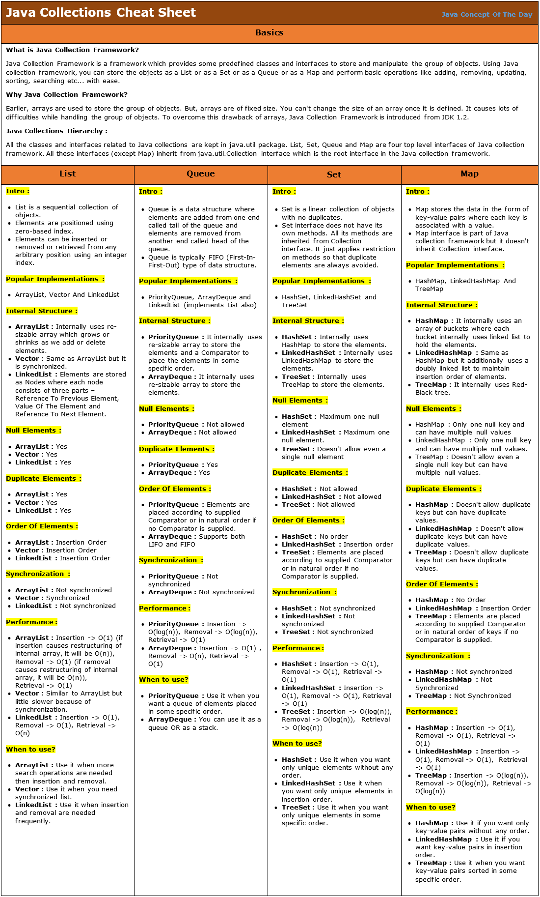

Title: Java Part 3

# Title: Java

### Table of Contents

| Sr No. | Question                                                                                                                                                                                                                                                                                                |
| ------ | ------------------------------------------------------------------------------------------------------------------------------------------------------------------------------------------------------------------------------------------------------------------------------------------------------- |
| 0      | [You have thread T1, T2, and T3, how will you ensure that thread T2 run after T1 and thread T3 run after T2?](https://jcoding09.github.io/interviewprep/module001/module0000/lecture-003.html#-you-have-thread-t1-t2-and-t3-how-will-you-ensure-that-thread-t2-run-after-t1-and-thread-t3-run-after-t2) |
| 1      | [How do you handle an unhandled exception in the thread?](https://jcoding09.github.io/interviewprep/module001/module0000/lecture-003.html#-how-do-you-handle-an-unhandled-exception-in-the-thread)                                                                                                      |
| 2      | [What is the difference between List<? extends T> and List <? super T> ?](https://jcoding09.github.io/interviewprep/module001/module0000/lecture-003.html#-what-is-the-difference-between-list-extends-t-and-list--super-t-)                                                                            |
| 3      | [Can you pass `List<String>` to a method which accepts `List<Object>` ?](https://jcoding09.github.io/interviewprep/module001/module0000/lecture-003.html#-can-you-pass-liststring-to-a-method-which-accepts-listobject-)                                                                                |
| 4      | [Difference between `List<?>` and `List<Object>` in Java?](https://jcoding09.github.io/interviewprep/module001/module0000/lecture-003.html#-difference-between-list-and-listobject-in-java)                                                                                                             |
| 5      | [Can we use Generics with Array?](https://jcoding09.github.io/interviewprep/module001/module0000/lecture-003.html#-can-we-use-generics-with-array)                                                                                                                                                      |
| 6      | [Explain Sealed Classes & Interfaces in Java.](https://jcoding09.github.io/interviewprep/module001/module0000/lecture-003.html#--explain-sealed-classes--interfaces-in-java)                                                                                                                            |
| 7      | [What is Thread in Java?](https://jcoding09.github.io/interviewprep/module001/module0000/lecture-003.html#-what-is-thread-in-java)                                                                                                                                                                      |
| 8      | [What is the difference between Thread and Process in Java?](https://jcoding09.github.io/interviewprep/module001/module0000/lecture-003.html#-what-is-the-difference-between-thread-and-process-in-java)                                                                                                |
| 9      | [How do you implement Thread in Java?](https://jcoding09.github.io/interviewprep/module001/module0000/lecture-003.html#-how-do-you-implement-thread-in-java)                                                                                                                                            |
| 10     | [When to use Runnable vs Thread in Java?](https://jcoding09.github.io/interviewprep/module001/module0000/lecture-003.html#-when-to-use-runnable-vs-thread-in-java)                                                                                                                                      |
| 11     | [What is the difference between start() and run() method of Thread class?](https://jcoding09.github.io/interviewprep/module001/module0000/lecture-003.html#-what-is-the-difference-between-start-and-run-method-of-thread-class)                                                                        |
| 12     | [What is the difference between Runnable and Callable in Java?](https://jcoding09.github.io/interviewprep/module001/module0000/lecture-003.html#-what-is-the-difference-between-runnable-and-callable-in-java)                                                                                          |
| 13     | [What is the difference between CyclicBarrier and CountDownLatch in Java?](https://jcoding09.github.io/interviewprep/module001/module0000/lecture-003.html#-what-is-the-difference-between-cyclicbarrier-and-countdownlatch-in-java)                                                                    |
| 14     | [What is Java Memory model?](https://jcoding09.github.io/interviewprep/module001/module0000/lecture-003.html#-what-is-java-memory-model)                                                                                                                                                                |
| 15     | [What is volatile variable in Java?](https://jcoding09.github.io/interviewprep/module001/module0000/lecture-003.html#-what-is-volatile-variable-in-java)                                                                                                                                                |
| 16     | [What is thread-safety? Is Vector a thread-safe class?](https://jcoding09.github.io/interviewprep/module001/module0000/lecture-003.html#-what-is-thread-safety-is-vector-a-thread-safe-class)                                                                                                           |
| 17     | [What is race condition in Java? Given one example?](https://jcoding09.github.io/interviewprep/module001/module0000/lecture-003.html#-what-is-race-condition-in-java-given-one-example)                                                                                                                 |
| 18     | [How to stop a thread in Java?](https://jcoding09.github.io/interviewprep/module001/module0000/lecture-003.html#-how-to-stop-a-thread-in-java)                                                                                                                                                          |
| 19     | [What happens when an Exception occurs in a thread?](https://jcoding09.github.io/interviewprep/module001/module0000/lecture-003.html#-what-happens-when-an-exception-occurs-in-a-thread)                                                                                                                |
| 20     | [How do you share data between two threads in Java?](https://jcoding09.github.io/interviewprep/module001/module0000/lecture-003.html#-how-do-you-share-data-between-two-threads-in-java)                                                                                                                |
| 21     | [What is the difference between notify and notifyAll in Java?](https://jcoding09.github.io/interviewprep/module001/module0000/lecture-003.html#-what-is-the-difference-between-notify-and-notifyall-in-java)                                                                                            |
| 22     | [Why wait, notify and notifyAll are not inside thread class?](https://jcoding09.github.io/interviewprep/module001/module0000/lecture-003.html#-why-wait-notify-and-notifyall-are-not-inside-thread-class)                                                                                               |
| 23     | [What is ThreadLocal variable in Java?](https://jcoding09.github.io/interviewprep/module001/module0000/lecture-003.html#-what-is-threadlocal-variable-in-java)                                                                                                                                          |
| 24     | [What is FutureTask in Java?](https://jcoding09.github.io/interviewprep/module001/module0000/lecture-003.html#-what-is-futuretask-in-java)                                                                                                                                                              |
| 25     | [What is the difference between the interrupted() and isInterrupted() method in Java?](https://jcoding09.github.io/interviewprep/module001/module0000/lecture-003.html#-what-is-the-difference-between-the-interrupted-and-isinterrupted-method-in-java)                                                |
| 26     | [Why wait and notify method are called from synchronized block?](https://jcoding09.github.io/interviewprep/module001/module0000/lecture-003.html#-why-wait-and-notify-method-are-called-from-synchronized-block)                                                                                        |
| 27     | [Why should you check condition for waiting in a loop?](https://jcoding09.github.io/interviewprep/module001/module0000/lecture-003.html#-why-should-you-check-condition-for-waiting-in-a-loop)                                                                                                          |
| 28     | [What is the difference between synchronized and concurrent collection in Java?](https://jcoding09.github.io/interviewprep/module001/module0000/lecture-003.html#-what-is-the-difference-between-synchronized-and-concurrent-collection-in-java)                                                        |
| 29     | [What is the difference between Stack and Heap in Java?](https://jcoding09.github.io/interviewprep/module001/module0000/lecture-003.html#-what-is-the-difference-between-stack-and-heap-in-java)                                                                                                        |
| 30     | [What is thread pool? Why should you thread pool in Java?](https://jcoding09.github.io/interviewprep/module001/module0000/lecture-003.html#-what-is-thread-pool-why-should-you-thread-pool-in-java)                                                                                                     |
| 31     | [How to avoid Deadlock in Java](https://jcoding09.github.io/interviewprep/module001/module0000/lecture-003.html#-how-to-avoid-deadlock-in-java)                                                                                                                                                         |
| 32     | [How do you check if Thread holds a lock or not in Java?](https://jcoding09.github.io/interviewprep/module001/module0000/lecture-003.html#-how-do-you-check-if-thread-holds-a-lock-or-not-in-java)                                                                                                      |
| 33     | [How do you take Thread dump in Java?](https://jcoding09.github.io/interviewprep/module001/module0000/lecture-003.html#-how-do-you-take-thread-dump-in-java)                                                                                                                                            |
| 34     | [Which JVM parameter is used to control stack size of a Thread?](https://jcoding09.github.io/interviewprep/module001/module0000/lecture-003.html#-which-jvm-parameter-is-used-to-control-stack-size-of-a-thread)                                                                                        |
| 35     | [ReentrantLock vs Synchronized Keyword In Java](https://jcoding09.github.io/interviewprep/module001/module0000/lecture-003.html#-reentrantlock-vs-synchronized-keyword-in-java)                                                                                                                         |
| 36     | [Can we run a thread twice in Java?](https://jcoding09.github.io/interviewprep/module001/module0000/lecture-003.html#-can-we-run-a-thread-twice-in-java)                                                                                                                                                |
| 37     | [Can we start a thread twice in Java?](https://jcoding09.github.io/interviewprep/module001/module0000/lecture-003.html#-can-we-start-a-thread-twice-in-java)                                                                                                                                            |
| 38     | [Next vs hasNext in Java.](https://jcoding09.github.io/interviewprep/module001/module0000/lecture-003.html#-next-vs-hasnext-in-java)                                                                                                                                                                    |
| 39     | [Can you use this() and super() both in a constructor?](https://jcoding09.github.io/interviewprep/module001/module0000/lecture-003.html#-can-you-use-this-and-super-both-in-a-constructor)                                                                                                              |
| 40     | [Can you make a constructor final, static or abstract?](https://jcoding09.github.io/interviewprep/module001/module0000/lecture-003.html#-can-you-make-a-constructor-final-static-or-abstract)                                                                                                           |
| 41     | [Discuss the pros and cons of using the ThreadLocal class in Java for managing thread-local variables.](https://jcoding09.github.io/interviewprep/module001/module0000/lecture-003.html#-discuss-the-pros-and-cons-of-using-the-threadlocal-class-in-java-for-managing-thread-local-variables)          |
| 42     | [What are CompletableFutures in Java, and how do they enable asynchronous programming?](https://jcoding09.github.io/interviewprep/module001/module0000/lecture-003.html#-what-are-completablefutures-in-java-and-how-do-they-enable-asynchronous-programming)                                           |
| 43     | [What do you mean by the statement- Stream is lazy?](https://jcoding09.github.io/interviewprep/module001/module0000/lecture-003.html#-what-do-you-mean-by-the-statement--stream-is-lazy)                                                                                                                |
| 44     | [What does the peek() method do? When should you use it?](https://jcoding09.github.io/interviewprep/module001/module0000/lecture-003.html#-what-does-the-peek-method-do-when-should-you-use-it)                                                                                                         |
| 45     | [Java Collections automatic reallocation(ensureCapacity) details when size is reached](https://jcoding09.github.io/interviewprep/module001/module0000/lecture-003.html#-what-does-the-peek-method-do-when-should-you-use-it)                                                                            |
| 46     | [Java collections interface and class mindmap?](https://jcoding09.github.io/interviewprep/module001/module0000/lecture-003.html#-what-does-the-peek-method-do-when-should-you-use-it)                                                                                                                   |
| 47     | [Explain Optional class and Functional interface](https://jcoding09.github.io/interviewprep/module001/module0000/lecture-003.html#-what-does-the-peek-method-do-when-should-you-use-it)                                                                                                                 |
| 48     | [Use case of Functional interface](https://jcoding09.github.io/interviewprep/module001/module0000/lecture-003.html#-what-does-the-peek-method-do-when-should-you-use-it)                                                                                                                                |

## \*. You have thread T1, T2, and T3, how will you ensure that thread T2 run after T1 and thread T3 run after T2?

To ensure that thread T2 runs after T1 and thread T3 runs after T2, you can use the `join()` method. This method allows one thread to wait for the completion of another.

```java
public class ThreadExecutionOrder {
    public static void main(String[] args) {
        Thread t1 = new Thread(() -> {
            System.out.println("Thread T1 is running");
        });

        Thread t2 = new Thread(() -> {
            try {
                t1.join(); // T2 waits for T1 to finish
            } catch (InterruptedException e) {
                e.printStackTrace();
            }
            System.out.println("Thread T2 is running");
        });

        Thread t3 = new Thread(() -> {
            try {
                t2.join(); // T3 waits for T2 to finish
            } catch (InterruptedException e) {
                e.printStackTrace();
            }
            System.out.println("Thread T3 is running");
        });

        t1.start();
        t2.start();
        t3.start();
    }
}
```

## \*. How do you handle an unhandled exception in the thread?

You can set an `UncaughtExceptionHandler` for a thread to handle uncaught exceptions.

```java
public class UnhandledException {
    public static void main(String[] args) {
        Thread thread = new Thread(() -> {
            throw new RuntimeException("An unhandled exception");
        });

        thread.setUncaughtExceptionHandler((t, e) -> {
            System.out.println("Caught exception from thread: " + t.getName() + " - " + e.getMessage());
        });

        thread.start();
    }
}
```

## \*. What is the difference between `List<? extends T>` and `List <? super T>` ?

- `List<? extends T>`: A list of objects that are instances of T or its subclasses. You can read from the list, but you cannot add to it (except `null`).

- `List<? super T>`: A list of objects that are instances of T or its superclasses. You can add instances of T or its subclasses to the list, but reading from it only returns `Object`.

## \*. Can you pass `List<String>` to a method which accepts `List<Object>` ?

No, you cannot pass `List<String>` to a method that accepts `List<Object>` because of type safety. Generics are invariant in Java.

```java
public class GenericExample {
    public static void main(String[] args) {
        List<String> stringList = new ArrayList<>();
        // methodAcceptingObjectList(stringList); // This will cause a compile-time error
    }

    public static void methodAcceptingObjectList(List<Object> list) {
        // Implementation
    }
}
```

## \*. Difference between `List<?>` and `List<Object>` in Java?

- `List<?>`: A list of unknown type. You can only read from the list, but cannot add to it (except `null`).

- `List<Object>`: A list that can hold any type of objects. You can both read from and add to the list.

## \*. Can we use Generics with Array?

You cannot create generic arrays directly in Java due to type erasure. However, you can use `List` or other generic collections instead.

```java
// This will cause a compile-time error
// T[] array = new T[10];

// You can use ArrayList instead
List<T> list = new ArrayList<>();
```

## \*. Explain Sealed Classes & Interfaces in Java.

Sealed classes and interfaces restrict which classes can extend or implement them. Introduced in Java 15 as a preview feature and standardized in Java 17.

```java
sealed class Shape permits Circle, Square {
}

final class Circle extends Shape {
}

final class Square extends Shape {
}

public class SealedClassExample {
    public static void main(String[] args) {
        Shape shape1 = new Circle();
        Shape shape2 = new Square();
        System.out.println(shape1 instanceof Circle); // true
        System.out.println(shape2 instanceof Square); // true
    }
}
```

In this example, only `Circle` and `Square` are permitted to extend `Shape`. Any attempt to extend `Shape` by another class will result in a compilation error.

To provide answers to the questions along with Java code snippets, let's go through each question from the provided image and offer a detailed explanation and corresponding code.

## \*. What is Thread in Java?

A `Thread` in Java is a lightweight process. It is the smallest unit of a process that can run concurrently with other threads.

```java
public class MyThread extends Thread {
    public void run() {
        System.out.println("Thread is running...");
    }

    public static void main(String[] args) {
        MyThread t = new MyThread();
        t.start();
    }
}
```

## \*. What is the difference between Thread and Process in Java?

A `Process` is an instance of a program that runs independently and isolated from other processes, while a `Thread` is a subset of the process that runs in shared memory space.

```java
// Example code not required as this is a conceptual explanation
```

## \*. How do you implement Thread in Java?

Threads can be implemented by either extending the `Thread` class or implementing the `Runnable` interface.

```java
// Extending Thread class
class MyThread extends Thread {
    public void run() {
        System.out.println("Thread is running...");
    }
}

public class TestThread {
    public static void main(String[] args) {
        MyThread t1 = new MyThread();
        t1.start();
    }
}

// Implementing Runnable interface
class MyRunnable implements Runnable {
    public void run() {
        System.out.println("Thread is running...");
    }
}

public class TestRunnable {
    public static void main(String[] args) {
        Thread t2 = new Thread(new MyRunnable());
        t2.start();
    }
}
```

## \*. When to use Runnable vs Thread in Java?

Use `Runnable` when you want to share the same task across multiple threads or when your class already extends another class.

```java
// Runnable example provided above
```

## \*. What is the difference between start() and run() method of Thread class?

The `start()` method creates a new thread and executes the `run()` method in that new thread, while `run()` method just executes in the current thread.

```java
class MyThread extends Thread {
    public void run() {
        System.out.println("Running in thread: " + Thread.currentThread().getName());
    }

    public static void main(String[] args) {
        MyThread t1 = new MyThread();
        t1.run();  // This will run in the main thread
        t1.start(); // This will run in a new thread
    }
}
```

## \*. What is the difference between Runnable and Callable in Java?

`Runnable` is a functional interface that returns void, while `Callable` returns a result and can throw a checked exception.

```java
import java.util.concurrent.Callable;
import java.util.concurrent.FutureTask;

class MyCallable implements Callable<Integer> {
    public Integer call() {
        return 123;
    }
}

public class TestCallable {
    public static void main(String[] args) throws Exception {
        MyCallable callable = new MyCallable();
        FutureTask<Integer> futureTask = new FutureTask<>(callable);
        Thread t = new Thread(futureTask);
        t.start();
        System.out.println(futureTask.get()); // Output will be 123
    }
}
```

## \*. What is the difference between CyclicBarrier and CountDownLatch in Java?

`CountDownLatch` is used for a single event while `CyclicBarrier` can be used for multiple events.

```java
import java.util.concurrent.CountDownLatch;
import java.util.concurrent.CyclicBarrier;

public class TestSynchronization {
    public static void main(String[] args) throws InterruptedException {
        // CountDownLatch example
        CountDownLatch latch = new CountDownLatch(3);
        Runnable task = () -> {
            latch.countDown();
            System.out.println("Counted down");
        };
        new Thread(task).start();
        new Thread(task).start();
        new Thread(task).start();
        latch.await();
        System.out.println("All tasks completed");

        // CyclicBarrier example
        CyclicBarrier barrier = new CyclicBarrier(3, () -> System.out.println("Barrier reached"));
        Runnable barrierTask = () -> {
            try {
                barrier.await();
                System.out.println("Barrier released");
            } catch (Exception e) {
                e.printStackTrace();
            }
        };
        new Thread(barrierTask).start();
        new Thread(barrierTask).start();
        new Thread(barrierTask).start();
    }
}
```

## \*. What is Java Memory model?

The Java Memory Model (JMM) defines how threads interact through memory and what behaviors are allowed in concurrent executions.

```java
// Conceptual explanation; code example not required
```

## \*. What is volatile variable in Java?

A `volatile` variable ensures visibility of changes to variables across threads.

```java
public class VolatileExample {
    private volatile boolean flag = true;

    public void run() {
        while (flag) {
            // Busy-wait loop
        }
        System.out.println("Flag changed");
    }

    public void stop() {
        flag = false;
    }

    public static void main(String[] args) throws InterruptedException {
        VolatileExample example = new VolatileExample();
        new Thread(example::run).start();
        Thread.sleep(1000);
        example.stop();
    }
}
```

## \*. What is thread-safety? Is Vector a thread-safe class?

Thread-safety means that a class or method can be used by multiple threads concurrently without causing problems. Yes, `Vector` is a thread-safe class.

```java
// Vector is synchronized, making it thread-safe
import java.util.Vector;

public class TestVector {
    public static void main(String[] args) {
        Vector<Integer> vector = new Vector<>();
        vector.add(1);
        vector.add(2);
        vector.add(3);
        System.out.println("Vector: " + vector);
    }
}
```

## \*. What is race condition in Java? Given one example?

A race condition occurs when two or more threads can access shared data and they try to change it at the same time.

```java
public class RaceConditionExample {
    private int count = 0;

    public void increment() {
        count++;
    }

    public static void main(String[] args) {
        RaceConditionExample example = new RaceConditionExample();
        Runnable task = () -> {
            for (int i = 0; i < 1000; i++) {
                example.increment();
            }
        };
        Thread t1 = new Thread(task);
        Thread t2 = new Thread(task);
        t1.start();
        t2.start();
        try {
            t1.join();
            t2.join();
        } catch (InterruptedException e) {
            e.printStackTrace();
        }
        System.out.println("Final count: " + example.count); // Expected 2000 but result may vary
    }
}
```

## \*. How to stop a thread in Java?

You can stop a thread in Java using a boolean flag.

```java
public class StopThreadExample {
    private volatile boolean running = true;

    public void run() {
        while (running) {
            System.out.println("Running");
            try {
                Thread.sleep(100);
            } catch (InterruptedException e) {
                Thread.currentThread().interrupt();
            }
        }
    }

    public void stop() {
        running = false;
    }

    public static void main(String[] args) throws InterruptedException {
        StopThreadExample example = new StopThreadExample();
        Thread t = new Thread(example::run);
        t.start();
        Thread.sleep(500);
        example.stop();
    }
}
```

## \*. What happens when an Exception occurs in a thread?

When an exception occurs in a thread, it will terminate unless the exception is caught and handled.

```java
public class ExceptionThreadExample {
    public static void main(String[] args) {
        Thread t = new Thread(() -> {
            try {
                throw new RuntimeException("Thread exception");
            } catch (Exception e) {
                System.out.println("Caught exception: " + e.getMessage());
            }
        });
        t.start();
    }
}
```

## \*. How do you share data between two threads in Java?

You can share data between threads using shared objects or data structures.

```java
public class SharedDataExample {
    private int counter = 0;

    public synchronized void increment() {
        counter++;
    }

    public static void main(String[] args) {
        SharedDataExample example = new SharedDataExample();
        Runnable task = () -> {
            for (int i = 0; i < 1000; i++) {
                example.increment();
            }
        };
        Thread t1 = new Thread(task);
        Thread t2 = new Thread(task);
        t1.start();
        t2.start();
        try {
            t1.join();
            t2.join();
        } catch (InterruptedException e) {
            e.printStackTrace();
        }
        System.out.println("Final counter: " + example.counter); // Should be 2000
    }
}
```

## \*. What is the difference between notify and notifyAll in Java?

`notify` wakes up one waiting thread, while `notifyAll` wakes up all waiting threads.

```java
public class NotifyExample {
    private final Object lock = new Object();

    public void doWait() {
        synchronized (lock) {
            try {
                System.out.println("Waiting");
                lock.wait();
                System.out.println("Woken up");
            } catch (InterruptedException e) {
                Thread.currentThread().interrupt();
            }
        }
    }

    public void doNotify

() {
        synchronized (lock) {
            System.out.println("Notifying one");
            lock.notify(); // or lock.notifyAll();
        }
    }

    public static void main(String[] args) throws InterruptedException {
        NotifyExample example = new NotifyExample();
        Thread t1 = new Thread(example::doWait);
        Thread t2 = new Thread(example::doWait);
        t1.start();
        t2.start();
        Thread.sleep(1000);
        example.doNotify();
    }
}
```

## \*. Why wait, notify and notifyAll are not inside thread class?

`wait`, `notify`, and `notifyAll` are part of the `Object` class because they are meant to be used on shared objects.

## \*. What is ThreadLocal variable in Java?

A `ThreadLocal` variable provides thread-local variables where each thread accessing such a variable has its own independently initialized copy.

```java
public class ThreadLocalExample {
    private static final ThreadLocal<Integer> threadLocal = ThreadLocal.withInitial(() -> 1);

    public static void main(String[] args) {
        Runnable task = () -> {
            int value = threadLocal.get();
            System.out.println("Initial value: " + value);
            threadLocal.set(value + 1);
            System.out.println("Updated value: " + threadLocal.get());
        };
        Thread t1 = new Thread(task);
        Thread t2 = new Thread(task);
        t1.start();
        t2.start();
    }
}
```

## \*. What is FutureTask in Java?

`FutureTask` represents a cancellable asynchronous computation. It can be used to wrap `Callable` or `Runnable` objects.

```java
import java.util.concurrent.Callable;
import java.util.concurrent.FutureTask;

public class FutureTaskExample {
    public static void main(String[] args) throws Exception {
        Callable<Integer> callable = () -> {
            Thread.sleep(1000);
            return 42;
        };

        FutureTask<Integer> futureTask = new FutureTask<>(callable);
        Thread t = new Thread(futureTask);
        t.start();
        System.out.println("Result: " + futureTask.get()); // Outputs 42 after 1 second
    }
}
```

## \*. What is the difference between the interrupted() and isInterrupted() method in Java?

`interrupted()` checks the interrupt status of the current thread and clears it, while `isInterrupted()` checks the interrupt status of any thread without clearing it.

```java
public class InterruptExample {
    public static void main(String[] args) {
        Thread t = new Thread(() -> {
            while (!Thread.currentThread().isInterrupted()) {
                System.out.println("Running");
            }
            System.out.println("Thread interrupted status: " + Thread.interrupted());
        });
        t.start();
        try {
            Thread.sleep(1000);
            t.interrupt();
        } catch (InterruptedException e) {
            e.printStackTrace();
        }
    }
}
```

## \*. Why wait and notify method are called from synchronized block?

`wait` and `notify` must be called from within a synchronized block to ensure that the current thread holds the lock on the object before calling these methods.

```java
// Conceptual explanation; code example included in NotifyExample
```

## \*. Why should you check condition for waiting in a loop?

To avoid spurious wakeups, it's essential to check the waiting condition in a loop.

```java
public class SpuriousWakeupExample {
    private final Object lock = new Object();
    private boolean condition = false;

    public void waitForCondition() {
        synchronized (lock) {
            while (!condition) { // Check in a loop
                try {
                    lock.wait();
                } catch (InterruptedException e) {
                    Thread.currentThread().interrupt();
                }
            }
            System.out.println("Condition met");
        }
    }

    public void setCondition() {
        synchronized (lock) {
            condition = true;
            lock.notifyAll();
        }
    }

    public static void main(String[] args) throws InterruptedException {
        SpuriousWakeupExample example = new SpuriousWakeupExample();
        new Thread(example::waitForCondition).start();
        Thread.sleep(1000);
        example.setCondition();
    }
}
```

## \*. What is the difference between synchronized and concurrent collection in Java?

Synchronized collections are thread-safe but have a single lock for the entire collection, leading to contention. Concurrent collections, like `ConcurrentHashMap`, use finer-grained locking for better scalability.

```java
import java.util.Collections;
import java.util.HashMap;
import java.util.Map;
import java.util.concurrent.ConcurrentHashMap;

public class CollectionExample {
    public static void main(String[] args) {
        Map<String, String> syncMap = Collections.synchronizedMap(new HashMap<>());
        syncMap.put("key1", "value1");
        syncMap.put("key2", "value2");

        ConcurrentHashMap<String, String> concurrentMap = new ConcurrentHashMap<>();
        concurrentMap.put("key1", "value1");
        concurrentMap.put("key2", "value2");

        System.out.println("Synchronized Map: " + syncMap);
        System.out.println("Concurrent Map: " + concurrentMap);
    }
}
```

## \*. What is the difference between Stack and Heap in Java?

The stack is used for static memory allocation and method execution, while the heap is used for dynamic memory allocation for objects at runtime.

```java
// Conceptual explanation; code example not required
```

## \*. What is thread pool? Why should you thread pool in Java?

A thread pool manages a set of reusable threads (pool of worker threads ) for executing tasks. It improves performance by reducing the overhead associated with creating and destroying threads.

#### Why use a thread pool?

- **Resource Management**: Reuses a fixed number of threads, managing system resources efficiently.
- **Improved Performance**: Reduces the latency associated with thread creation.
- **Simplified Concurrency**: Provides a higher-level API for executing tasks concurrently.

#### Example using `ExecutorService`:

```java
import java.util.concurrent.ExecutorService;
import java.util.concurrent.Executors;

public class ThreadPoolExample {
    public static void main(String[] args) {
        // Create a thread pool with 3 threads
        ExecutorService executor = Executors.newFixedThreadPool(3);

        // Submit 5 tasks to the thread pool
        for (int i = 0; i < 5; i++) {
            executor.submit(() -> {
                String threadName = Thread.currentThread().getName();
                System.out.println("Thread name: " + threadName);
                try {
                    // Simulate some work with Thread.sleep
                    Thread.sleep(1000);
                } catch (InterruptedException e) {
                    Thread.currentThread().interrupt();
                }
                System.out.println("Completed: " + threadName);
            });
        }

        // Shut down the executor service
        executor.shutdown();
    }
}
```

#### Explanation:

- **ExecutorService**: Interface that represents a pool of threads.
- **Executors.newFixedThreadPool(int nThreads)**: Creates a thread pool with a fixed number of threads.
- **executor.submit(Runnable task)**: Submits a task for execution.
- **executor.shutdown()**: Initiates an orderly shutdown where previously submitted tasks are executed, but no new tasks will be accepted.

## \*. How to avoid Deadlock in Java

Deadlocks occur when two or more threads are blocked forever, waiting for each other. To avoid deadlock, you can follow several strategies:

#### 1 Avoid Nested Locks

Avoid acquiring multiple locks if possible. If you must, always acquire the locks in the same order.

```java
class A {
    synchronized void methodA(B b) {
        System.out.println("Thread 1 starts execution of methodA");
        b.last();
    }

    synchronized void last() {
        System.out.println("Inside A.last()");
    }
}

class B {
    synchronized void methodB(A a) {
        System.out.println("Thread 2 starts execution of methodB");
        a.last();
    }

    synchronized void last() {
        System.out.println("Inside B.last()");
    }
}

public class AvoidDeadlock implements Runnable {
    A a = new A();
    B b = new B();

    AvoidDeadlock() {
        Thread t = new Thread(this);
        t.start();
        a.methodA(b); // main thread
    }

    public void run() {
        b.methodB(a); // child thread
    }

    public static void main(String[] args) {
        new AvoidDeadlock();
    }
}
```

#### 2 Use `tryLock` with Timeout

Use `ReentrantLock` with `tryLock` to avoid waiting indefinitely.

```java
import java.util.concurrent.locks.Lock;
import java.util.concurrent.locks.ReentrantLock;

public class AvoidDeadlockWithTryLock {
    private final Lock lock1 = new ReentrantLock();
    private final Lock lock2 = new ReentrantLock();

    public void method1() {
        try {
            if (lock1.tryLock() && lock2.tryLock()) {
                // Critical section
            }
        } finally {
            lock1.unlock();
            lock2.unlock();
        }
    }

    public void method2() {
        try {
            if (lock2.tryLock() && lock1.tryLock()) {
                // Critical section
            }
        } finally {
            lock2.unlock();
            lock1.unlock();
        }
    }
}
```

## \*. How do you check if Thread holds a lock or not in Java.

The `Thread` class does not provide a direct method to check if a thread holds a lock. However, you can use `ReentrantLock` to check if the current thread holds the lock.

```java
import java.util.concurrent.locks.ReentrantLock;

public class CheckLock {
    private final ReentrantLock lock = new ReentrantLock();

    public void checkLock() {
        lock.lock();
        try {
            // Check if current thread holds the lock
            if (lock.isHeldByCurrentThread()) {
                System.out.println("Current thread holds the lock");
            }
        } finally {
            lock.unlock();
        }
    }

    public static void main(String[] args) {
        CheckLock example = new CheckLock();
        example.checkLock();
    }
}
```

## \*. How do you take Thread dump in Java.

A thread dump provides a snapshot of all the threads running in a JVM. You can take a thread dump in several ways:

#### 1 Using `jstack` Command

Use the `jstack` command-line utility to get a thread dump.

```sh
jstack <pid>
```

Replace `<pid>` with the process ID of your Java application.

#### 2 Using `jvisualvm`

You can also use the `jvisualvm` tool, which provides a graphical interface to take a thread dump.

#### 3 Programmatically

You can use `ThreadMXBean` to take a thread dump programmatically.

```java
import java.lang.management.ManagementFactory;
import java.lang.management.ThreadInfo;
import java.lang.management.ThreadMXBean;

public class ThreadDump {
    public static void main(String[] args) {
        ThreadMXBean threadMxBean = ManagementFactory.getThreadMXBean();
        ThreadInfo[] threadInfos = threadMxBean.dumpAllThreads(true, true);
        for (ThreadInfo threadInfo : threadInfos) {
            System.out.println(threadInfo.toString());
        }
    }
}
```

## \*. Which JVM parameter is used to control stack size of a Thread.

You can control the stack size of a thread using the `-Xss` JVM parameter.

```sh
java -Xss512k MyClass
```

This sets the stack size of each thread to 512 kilobytes.

## \*. ReentrantLock vs Synchronized Keyword In Java.

#### Synchronized Keyword

- Implicit lock mechanism.
- Block-structured: lock is acquired and released automatically.
- Simpler to use.
- No explicit timeout.

```java
public class SynchronizedExample {
    public synchronized void syncMethod() {
        // Critical section
    }
}
```

#### ReentrantLock

- Explicit lock mechanism.
- More flexible: allows explicit lock and unlock, as well as tryLock with timeout.
- Can be fair (first-come, first-served).
- Supports multiple conditions.

```java
import java.util.concurrent.locks.Lock;
import java.util.concurrent.locks.ReentrantLock;

public class ReentrantLockExample {
    private final Lock lock = new ReentrantLock();

    public void lockMethod() {
        lock.lock();
        try {
            // Critical section
        } finally {
            lock.unlock();
        }
    }
}
```

## \*. Can we run a thread twice in Java?

- Yes, when you call the run() method, it doesn't create a new thread. The run() method is treated as a normal method and pushed into the main stack, so the main thread would execute it. So, it's not multi-threading.

## \*. Can we start a thread twice in Java?

- No, Thread can only start once. If you try to start it for a second time, it will throw an exception, i.e., `java.lang.IllegalThreadStateException`.

## \*. Next vs hasNext in Java.

- hasNext() : hasNext() method returns true if iterator have more elements.

- next() : next() method returns the next element and also moves cursor pointer to the next element.

## \*. Can you use this() and super() both in a constructor?

- Both this() and super() can not be used together in constructor.

`super()`- calls the base class constructor whereas
`this()`- calls current class constructor.

- Both this() and super() are constructor calls.

- Constructor call must always be the first statement. So you either have super() or this() as first statement.

## \*. Can you make a constructor final, static or abstract?

When you set a method as `final` it means: "I don't want any class override it." But according to the Java Language Specification: JLS 8.8 - "Constructor declarations are not members. They are never inherited and therefore are not subject to hiding or overriding."

When you set a method as `static` it means: "This method belongs to the class, not a particular object." But the constructor is implicitly called to initialize an object, so there is no purpose in having a static constructor.

When you set a method as `abstract` it means: "This method doesn't have a body and it should be implemented in a child class." But the constructor is called implicitly when the new keyword is used so it can't lack a body.

Constructors aren't inherited so can't be overridden so no use to have `final` constructor

Constructor is called automatically when an instance of the class is created, it has access to instance fields of the class. so no use to have `static` constructor.

Constructor can't be overridden so no use to have an `abstract` constructor.

Let's go through each question and provide a Java code snippet where appropriate to illustrate the concepts.

## \*. Discuss the pros and cons of using the ThreadLocal class in Java for managing thread-local variables.

**Pros:**

- **Thread Safety:** Each thread has its own isolated copy of a ThreadLocal variable, eliminating the need for synchronization.
- **Encapsulation:** Useful for managing per-thread data such as user sessions or transaction contexts.
- **Performance:** Reduces the contention between threads since no sharing of variables occurs.

**Cons:**

- **Memory Leaks:** Can lead to memory leaks if not managed properly, especially in the case of thread pools where threads are reused.
- **Complexity:** May add to the complexity of the codebase and make it harder to reason about the flow of data.
- **Debugging Difficulty:** Debugging thread-local variables can be challenging due to their isolated nature.

**Java Code Snippet:**

```java
public class ThreadLocalExample {
    private static final ThreadLocal<Integer> threadLocal = ThreadLocal.withInitial(() -> 1);

    public static void main(String[] args) {
        Runnable task = () -> {
            int value = threadLocal.get();
            System.out.println(Thread.currentThread().getName() + " initial value: " + value);
            threadLocal.set(value + 1);
            System.out.println(Thread.currentThread().getName() + " updated value: " + threadLocal.get());
        };

        Thread thread1 = new Thread(task);
        Thread thread2 = new Thread(task);

        thread1.start();
        thread2.start();
    }
}
```

## \*. What are CompletableFutures in Java, and how do they enable asynchronous programming?

**CompletableFuture** is part of the Java `java.util.concurrent` package and provides a way to handle asynchronous programming. It represents a future result of an asynchronous computation and provides methods to handle the result once it's available, chain multiple computations, and handle errors.

**Java Code Snippet:**

```java
import java.util.concurrent.CompletableFuture;
import java.util.concurrent.ExecutionException;

public class CompletableFutureExample {
    public static void main(String[] args) throws InterruptedException, ExecutionException {
        CompletableFuture<String> future = CompletableFuture.supplyAsync(() -> {
            // Simulate a long-running task
            try {
                Thread.sleep(1000);
            } catch (InterruptedException e) {
                throw new IllegalStateException(e);
            }
            return "Hello, World!";
        });

        // Attach a callback to be executed when the future is completed
        future.thenAccept(result -> {
            System.out.println("Result: " + result);
        });

        // Wait for the future to complete
        future.get();
    }
}
```

## \*. What do you mean by the statement- Stream is lazy?

Streams in Java are lazy because they do not process data until a terminal operation is invoked. Intermediate operations (like `map`, `filter`, etc.) are only executed when a terminal operation (like `collect`, `forEach`, etc.) is called.

**Java Code Snippet:**

```java
import java.util.Arrays;
import java.util.List;

public class StreamLazinessExample {
    public static void main(String[] args) {
        List<String> names = Arrays.asList("Alice", "Bob", "Charlie");

        // Intermediate operations are not executed yet
        names.stream()
                .filter(name -> {
                    System.out.println("Filtering: " + name);
                    return name.startsWith("A");
                })
                .map(name -> {
                    System.out.println("Mapping: " + name);
                    return name.toUpperCase();
                });

        System.out.println("No terminal operation yet.");

        // Terminal operation triggers processing
        names.stream()
                .filter(name -> {
                    System.out.println("Filtering: " + name);
                    return name.startsWith("A");
                })
                .map(name -> {
                    System.out.println("Mapping: " + name);
                    return name.toUpperCase();
                })
                .forEach(name -> System.out.println("Final Result: " + name));
    }
}
```

## \*. What does the peek() method do? When should you use it?

The `peek()` method in Java Streams is an intermediate operation that allows you to perform a side-effect action (such as logging) on each element as it is processed. It is primarily used for debugging purposes to see the contents of the stream at various points.

**Java Code Snippet:**

```java
import java.util.Arrays;
import java.util.List;

public class StreamPeekExample {
    public static void main(String[] args) {
        List<String> names = Arrays.asList("Alice", "Bob", "Charlie");

        names.stream()
                .filter(name -> name.startsWith("A"))
                .peek(name -> System.out.println("Filtered: " + name))
                .map(String::toUpperCase)
                .peek(name -> System.out.println("Mapped: " + name))
                .forEach(name -> System.out.println("Final Result: " + name));
    }
}
```

**When to use `peek()`:**

- Use `peek()` when you want to inspect the elements of the stream at a certain point in the pipeline, usually for debugging purposes.
- Avoid using `peek()` for anything that alters the state or relies on side-effects as it goes against the functional programming paradigm.

## \*. Java Collections automatic reallocation(ensureCapacity) details when size is reached

### 1. **ArrayList**

- **Initial Capacity**: By default, the initial capacity of an `ArrayList` is 10.
- **Resize Behavior**: When an `ArrayList` needs to grow, it increases its size by approximately 50%.
- **Example**: If the current capacity is `n`, it will be increased to `n + (n >> 1)` (which is equivalent to 1.5 times the current capacity).

### 2. **HashMap**

- **Initial Capacity**: The default initial capacity of a `HashMap` is 16.
- **Resize Behavior**: When a `HashMap` is resized, its capacity is doubled.
- **Load Factor**: The default load factor is 0.75, meaning the `HashMap` will resize when the number of entries exceeds 75% of the current capacity.
- **Example**: If the current capacity is `n`, it will be increased to `2 * n`.

### 3. **HashSet**

- **Initial Capacity**: The default initial capacity of a `HashSet` is 16.
- **Resize Behavior**: Similar to `HashMap`, a `HashSet` doubles its capacity when it exceeds the load factor threshold.
- **Load Factor**: The default load factor is also 0.75.
- **Example**: If the current capacity is `n`, it will be increased to `2 * n`.

### 4. **LinkedList**

- `LinkedList` does not have a predefined capacity or resizing mechanism as it is a doubly linked list. It grows dynamically with each addition.

### 5. **Vector**

- **Initial Capacity**: By default, the initial capacity of a `Vector` is 10.
- **Resize Behavior**: When a `Vector` needs to grow, it doubles its size by default.
- **Example**: If the current capacity is `n`, it will be increased to `2 * n`.

### 6. **Stack**

- `Stack` extends `Vector` and hence inherits its resizing behavior.

### 7. **TreeMap** and **TreeSet**

- These collections are based on Red-Black Trees and do not require resizing because they do not use an underlying array structure. Their growth depends on the tree node insertions and balancing operations.

### Summary Table

| Collection Type | Initial Capacity | Resize Increase Percentage |
| --------------- | ---------------- | -------------------------- |
| ArrayList       | 10               | 50%                        |
| HashMap         | 16               | 100%                       |
| HashSet         | 16               | 100%                       |
| LinkedList      | Dynamic          | N/A                        |
| Vector          | 10               | 100%                       |
| Stack           | 10               | 100%                       |
| TreeMap         | N/A              | N/A                        |
| TreeSet         | N/A              | N/A                        |

Note: The actual resizing behavior can be influenced by custom constructors or initial capacity settings provided during instantiation.

| Collection Type | Default Load Factor | Resize Percentage |
| --------------- | ------------------- | ----------------- |
| **ArrayList**   | N/A                 | 50% (1.5x)        |
| **HashMap**     | 0.75                | 100% (2x)         |
| **HashSet**     | 0.75                | 100% (2x)         |
| **LinkedList**  | N/A                 | N/A               |
| **Vector**      | N/A                 | 100% (2x)         |
| **Stack**       | N/A                 | 100% (2x)         |
| **TreeMap**     | N/A                 | N/A               |
| **TreeSet**     | N/A                 | N/A               |

## \*. Java collections interface and class mindmap



## \*. Explain Optional class and Functional interface

### Java `Optional` Class

The `Optional` class in Java, introduced in Java 8, is a container that may or may not hold a non-null value. It is used to represent the presence or absence of a value and to avoid `NullPointerException`. `Optional` is often used to handle null values in a more explicit and readable way.

#### Common Methods of `Optional`

1. **Creation**

   - `Optional.of(value)`: Creates an `Optional` with the given non-null value.
   - `Optional.ofNullable(value)`: Creates an `Optional` that can hold a null value.
   - `Optional.empty()`: Creates an empty `Optional`.

2. **Checking Value Presence**

   - `isPresent()`: Returns `true` if the value is present, `false` otherwise.
   - `ifPresent(Consumer<? super T> action)`: Executes the given action if a value is present.

3. **Retrieving the Value**

   - `get()`: Returns the value if present; otherwise, throws `NoSuchElementException`.
   - `orElse(T other)`: Returns the value if present; otherwise, returns the provided default value.
   - `orElseGet(Supplier<? extends T> other)`: Returns the value if present; otherwise, invokes the provided supplier and returns the result.
   - `orElseThrow(Supplier<? extends X> exceptionSupplier)`: Returns the value if present; otherwise, throws an exception created by the provided supplier.

4. **Transforming the Value**
   - `map(Function<? super T, ? extends U> mapper)`: Applies the provided function to the value if present and returns an `Optional` with the result.
   - `flatMap(Function<? super T, Optional<U>> mapper)`: Applies the provided function to the value if present and returns the result.

#### Example Usage

```java
import java.util.Optional;

public class OptionalExample {
    public static void main(String[] args) {
        // Creating Optional objects
        Optional<String> optionalValue = Optional.of("Hello, World!");
        Optional<String> emptyOptional = Optional.empty();
        Optional<String> nullableOptional = Optional.ofNullable(null);

        // Checking value presence
        if (optionalValue.isPresent()) {
            System.out.println(optionalValue.get());
        }

        // Using ifPresent to avoid null checks
        optionalValue.ifPresent(System.out::println);

        // Providing a default value
        System.out.println(nullableOptional.orElse("Default Value"));

        // Throwing an exception if value is not present
        try {
            emptyOptional.orElseThrow(() -> new IllegalStateException("Value is missing!"));
        } catch (Exception e) {
            System.out.println(e.getMessage());
        }

        // Transforming the value
        Optional<Integer> length = optionalValue.map(String::length);
        length.ifPresent(System.out::println);
    }
}
```

### Functional Interfaces

Functional interfaces are interfaces with a single abstract method. They provide target types for lambda expressions and method references. Java 8 introduced several built-in functional interfaces in the `java.util.function` package.

#### Common Functional Interfaces

1. **Consumer<T>**: Represents an operation that takes a single input argument and returns no result.

   - Method: `void accept(T t)`

2. **Supplier<T>**: Represents a supplier of results.

   - Method: `T get()`

3. **Function<T, R>**: Represents a function that takes one argument and produces a result.

   - Method: `R apply(T t)`

4. **Predicate<T>**: Represents a predicate (boolean-valued function) of one argument.

   - Method: `boolean test(T t)`

5. **UnaryOperator<T>**: Represents an operation on a single operand that produces a result of the same type as its operand.

   - Method: `T apply(T t)`

6. **BinaryOperator<T>**: Represents an operation upon two operands of the same type, producing a result of the same type as the operands.
   - Method: `T apply(T t1, T t2)`

#### Example Usage

```java
import java.util.function.*;

public class FunctionalInterfaceExample {
    public static void main(String[] args) {
        // Using a Consumer
        Consumer<String> consumer = System.out::println;
        consumer.accept("Hello, Consumer!");

        // Using a Supplier
        Supplier<String> supplier = () -> "Hello, Supplier!";
        System.out.println(supplier.get());

        // Using a Function
        Function<String, Integer> function = String::length;
        System.out.println(function.apply("Hello, Function!"));

        // Using a Predicate
        Predicate<String> predicate = s -> s.isEmpty();
        System.out.println(predicate.test("Hello, Predicate!"));

        // Using a UnaryOperator
        UnaryOperator<String> unaryOperator = s -> s.toUpperCase();
        System.out.println(unaryOperator.apply("Hello, UnaryOperator!"));

        // Using a BinaryOperator
        BinaryOperator<String> binaryOperator = (s1, s2) -> s1 + s2;
        System.out.println(binaryOperator.apply("Hello, ", "BinaryOperator!"));
    }
}
```

### Use Case: Combining `Optional` and Functional Interfaces

A practical use case of combining `Optional` with functional interfaces is in streamlining operations that might return null values. For example, fetching a user's email address and then sending a welcome email if the address is present:

```java
import java.util.Optional;
import java.util.function.Consumer;

public class OptionalWithFunctionalInterface {
    public static void main(String[] args) {
        User user = new User("john.doe@example.com");
        sendWelcomeEmail(user);
    }

    static void sendWelcomeEmail(User user) {
        Optional.ofNullable(user.getEmail())
                .ifPresent(sendEmail);
    }

    static Consumer<String> sendEmail = email -> {
        // Simulate sending email
        System.out.println("Sending welcome email to " + email);
    };

    static class User {
        private String email;

        User(String email) {
            this.email = email;
        }

        public String getEmail() {
            return email;
        }
    }
}
```

## \*. Use case of Functional interface

Using a functional interface instead of a normal interface in Java has several advantages, particularly in the context of functional programming introduced in Java 8. Here are some key reasons why functional interfaces are preferred in many scenarios:

### 1. **Lambda Expressions and Method References**

Functional interfaces are designed to be implemented using lambda expressions and method references, which provide a more concise and readable way to express instances of single-method interfaces.

#### Example

**With a normal interface:**

```java
interface Printer {
    void print(String message);
}

public class NormalInterfaceExample {
    public static void main(String[] args) {
        Printer printer = new Printer() {
            @Override
            public void print(String message) {
                System.out.println(message);
            }
        };
        printer.print("Hello, World!");
    }
}
```

**With a functional interface:**

```java
@FunctionalInterface
interface Printer {
    void print(String message);
}

public class FunctionalInterfaceExample {
    public static void main(String[] args) {
        Printer printer = message -> System.out.println(message);
        printer.print("Hello, World!");
    }
}
```

The functional interface example is more concise and easier to read.

### 2. **Standardization and Reusability**

Java 8 introduced a set of standard functional interfaces in the `java.util.function` package, which are widely used throughout the JDK and third-party libraries. These standard interfaces improve code reusability and interoperability.

#### Example

Using a `Consumer` from `java.util.function`:

```java
import java.util.function.Consumer;

public class ConsumerExample {
    public static void main(String[] args) {
        Consumer<String> printer = message -> System.out.println(message);
        printer.accept("Hello, World!");
    }
}
```

### 3. **Stream API Integration**

Functional interfaces are essential for using the Stream API, which provides a powerful and expressive way to work with collections and other data sources.

#### Example

```java
import java.util.Arrays;
import java.util.List;

public class StreamExample {
    public static void main(String[] args) {
        List<String> names = Arrays.asList("Alice", "Bob", "Charlie");

        names.stream()
             .filter(name -> name.startsWith("A"))
             .forEach(System.out::println);
    }
}
```

In this example, `filter` and `forEach` use functional interfaces `Predicate` and `Consumer`, respectively.

### 4. **Simplified Syntax**

Functional interfaces enable simplified syntax for implementing methods, especially when the implementation is straightforward.

#### Example

**Without lambda (using anonymous inner class):**

```java
Runnable runnable = new Runnable() {
    @Override
    public void run() {
        System.out.println("Running");
    }
};
new Thread(runnable).start();
```

**With lambda:**

```java
Runnable runnable = () -> System.out.println("Running");
new Thread(runnable).start();
```

### 5. **Improved Code Readability and Maintainability**

The use of lambda expressions and functional interfaces often results in code that is more readable and maintainable by reducing boilerplate code and making the intent clearer.
